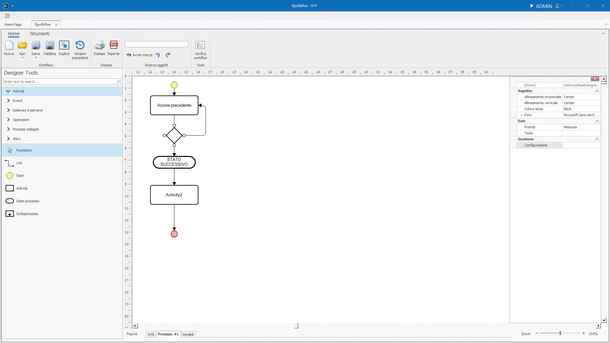
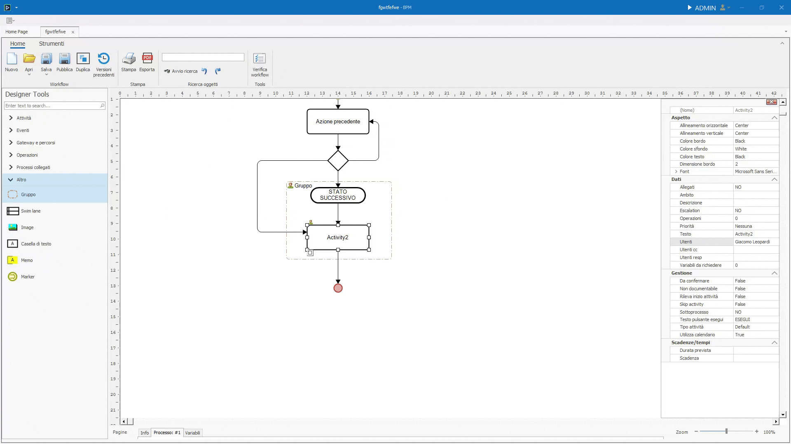

# Designer Tools

In questa pagina verranno descritte dettagliatamente tutte le sezioni e gli elementi all'interno del **_Designer Tools_** e **_Menù contestuale_**.  

Il **_Designer Tools_** è il pannello che si trova sulla sinistra, si accede al **_Menù contestuale_** di un elemento cliccandoci sopra col tasto destro.

## Designer Tools

Il Designers Tools è suddiviso in 6 sezioni.  

Alla sommità è situata la search bar. Digitando al suo interno è possibile filtrare gli oggetti delle varie sezioni. I risultati della ricerca appariranno nella propria sezione. Se più oggetti corrispondono col termine ricercato, verranno mostrati nelle proprie sezioni, se diverse, collassate.

### Attività

Sezione contenente i principali elementi di un flusso.

#### Puntatore

Cliccandolo, riporta le funzionalità del mouse a quelle standard: click per tasto sinistro e menù contestuale per tasto destro.  

Non essendo trascinabile nel canvas e, quindi, **non essendo un elemento**, non possiede attributi.

#### Link

Il link è un collegamento tra un elemento e un altro.  

Una volta selezionato dal Designer Tools, passando il cursore sopra un elemento, appariranno dei cerchi gialli. Selezionando un cerchio e tenendo premuto il tasto sinistro, inizierà il tracciamento del link.  

Mentre si sta tracciando, passando il cursore su un elemento differente dal primo, è possibile collegarlo ad uno dei punti del destinatario.


Fatto ciò, i due elementi saranno collegati: spostandoli all'interno del canvas, il link rimarrà ancorato ad essi.  

Cliccando sul collegamento con il tasto destro del mouse, si aprirà il menù di contesto contenente una lista di proprietà:

* Nome Collegamento, aprirà un dialog dove poter inserire il nome del link che verrà mostrato nel canvas.
* Percorso per Pianificazione, se spuntato, il processo, al suo inizio, riterrà il collegamento come percorso default per determinare le attività future.
* Condizioni Abilitazione, complementari al Percorso per Pianificazione, le condizioni di abilitazione decidono se un Link sia percorribile o meno. Tale decisione è basata sulle formule scritte nel dialog che si apre una volta cliccata l'opzione.  Una volta inserita una condizione, l'inizio del **_Link_** assumerà una forma a rombo. Se da un elemento, sono collegati più **_Link_** con uscite diverse, essi sono trattati come un percorso inclusive, documentato e approfondito [qui](#percorsi-liberi-inclusive-e-complex). 
* Imposta variabili, è possibile impostare delle variabili quando il link viene attraversato, arrivando a destinazione coi nuovi valori assegnati.
* Tipo Linea, è possibile decidere tra le varie opzioni il comportamento del link all'interno del canvas.
* Elimina Collegamento

#### Start

Lo **_Start_** è il punto di inizio di ogni flusso manualmente azionato.  

Un flusso può avere più Start. In tal caso, alla partenza del processo, verrà richiesto all'utente da quale Start partire.  

Ogni Start ha necessariamente bisogno che le **_Variabili da richiedere_** siano dichiarate.  
Una volta inserite, apparirà una @ accanto allo start nel canvas.
Allo stesso modo, se sono presenti delle Variabili da richiedere, è dovuto specificare gli **_Utenti e Responsabili_** della task.  

È inoltre possibile richiedere l'inserimento di allegati e lo svolgimento di operazioni, sempre tramite il menù contestuale, alla voce **_Allegati da richiedere_** e **_Operazioni_**.  
Uno Start consente di effettuare delle operazioni **_In esecuzione_** e ad **_Esecuzione terminata_**.

#### Attività

Le **_Attività_** sono il blocco fondamentale dei processi.
Servono a definire il lavoro di ogni persona. Attività per attività, un processo viene concluso, portando a termine lavori che, senza il BPM, risulterebbero tediosi e ad alto compenso di tempo.

Le **_Attività_**, nel pannello degli attributi, presentano una serie di caratteristiche che rendono la task personalizzabile e utilizzabile in ogni ambito.
Nella sezione **_Gestione_** si trovano gli attributi principali di un'attività:

##### Da confermare

Attributo che aggiunge la necessità di confermare la fine dell'attività per poter mandare avanti il flusso.

##### Rileva inizio attività

Se impostato su true, rileva la data di inizio dell'attività e non viene dedotta dalla fine della task precedente.

##### Skip activity

Se impostato su True salterà l'esecuzione della task. 

!!! info "Perché inserire nel disegno una task che non verrà mai eseguita?"
    L'attributi Skip activity serve solo per rendere il disegno più fruibile, Facendo capire all'utente finale il modo in cui determinate azioni vanno svolte o suddivise.

##### Sottoprocesso

Se impostato su True, rende l'Attività un Sottoprocesso.  
Per approfondire il concetto di **_Sottoprocesso_** scendi alla sezione Sottoprocesso o clicca [qui]().

##### Testo pulsante esegui

Attributo di tipo testuale. Il testo inserito apparirà al posto di "Esegui" sul bottone esegui.

##### Tipo attività

Attributo che va scelto da un dropdown. Serve come filtro.

##### Utilizza calendario

**_Utilizza calendario_** è un attributo che aggiunge alle **_Scadenze/Tempi_** la logica per capire quando un giorno è lavorativo o meno, basandosi sul calendario.
Se una task ha una data di scadenza, **_Utilizza calendario_** fa sì che i giorni del weekend non vengano contati.  

Il concetto di pianificazione e scadenze è approfondito [qui](#pianificazione-e-scadenze)

#### Stato processo

L'elemento **_Stato processo_** serve a visualizzare graficamente lo stato del processo.
Uno Stato processo consente di effettuare delle operazioni solo **_In attivazione_**.

Nella sezione Gestione ci sono 2 attributi:

##### Blocca edit

##### Stato di chiusura

Impostando questo attributo a True, si sancisce la fine del processo.

#### Sottoprocesso

Un **_Sottoprocesso_** è un processo avviato dall'interno di un altro processo.
Nel canvas dove viene inserito un Sottoprocesso (o un'attività con attributo Sottoprocesso impostato a true) l'elemento apparirà uguale ad una semplice attività, ma con una croce sotto la label descrittiva.  
Cliccando due volte sopra l'elemento, si entra nel canvas del Sottoprocesso.
Le funzionalità sono le stesse di un processo normale. L'unica differenza è nello start, che avviene non appena l'elemento principale del Sottoprocesso entra in esecuzione e alla fine del sottoprocesso si passa all'elemento seguente nel processo principale.  

Gli attributi che differenziano un'attività da un Sottoprocesso sono nella sezione **_Scadenze/Tempi_**. Entrambi questi attributi vengono approfonditi nella loro sezione [qui](#pianificazione-e-scadenze).

### Eventi

La sezione **_Eventi_** raggruppa tutti gli elementi che fungono da Start e gli elementi che fungono da fine.  

!!! note "Variabili da richiedere e Start"
    Essendo tutti elementi predisposti per essere l'inizio di un processo (ad esclusione di quelli di fine processo), è vivamente consigliato di impostare le variabili da richiedere direttamente nello Start.

#### Start

Lo **_Start_** convenzionale è stato trattato [qui](#start).

#### Start su evento

Lo **_Start su evento_** ha la capacità di iniziare un processo quando un evento predefinito che arriva dall'esterno.
Gli eventi sono definiti dai connettori che a loro volta sono elencati nella voce "Elenco connettori" nella sezione "Configurazione" del menù principale.

#### Start a tempo

Lo **_Start a tempo_** ha la capacità di iniziare un processo in modo ricorrente.
Configurando lo **_Start a tempo_** è possibile impostare una descrizione e ogni quanto tempo far partire nuovamente il processo.  
Le opzioni sono:

* Ricorre ogni giorno.
* Ricorre ogni settimana, dove è necessario scegliere il giorno settimanale in cui il processo ricorrerà.
* Ricorre ogni mese, dove è necessario scegliere il numero del mese in cui far ricorrere il processo, altrimenti si può spuntare il checkbox "Ultimo del mese" per avviare il processo nell'ultimo giorno di ogni mese.

In basso, infine, si ha la possibilità di specificare l'ora in cui partirà il processo.

#### Attesa

Analogamente allo start a tempo, l'**_Attesa_** è un genere di start che, una volta avviato un processo, attenderà il tempo stabilito prima di continuare.  

Configurando l'evento, è possibile impostare una descrizione, il numero di giorni da attendere e cosa fare una volta che il tempo prestabilito sia passato.

Tramite l'inpuit numerico iniziale è possibile stabilire il numero di giorni da attendere. Dopodiché tramite è possibile specificare una sola scelta su che azione dovrà svolgere l'elemento:

* Non attendere oltre.
* Attendi il primo X.
* Attendi che sia il primo, secondo, terzo, quarto o ultimo X del mese.
* Attendi che sia il Y del mese.

X è il giorno della settimana scelto tramite un dropdown.
Y è il giorno del mese impostato tramite input numerico.

Infine è anche possibile far attendere l'inizio fino ad una determinata ora del giorno stabilito tramite un'ultima checkbox e impostando l'orario.

#### Fine e Termina processo

**_Fine e Termina processo_** sono due elementi per dichiarare completato un processo.
La differenza tra i due elementi è che **_Termina processo_** termina tutti i rami paralleli e sottoprocessi attivi.

### Gateway e percorsi

La sezione **_Gateway e Percorsi_** raggruppa gli elementi che consentono di instradare il processo in direzioni diverse dipendentemente dalla configurazione dell'elemento.

#### Percorsi alternativi (exclusive)

L'elemento **_Percorsi alternativi (exclusive)_** permette di dividere il percorso del processo.
Da questo gateway è possibile ramificare in percorsi diversi il processo, ognuno con la propria condizione di instradamento.
Le condizioni dei percorsi sono impostate schiacciando tasto destro sul gateway e cliccando sull'entrata **_Configurazione_**.

Una volta aperto il popup di configurazione, è possibile definire le condizioni di ogni percorso cliccando sui bottoni, uno per percorso, situati accanto alle entrate della colonna "Condizione".



Dalla configurazione è anche impostabile il percorso da considerare come default che sarà quello che il processo percorrerà se nessuna delle condizioni di uscita risulta come True.

!!! info "Cosa succede se più uscite risultano come true?"

    I **_Percorsi alternativi (exclusive)_** sono scelte che vanno ad instradare il processo in un singolo percorso. Di conseguenza, se più condizioni di uscita risultano come True, il percorso instradato sarà il primo.

#### Percorsi paralleli (parallel)

L'elemento **_Percorsi paralleli (parallel)_** funge da sdoppiatore del percorso principale in ramificazioni parallele.
Tutte le ramificazioni parallele sono contemporanee, ma l'avanzamento varia in base allo svolgimento delle task interne di ognuna.

In questo caso non ci sono condizioni, in quanto tutti i rami andranno eseguiti.

#### Percorsi liberi (inclusive) e Complex

Gli elementi **_Percorsi liberi_** e **_Complex_** sono il contrario dei percorsi exclusive: tutte le condizione d'uscita che risultano come True vengono instradate.

#### Sincronizza

L'elemento **_Sincronizza_** serve a convergere le ramificazioni che si sono create utilizzando i Gateway.
Configurando l'elemento, è possibile definire il Number to pass, ovverosia quali percorsi devono essere arrivati all'elemento per far sì che il processo continui.

### Operazioni

Le **_Operazioni_** sono azioni specifiche e complesse: per questo è presente una sezione dedicata a loro che entra nelle specifiche, approfondendo ogni aspetto del loro funzionamento.  

Clicca [qui]() per saltare alla loro sezione.

### Processi collegati

Analogamente alle operazioni, i **_Processi collegati_** hanno una sezione approfondita [qui]().

### Altro

La sezione **_Altro_** raggruppa gli elementi che non rientrano nel resto delle categorie.

#### Gruppo e Swim lane

L'elemento **_Gruppo_** è un raggruppatore di elementi.
Gli elementi all'interno del **_Gruppo_** possono essere svolti dagli utenti assegnati al **_Gruppo_** stesso.



L'elemento **_Swim lane_** è analogo a quello di gruppo.
Per aggiungere pioù **_Swim lane_** basta trascinarne quante necessarie nel canvas.
Le **_Swim lane_** suddividono il disegno in corsie, ognuna coi propri utenti associati che potranno svolgere le azioni all'interno della propria corsia.

!!! Warning "Multuple associazioni di Utenti"

    Se ad un **_Gruppo_** o una **_Swim lane_** e ad una task interna ad essi sono associati degli utenti e tali utenti differiscono con quelli associati nel contenitore, la task potrà essere svolta **solo** dagli utenti associati alla task stessa.
    <center>**Task Users > Container Users**</center>

#### Image, Casella di testo e Memo.

**_Image_** è un elemento statico, attraverso cui è possibile inserire un immagine all'interno del canvas.  

La **_Casella di testo_** è del semplice testo slegato ad altri elementi. È utile per dare titoli a parti o sezioni del flusso.  

Il **_Memo_** ha la stessa funzionalità di un postit ed è collegabile ad un task tramite il link. Così facendo, tra la task e il **_Memo_** apparirà una linea tratteggiata gialla. È utile per scrivere note e ricordare agli utenti delle informazioni chiave per lo svolgimento di una task.

#### Marker

Il **_Marker_** è uno strumento utilizzato per navigare all'interno del processo tra diverse pagine. Questo risulta particolarmente utile quando si desidera rendere il processo stampabile, ad esempio su un foglio A4, evitando di estenderlo eccessivamente in verticale.  
In questi casi, si aggiunge una nuova pagina, e il **_Marker_** funge da "collegamento" che consente di proseguire con il processo su un'altra sezione. In pratica, è un riferimento che rimanda a un'altra pagina del processo.

## Menù contestuale

Il menù contestuale appare quando si preme il tasto destro del mouse su un oggetto nel canvas. In base all'oggetto cliccato le entrate saranno differenti. 

### Colore e font

Generalmente, in un oggetto è possibile cambiare:

* Colore e font della targhetta dell'elemento.
* Colore dello sfondo.
* Colore e spessore e del bordo.

### Allineamento

L'entrata **_Allineamento_** a sua volta ha 10 scelte: 

#### Allinea

Allineano gli elemento selezionati secondo il tipo di allineamento in base alla posizione dell'elemento su cui è stato cliccato il tasto destro.

#### Porta davanti e Porta dietro

Modifica lo Z-index di un oggetto: se un oggetto risulta sovrapposto ad un altro, per portarlo in avanti è sufficiente cliccare **_Porta avanti_** per portarlo in primo piano. 
Lo stesso, ma al contrario, vale per **_Porta dietro_**.

#### Distribuisci

Selezionando più oggetti(1)è possibile spostarli in massa distrubuendoli su uno dei loro assi utilizzando le due entrate **_Distribuisci verticalmente_** o **_Distribuisci orizzontalmente_**.
{ .annotate }

1.  Per selezionare più oggetti è necessario tenere premuto ++ctrl++ o ++shift++ quando si va a cliccare, col tasto sinistro, su un elemento. Altrimenti, cliccando su una parte vuota del canvas e tenendo premuto, è possibile delineare un'area i cui elementi interno verranno selezionati.

### Manipolazione oggetto

Oltre al tagliare e copiare un oggetto, è possibile spostarlo da una pagina ad un'altra del processo tramite l'entrata **_Sposta oggetto alla pagina ..._**.

### Manipolazione Testo e Label

Nel menù contestuale è presente l'entrata **_Sposta testo_** per spostare l'etichetta dell'oggetto dove si vuole nel canvas. Essa rimarrà ancorata al punto dove si è spostata.
L'entrata **_Modifica Testo_** consente di modificare il testo della Label.

### Impostare un oggetto come oggetto di avvio

!!! danger "Rimozione dello Start"
    È possibile rimuovere lo Start, ma è un comportamento non convenzionale e tendenzialmente sconsigliato in quanto il processo richiederà all'utente di inserire direttamente le variabili da richiedere.

Premendo tasto destro, l'entrata **_Imposta come oggetto di avvio_** renderà l'oggetto su cui si è cliccato, il punto di partenza.

### Definire gli Utenti e i Responsabili, le Variabili da richiedere e gli Allegati da richiedere

Tramite l'entrata **_Utenti e responsabili_** è possibile definire chi dovrà svolgere una determinata task.

Analogamente, è possibile definire i dati che, gli utenti precedentemente, assegnati dovranno inserire.
Questo è possibile tramite l'entrata **_Variabili da richiedere_** che, una volta cliccata, aprirà una nuova pagina dedicata all'inserimento delle variabili.  
Questa pagina, chiamata **_Magazzino delle variabili_**, viene trattata e approfondita nella sua sezione apposita [qui](MagazzinoVariabili.md).
Per aggiungere una Variabile da richiedere, basta prenderne una dalla lista di sinistra e trascinarla nel canvas.
Così facendo, gli utenti a cui è assegnata la task, dovranno inserire i valori delle variabili così definite.


Infine, è possibile definire gli allegati da definire tramite l'entrata **_Allegati da richiedere_**.  
In questo caso non è possibile definire gli allegati che andranno inseriti, bensì dei filtri che vadano a scremare i possibili allegati inseribili. Tutto questo tramite un popup.  
Il popup presenta due checkbox:

* La prima, se spuntata, renderà funzionanti i filtri e le preferenze che vengono definite nel resto del popup.
* La seconda, invece, fa sì che gli allegati caricati non possano essere poi modificati.

Dopodiché una sezione dedicata ai filtri: qui è possibile infatti definire il **_Gruppo allegato_**, il **_Tipo allegato_** e il **_Percorso_**.  

Il **_Gruppo allegato_** e il **_Tipo Allegato_** sono definibili dal menù delle impostazioni alla sezione **_Configurazione_**, sottogruppo **_Allegati_**.  

Per il **_Percorso_** invece è necessario scegliere una delle cartelle interne al processo.  
Per crearne una è necessario cliccare la voce **_Allegati_** dalla **_barra degli strumenti_**.  
Da lì si apriranno le impostazioni generali del processo relative agli allegati.  
Cliccando tasto destro sulla lista delle cartelle, sarà possibile crearne una nuova. Una volta fatto, sarà presente tra le scelte disponibili per determinare il percorso degli allegati di una task.

Sotto i Filtri, è possibile gestire la **_Dimensione Massima in KB_** (Dim. Massima kb), tramite un input numerico.
Il numero immesso sarà il tetto massimo per la dimensione di un file.  

Nella parte bassa del popup invece si ha il gruppo relativo ai Tipi di file consentiti.  
Tramite una serie di checkbox è possibile definire le estensioni dei file che possono essere accettati.  
L'input di testo finale invece è riservato ad estensioni specifiche per gli utenti che ne hanno bisogno. **_Tali estensioni vanno separate dalla virgola e includendo il punto_**.

``` title="Altre Estensioni" linenums="1"
.cad,.php,.bat
```

### Operazioni

L'entrata relativa alle **_Operazioni_** apre un popup che permette di eseguire delle operazioni in diversi momenti della task.  
In base all'elemento su cui si apre il popup, i momenti in cui sarà possibile svolgere un'operazione saranno diversi.  
Per svolgere un'operazione basta trascinarla dalla colonna **_Operazioni disponibili_** a quella del momento in cui si desidera svolgerla.(1) 
{ .annotate }

1. Il titolo della colonna è il momento in cui verrà svolta l'operazione.

Le **_Operazioni_** vengono svolte in ordine Top to Bottom.

Le **_Operazioni_** sono azioni specifiche e complesse, per approfondimenti e spiegazioni è nmecessario rifarsi alla loro sezione [qui]().

### Formula di validazione

La **_Formula di validazione_** è una formula che determina se è possibile continuare con la task successiva del processo.
Cliccando su questa entrata, verrà aperto il popup per la scrittura delle formule.  
Le formule di validazione degli elementi del canvas sono in una relazione AND con le altre formule definibili dalla barra degli strumenti della pagina delle variabili.

### Escalation

L'**_Escalation_** è un'entrata del menù contestuale specifica di alcuni elementi.  
Con l'utilizzo dell'**_Escalation_** è possibile, dopo un determinato numero di giorni inserito dall'utente, eseguire le 3 azioni seguenti:

* Non variare attività
* Riassegna attività, cedendo ad altri utenti la possibilità di mandare avanti il processo
* Chiudi attività

Dall'Escalation poi è possibile iniziare un collegamento, così da poter instradare il processo altrove in caso si dovesse riassegnare o chiudere la task.

### Pianificazione e Scadenze

Il popup "Pianificazione e Scadenze" permette di impostare i dettagli di pianificazione, scadenze e priorità relativi a una specifica attività (task). È diviso in tre schede principali: Pianificazione e scadenze, Variabili, e Dati aggiuntivi.

In **_Pianificazione e Scadenze_** è possibile impostare la durata prevista e la scadenza di una task.
Inoltre sono presenti 3 checkbox:

* Da confermare
* Rileva inizio
* Utilizza calendario

La tab **_Variabili_** consente di associare variabili ai campi relativi a una pianificazione aggiornata dell'attività. I campi configurabili includono:

* Data inizio prevista aggiornata, consente di collegare una variabile alla data di inizio pianificata dell'attività nel calendario.
* Data fine aggiornata, permette di associare una variabile alla data di fine dell'attività pianificata.
* Durata prevista (giorni), offre la possibilità di collegare una variabile che rappresenta la durata stimata dell'attività (in giorni).
* Scadenza dell'attività, configura una variabile per rappresentare la data di scadenza dell'attività.
* Priorità dell'attività, consente di associare una variabile alla priorità assegnata all'attività.

La scheda **_Dati aggiuntivi_** consente di associare variabili a campi specifici relativi ai dati pianificati e ai dati effettivi di un'attività. Questa scheda è divisa in due sezioni principali: Dati Previsti/Pianificati e Dati Effettivi.

Nel gruppo **_Dati Previsti/Pianificati_** è possibile configurare le variabili per i dati pianificati dell'attività. I campi disponibili sono:

* Data inizio prevista/pianificata, permette di collegare una variabile alla data di inizio pianificata dell'attività nel calendario.
* Data fine prevista/pianificata, consente di associare una variabile alla data di fine pianificata dell'attività.
* Durata prevista (giorni), Collega una variabile che rappresenta la durata stimata dell'attività in giorni.

Il Gruppo **_Dati Effettivi_** permette di configurare le variabili per i dati effettivi dell'attività, ovvero i valori realmente registrati. I campi configurabili sono:

* Data inizio dell'attività, associa una variabile che rappresenta la data di inizio effettiva dell'attività.
* Data fine dell'attività, collega una variabile alla data di completamento effettiva dell'attività.
* Durata effettiva (giorni), consente di collegare una variabile che rappresenta la durata effettiva dell'attività in giorni.

### Configurazione

L'entrata **_Configurazione_** è differente per ogni elemento e viene approfondita nelle sezioni relative ai singoli elementi.


## Pannello attributi

Analogamente, a destra del canvas si trova il **_Pannello Attributi_** che, molto spesso, presenta entrate comuni a quelle del menù contestuale.

### Aspetto

Nel Pannello attributi, **_Aspetto_** contiene tutte le informazioni di un oggetto relative all'allineamento della targhetta, ai colori e ai font.

### Dati

La sezione **_Dati_** comprende le proprietà più specifiche di un singolo elemento.  

Gli attributi elencati forniscono informazioni e impostazioni per personalizzare il comportamento e la gestione della task all'interno del flusso. Si tratta di proprietà che riguardano ambiti funzionali, priorità, gestione utenti e operazioni specifiche, oltre ad altre configurazioni utili per determinare come la task interagisce con il sistema o con altri elementi del flusso.

#### Ambito e Descrizione

L'**_Ambito_** è un campo di testo libero.  
Dalla to-do list è possibile ricercare tutte le task con uno stesso **_Ambito_**.

Impostando la **_Descrizione_** è possibile fornire informazioni testuali riguardanti una task, utili a chi dovrà poi dovrà svolgerla. Apparirà infatti nella tab **_Istruzioni_** quando un utente starà eseguendo la task.

#### Escalation
 
Con l'utilizzo dell'**_Escalation_** è possibile, dopo un determinato numero di giorni inserito dall'utente, eseguire le 3 azioni seguenti:

* Non variare attività
* Riassegna attività, cedendo ad altri utenti la possibilità di mandare avanti il processo
* Chiudi attività

Dall'Escalation poi è possibile iniziare un collegamento, così da poter instradare il processo altrove in caso si dovesse riassegnare o chiudere la task.

#### Operazioni

Da **_Operazioni_** si apre un popup che permette di eseguire delle operazioni in diversi momenti della task.  
In base all'elemento su cui si apre il popup, i momenti in cui sarà possibile svolgere un'operazione saranno diversi.  
Per svolgere un'operazione basta trascinarla dalla colonna **_Operazioni disponibili_** a quella del momento in cui si desidera svolgerla.(1) 
{ .annotate }

1. Il titolo della colonna è il momento in cui verrà svolta l'operazione.

Le **_Operazioni_** vengono svolte in ordine Top to Bottom.

Le **_Operazioni_** sono azioni specifiche e complesse, per approfondimenti e spiegazioni è nmecessario rifarsi alla loro sezione [qui](MagazzinoVariabili.md).

#### Priorità

Tramite **_Priorità_** è possibile assegnare un livello di importanza per lo svolgimento di una task.  

Dalla to-do list è possibile filtrare e ordinare le task in base alla loro priorità.  

I livelli possibili sono: Bassa, Media, Alta o Sospesa.

#### Testo

Il **_Testo_** consente di modificare ciò che appare sul canvas a video nella label di un elemento. Il valore inserito sarà anche un nome secondario dell'elemento, filtrabile anch'esso e che apparirà nella tab **_Dati_** dell'esecuzione di una task.

#### Definire gli Utenti, Utenti cc e Responsabili, le Variabili da richiedere e gli Allegati

Tramite l'entrata **_Utenti_**, **_Utenti cc_** e **_Utenti resp_** è possibile definire chi dovrà svolgere una determinata task.
Cliccando questi attributi verrà aperto un popup dove sarà possibile, tramite delle checkbox, marcare gli utenti che dovranno svolgere la task, supervisionarla o che saranno i responsabili del loro svolgimento.

Analogamente, è possibile definire i dati che, gli utenti precedentemente, assegnati dovranno inserire.
Questo è possibile tramite l'entrata **_Variabili da richiedere_** che, una volta cliccata, aprirà una nuova pagina dedicata all'inserimento delle variabili.  
Questa pagina, chiamata **_Magazzino delle variabili_**, viene trattata e approfondita nella sua sezione apposita [qui]().
Per aggiungere una Variabile da richiedere, basta prenderne una dalla lista di sinistra e trascinarla nel canvas.
Così facendo, gli utenti a cui è assegnata la task, dovranno inserire i valori delle variabili così definite.

Infine, è possibile definire gli allegati da definire tramite l'entrata **_Allegati_**.  
In questo caso non è possibile definire gli allegati che andranno inseriti, bensì dei filtri che vadano a scremare i possibili allegati inseribili. Tutto questo tramite un popup.  
Il popup presenta due checkbox:

* La prima, se spuntata, renderà funzionanti i filtri e le preferenze che vengono definite nel resto del popup.
* La seconda, invece, fa sì che gli allegati caricati non possano essere poi modificati.

Dopodiché una sezione dedicata ai filtri: qui è possibile infatti definire il **_Gruppo allegato_**, il **_Tipo allegato_** e il **_Percorso_**.  

Il **_Gruppo allegato_** e il **_Tipo Allegato_** sono definibili dal menù delle impostazioni alla sezione **_Configurazione_**, sottogruppo **_Allegati_**.  

Per il **_Percorso_** invece è necessario scegliere una delle cartelle interne al processo.  
Per crearne una è necessario cliccare la voce **_Allegati_** dalla **_barra degli strumenti_**.  
Da lì si apriranno le impostazioni generali del processo relative agli allegati.  
Cliccando tasto destro sulla lista delle cartelle, sarà possibile crearne una nuova. Una volta fatto, sarà presente tra le scelte disponibili per determinare il percorso degli allegati di una task.

Sotto i Filtri, è possibile gestire la **_Dimensione Massima in KB_** (Dim. Massima kb), tramite un input numerico.
Il numero immesso sarà il tetto massimo per la dimensione di un file.  

Nella parte bassa del popup invece si ha il gruppo relativo ai Tipi di file consentiti.  
Tramite una serie di checkbox è possibile definire le estensioni dei file che possono essere accettati.  
L'input di testo finale invece è riservato ad estensioni specifiche per gli utenti che ne hanno bisogno. **_Tali estensioni vanno separate dalla virgola e includendo il punto_**.

``` title="Altre Estensioni" linenums="1"
.cad,.php,.bat
```

### Scadenze/Tempi

L'approfondimento sulle **_Scadenze/Tempi_** è presenta nella sua sezione [qui](#pianificazione-e-scadenze).