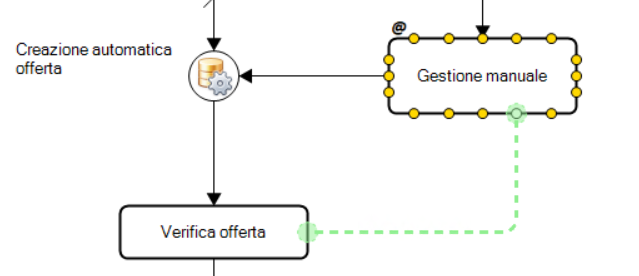
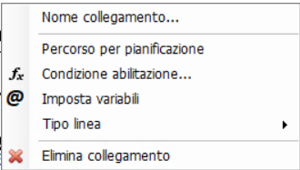

Nel disegno di un processo BPM, i **link** rappresentano i collegamenti logici tra task, stati, operazioni o altri elementi del processo. Sono fondamentali per determinare il flusso operativo e includono sia **componenti funzionali** che **componenti grafiche**.

## Funzione del Link

Un link collega il **termine** di un'attività con l'**inizio** della successiva. È un elemento che può essere configurato e personalizzato secondo diversi parametri disponibili da tasto destro:

### Nome collegamento

Permette di assegnare un'etichetta testuale al link, utile per identificare percorsi alternativi o indicare il significato logico del collegamento. Questo nome viene visualizzato vicino alla linea e non modifica la logica del processo.

### Condizione abilitazione

Definisce una condizione (espressa tramite formula) che deve essere vera affinché il link venga attivato. È una forma compatta per gestire flussi condizionati, alternativa all'uso di gateway.  
Quando è presente una condizione, compare un piccolo **rombo** grafico all'inizio del link.

### Imposta variabili

Consente di impostare valori su variabili nel momento in cui il processo percorre quel link. È uno dei diversi modi per iniettare logica personalizzata nel flusso, alternativo all’uso di operazioni nei task o stati.

## Tipo di Linea

La parte grafica del link può essere personalizzata per migliorare la leggibilità del disegno del processo. Le tipologie disponibili sono:

- **Linea diretta**  
  Segmento lineare semplice, senza deviazioni.

- **Linea ortogonale automatica**  
  Percorso generato automaticamente composto solo da segmenti orizzontali e verticali.

- **Linea ortogonale manuale**  
  Come la precedente, ma con controllo manuale del routing. L’utente definisce i punti intermedi.

- **Linea poligonale**  
  Percorso libero composto da segmenti arbitrari, da configurare manualmente.

> 💡 La modalità più utilizzata in fase iniziale è quella **ortogonale automatica**, eventualmente modificata successivamente in manuale per una migliore pulizia grafica.

## Note sul Routing

Durante la creazione dei link:

- I **punti di ancoraggio** sono visibili come **puntini gialli** sugli oggetti.
- Durante il **drag-and-drop**, una linea **verde** indica che il collegamento è valido; una **rossa** segnala che non è permesso.

### Regole di connessione

- Ogni punto può essere condiviso da più link contemporaneamente.
- Tuttavia, **non può essere usato sia come punto di partenza che di arrivo**:
  - un punto utilizzato per un link in uscita non può essere usato per un link in entrata, e viceversa.
- Alcuni oggetti (es. **gateway**) supportano più ingressi o più uscite secondo logiche specifiche.
- Le **operazioni** accettano un solo input e un solo output.

### Superamento dei limiti di routing

In situazioni dove le regole limitano la costruzione desiderata, è possibile utilizzare una **attività con parametro `skip`** come elemento intermedio per aggirare i vincoli.
