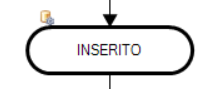

## Descrizione

Lo **Stato** è un'entità astratta all'interno del processo BPM che rappresenta un **punto significativo** nell’evoluzione del flusso, ma **non costituisce un'attività eseguibile (task)**. Si tratta di una **milestone logica** che fotografa la condizione globale del processo in un determinato momento.

Ogni processo definisce autonomamente i propri stati in funzione del dominio applicativo. Esempi comuni includono:

- `INSERITO`
- `IN APPROVAZIONE`
- `APPROVATO`
- `CONCLUSO`
- ...

## Caratteristiche principali

- Lo **Stato** non ha una logica esecutiva propria ma viene **raggiunto a seguito dell’esecuzione di uno o più task** o di transizioni definite nel flusso.
- Gli stati sono **esclusivi**: in un determinato momento, un processo può trovarsi in **uno e un solo stato**.
- La transizione da uno stato a un altro può essere **automatica** (guidata dalla logica del workflow) o **manuale** in base ad un'attivazione forzata da un utente owner del processo.

## Utilizzo

- Serve come **indicatore del progresso** del processo.
- Può essere utilizzato per **filtrare, classificare o monitorare** l’avanzamento dei processi nel sistema.
- Lo stato marcato come 'stato di chiusura' fa sì che, al suo raggiungimento, eventuali altri task aperti vengano forzati alla chiusura (annullati)
- Lo stato marcato come 'blocca edit' consente di bloccare la modifica dei dati di processo (o documento) al di fuori delle logiche di processo

## Configurazione

Lo stato può essere inserito all'interno del workflow di processo: in questo caso lo stato si attiva automaticamente al completamento dei task ad esso precedenti.
Nel menu tasto destro sono presenti alcune funzionalità tipiche del designer:

## Menu tasto destro

Nel menu tasto destro relativo al task sono presenti una serie di funzioni che permettono di regolare il funzionamento dello stato.

Personalizzazione dell'aspetto:

- Allineamento ➝ Permette di allineare l'oggetto con altri elementi.
- Colore ➝ Cambia il colore dell'elemento.
- Font ➝ Modifica lo stile del testo.

Modifica e gestione dell'oggetto:

- Sposta oggetto alla pagina... ➝ Permette di spostare l'oggetto in un'altra pagina.
- Taglia ➝ Rimuove l'oggetto dalla posizione corrente (pronto per incollarlo altrove).
- Copia ➝ Duplica l'oggetto per incollarlo in un'altra posizione.
- Modifica testo (F2) ➝ Permette di modificare il testo dell'elemento.
- Sposta testo ➝ Cambia la posizione del testo all'interno dell'oggetto.

Impostazioni:

- Imposta come oggetto di avvio ➝ Definisce l'elemento come punto di partenza nel flusso di lavoro.
- Operazioni ➝ Permette di configurare azioni specifiche legate all'elemento.

Altro:

- Elimina ➝ Cancella l'oggetto dal flusso di lavoro.

---

## Form Operazioni

Nel contesto di un processo BPM, le operazioni rappresentano attività automatiche (come esecuzione di query SQL, invio di mail, chiamate a web service, ecc.) che possono essere inserite nel workflow esattamente come un task manuale.

Tuttavia, per evitare di appesantire il disegno del flusso con dettagli tecnici, il sistema consente di associare operazioni direttamente agli stati tramite la Form Operazioni.

Nella form è possibile trascinare (drag & drop) le operazioni già disponibili nel BPM, associandole a specifici eventi del task.
Le operazioni disponibili sono sempre le stesse (Decision Table, Imposta Variabili, Invio Mail, Esegui SQL, Connettore Azione, ecc.) e sono gestite in modo centralizzato.

Per quanto riguarda gli stati, le operazioni si possono agganciare all'evento di 'attivazione' dello stato ==> il momento in cui lo stato è stato raggiunto dal workflow oppure quando questo è stato attivato manualmente dall'utente.

