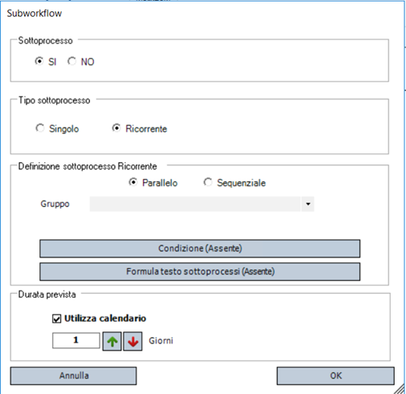

## Introduzione

I **sottoprocessi** sono un tipo particolare di task, rappresentati graficamente in modo differente, che funzionano come **contenitori** di processi secondari.
Sono fondamentali per:

- Pulire e rendere più leggibile la grafica di processi complessi isolando parti ripetitive o di dettaglio.
- Riutilizzare logiche che devono essere eseguite più volte in base a condizioni dinamiche.

## Tipologie di sottoprocesso

Ci sono due modalità operative principali:

### Sottoprocesso Singolo

- È un processo "figlio" isolato dal flusso principale.
- Serve solo per questioni di organizzazione e leggibilità: la logica è definita dentro il sottoprocesso e viene eseguita una sola volta.
- Si può vedere come una "scatola nera" che puoi aprire per guardare il dettaglio tecnico.

### Sottoprocesso Ricorrente

Quando serve eseguire lo stesso sottoprocesso più volte, su dati diversi.
In pratica, il sottoprocesso "gira" su ogni riga di un gruppo di variabili.
La configurazione di un sottoprocesso ricorrente include:

- **Modalità di esecuzione**:

    - Parallelo: tutte le istanze partono subito.
    - Sequenziale: ogni istanza parte solo dopo che la precedente è completata.

- **Condizione**: una formula logica che stabilisce se eseguire il sottoprocesso per una certa riga.
  Se la condizione è falsa, quella riga viene ignorata.
- **Formula testo**: una formula che genera il nome di ciascuna istanza del sottoprocesso, così che nella Todo List gli utenti capiscano a quale "riga" si riferisce ogni task.
- **Durata**: se il sottoprocesso non è ancora esploso (cioè non sono ancora generate tutte le istanze), il BPM usa questa durata "globale" come riferimento di pianificazione.
