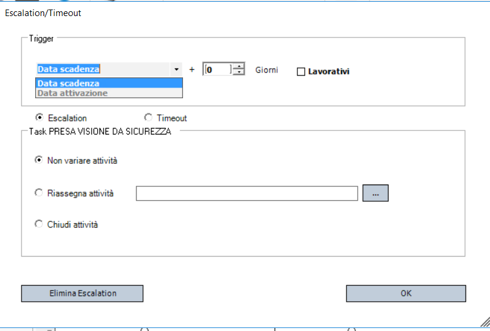

# Attività (Task) nel Processo

## Cos'è un'attività

Un'attività rappresenta un'unità operativa all'interno di un processo ed è sempre assegnata a uno o più utenti o gruppi. Ogni task, prima o poi, finisce nella **to-do list** di almeno una persona, diventando così visibile e gestibile nel flusso di lavoro.

## Ruoli associati al task

Nel rispetto di una logica di processo, ogni attività può prevedere l’assegnazione di più ruoli:

- **Esecutore**: l’utente che effettivamente esegue il task.
- **Responsabile** (opzionale): colui che assegna il task all’esecutore; può essere specificato tramite i parametri del processo.
- **Utente in copia (CC)**: riceve aggiornamenti sull'andamento del task ma non ha responsabilità operative dirette.

> In contesti meno formalizzati, è possibile semplificare questa logica: ad esempio, il primo utente che visualizza il task può prenderlo in carico ed eseguirlo direttamente, senza passaggi intermedi o ruoli formali.

---

## Variabili del task

Ogni task è associato a un insieme di **variabili**, ovvero dati o informazioni necessari per la sua corretta esecuzione. Queste possono essere:

- **In lettura**: informazioni che l’esecutore deve conoscere.
- **In scrittura**: dati che devono essere raccolti o aggiornati durante il completamento dell’attività.

---

## Menu tasto destro

Nel menu tasto destro relativo al task sono presenti una serie di funzioni che permettono di regolare il funzionamento del task stesso.

Personalizzazione dell'aspetto:

- Allineamento ➝ Permette di allineare l'oggetto con altri elementi.
- Colore ➝ Cambia il colore dell'elemento.
- Font ➝ Modifica lo stile del testo.

Modifica e gestione dell'oggetto:

- Sposta oggetto alla pagina... ➝ Permette di spostare l'oggetto in un'altra pagina.
- Taglia ➝ Rimuove l'oggetto dalla posizione corrente (pronto per incollarlo altrove).
- Copia ➝ Duplica l'oggetto per incollarlo in un'altra posizione.
- Modifica testo (F2) ➝ Permette di modificare il testo dell'elemento.
- Sposta testo ➝ Cambia la posizione del testo all'interno dell'oggetto.

Impostazioni:

- Imposta come oggetto di avvio ➝ Definisce l'elemento come punto di partenza nel flusso di lavoro.
- Utenti e responsabili... ➝ Permette di assegnare utenti responsabili dell'elemento.
- Variabili da richiedere ➝ Specifica le variabili necessarie per l'elemento.
- Allegati da richiedere ➝ Definisce eventuali file o documenti da allegare.
- Operazioni ➝ Permette di configurare azioni specifiche legate all'elemento.
- Pianificazione e scadenze… ➝ Gestisce tempi e scadenze dell'elemento.
- Escalation ➝ Imposta regole per l'escalation in caso di problemi.

Altro:

- Elimina ➝ Cancella l'oggetto dal flusso di lavoro.

---

## Form Utenti e Responsabili

La form consente di configurare:

-	Esecutore: utenti o gruppi autorizzati a svolgere il task.
-	Responsabile: utenti o gruppi che supervisionano e assegnano il task.
-	CC: utenti o gruppi che devono essere informati sull’esecuzione del task.

Sono gestibili sia utenti/gruppi statici sia variabili di tipo UserType (identificate dal simbolo @ all’inizio del nome). L'uso delle variabili UserType consente il routing dinamico dei task sulla base dei dati del processo.

Nella parte inferiore della form è presente il flag:

-	Task deve essere assegnato prima di poter essere eseguito

Non selezionato: Il primo utente disponibile tra gli esecutori può prendere in carico o eseguire direttamente il task. Nessuna assegnazione preventiva è necessaria.
Selezionato: Il responsabile deve assegnare esplicitamente il task a un esecutore. Solo l'assegnatario potrà poi eseguire l'attività.

Tipologie di Utenti Gestibili:

- Utente singolo: Utente fisico presente in anagrafica.
- Gruppo: Insieme di utenti
- Variabile UserType: Placeholder dinamico risolto a runtime in base ai dati del processo (es: @[FUNZIONE COINVOLTA]).

Le variabili UserType garantiscono la massima flessibilità nei workflow complessi, adattandosi automaticamente a chi deve realmente gestire l'attività.

---

## Form Variabili da Richiedere

La form "Variabili da Richiedere" permette di configurare quali variabili devono essere compilate o mostrate durante l'esecuzione del task.
Questa form è una versione limitata dell'editor variabili di processo/documento:

•	Non è possibile creare nuove variabili.
•	Si possono solo selezionare variabili esistenti definite a livello di processo o documento.

L'obiettivo è definire quali dati devono essere richiesti all'utente durante il task, partendo dalla struttura globale del processo.

---

### Comportamento delle Variabili nel Contesto del Task ###

Quando una variabile viene agganciata al task:

•	Alcune proprietà della variabile (descrizione, obbligatorietà, posizione, formule di validazione, ecc.) possono essere personalizzate localmente, cioè solo per quel task.
•	Le modifiche NON influenzano la definizione della variabile a livello di processo.

Questo meccanismo consente di riutilizzare le stesse variabili in task diversi con configurazioni diverse.

Esempi pratici:

•	Una variabile "Note" può essere obbligatoria in un task ma facoltativa in un altro.
•	Una variabile "Importo" può avere diverse formule di validazione in base al task.

### Importazione di pagine di variabili

Per semplificare la configurazione, è possibile importare intere pagine di variabili già definite a livello di processo.

Importa Pagina:	Consente di caricare in blocco tutte le variabili appartenenti a una specifica pagina del processo.
Inserimento Singolo:	È comunque possibile aggiungere le variabili una ad una, se necessario.

**Nota operativa:** L'importazione di una pagina è particolarmente utile quando esiste una struttura standard di dati da raccogliere, riducendo il rischio di errori manuali e velocizzando l'implementazione dei task.

**Attenzione:** una variabile deve già esistere nel processo per poter essere associata al task. Se manca, va prima creata a livello di processo/documento.

---

## Form Allegati da Richiedere

Questa form serve per indicare che, su uno specifico task, bisogna gestire degli allegati (documenti, immagini, ecc.).

Cosa si può configurare:

- Attiva gestione allegati su questo task: se attivo l'utente vedrà durante l'esecuzione un tab con l’albero degli allegati associati al processo/documento
- Allegati in sola lettura: se attivo, l'utente può solo vedere gli allegati
Con i filtri puoi restringere la visibilità degli allegati per l'utente:
- Gruppo allegato: solo allegati di un certo gruppo
- Tipo allegato: solo allegati di un certo tipo (esempio: solo "Contratti", solo "Fatture", ecc.).
- Percorso: solo allegati che stanno in una certa cartella del processo/documento.

!!! note "⚡ Nota: "
    in BPM gli allegati sono organizzati in "cartelle" logiche, anche se fisicamente sono salvati nello stesso spazio.

- Dimensione massima: per mettere un limite alla dimensione degli allegati (in KB).
- Tipi di file consentiti: per indicare che tipo di file sono accettati: Word, Excel, PDF, immagini (JPG, PNG…), oppure aggiungere altre estensioni a mano (.cad, .php, ecc.).

Questa form controlla quali allegati l'utente può vedere e cosa può farci (vedere, modificare, aggiungere) durante un task.

---

## Form Operazioni

Nel contesto di un processo BPM, le operazioni rappresentano attività automatiche (come esecuzione di query SQL, invio di mail, chiamate a web service, ecc.) che possono essere inserite nel workflow esattamente come un task manuale.

Tuttavia, per evitare di appesantire il disegno del flusso con dettagli tecnici, il sistema consente di associare operazioni direttamente ai task tramite la Form Operazioni.

Nella form è possibile trascinare (drag & drop) le operazioni già disponibili nel BPM, associandole a specifici eventi del task.
Le operazioni disponibili sono sempre le stesse (Decision Table, Imposta Variabili, Invio Mail, Esegui SQL, Connettore Azione, ecc.) e sono gestite in modo centralizzato.

Le operazioni si possono agganciare a precisi momenti di vita del task:

1.	Attivazione Task
    - Quando il task diventa disponibile per l’utente, subito dopo il completamento dei task precedenti.
    - Tipico uso: inviare notifiche agli utenti o ad altri sistemi.

2.	Inizio Task
    - Scatta solo se il task ha attiva la proprietà “rileva inizio”.
    - Parte quando l’utente seleziona "INIZIA" dalla sua to-do list.
    - In caso contrario, questo evento non viene lanciato.

3.	In Esecuzione
    - Scatta subito prima del completamento del task.
    - Dopo il click su "COMPLETATO" da parte dell'utente, ma prima delle formule di validazione.

4.	Esecuzione Terminata
    - Scatta dopo il completamento definitivo del task e dopo il superamento delle validazioni.
    - L’effetto è simile a un normale avanzamento nel flusso, ma senza dover disegnare ulteriori task. 

**Perchè è importante**

-	Permette di **centralizzare** la gestione di logiche tecniche senza sporcare il disegno principale del workflow.
-	Consente **alta modularità**: ogni task può avere comportamenti automatici senza bisogno di ulteriori nodi nel processo.
-	Rende il disegno **più leggibile**: i dettagli di integrazione o automazione restano contestualizzati nel task.

**In sintesi**
La Form Operazioni è lo strumento che ti consente di collegare logiche automatiche ai task, sfruttando eventi precisi, mantenendo il flusso pulito, e senza rinunciare alla potenza di integrazione del BPM

---

## Form Pianificazione e Scadenze

Selezionando un task e utilizzando il menu contestuale "Pianificazione e scadenze", si apre una finestra che permette di configurare in dettaglio i parametri temporali dell'attività. Questa configurazione è fondamentale per una gestione efficace delle scadenze e per il corretto funzionamento delle automazioni del processo.

### Tab: Pianificazione e Scadenze

Qui si può impostare:

- Durata prevista: Indica il numero di giorni previsti per completare il task. 
- Scadenza: Definisce il termine massimo entro cui il task deve essere completato, calcolato a partire dalla data di inizio.
- Opzioni:
    * Da confermare: Se abilitato, indica che la pianificazione deve essere approvata manualmente.
    * Rileva inizio: Se selezionato, il sistema attiva la rilevazione della data inizio da parte dell’utente.
    * Utilizza calendario: Se abilitato, il calcolo della durata e delle scadenze considera solo i giorni lavorativi definiti nel calendario aziendale (esclude weekend, festività, ecc.). 

### Tab: Dati aggiuntivi

In questo tab si possono mappare variabili di processo ai dati del task:

- Collega la scadenza dell'attività: Associa la scadenza calcolata a una variabile del processo per poterla usare altrove (es. notifiche).
- Collega la priorità dell'attività: Associa una variabile di processo alla priorità del task. Puoi mappare valori specifici con la funzione Mappatura valori. Se non configuri correttamente questa mappatura, il task potrebbe risultare senza priorità e comportarsi in modo anomalo nelle liste.
- Collega il colore del task nella todo list: Definisce dinamicamente il colore con cui il task verrà visualizzato nella todo list, in base a una variabile del processo.

---

## Form Escalation 

Quando un task supera il tempo previsto (scadenza o durata massima), è necessario definire come il processo deve reagire. La finestra **Escalation/Timeout** permette di configurare il comportamento automatico del sistema in questi casi.

### Cosa si può fare

Quando il task supera il limite impostato, si possono attivare due strategie principali:

1.	Attivare un flusso alternativo

Questo significa attivare il processo su un nuovo percorso. Esempi tipici:

- Inviare notifiche o promemoria.
- Assegnare nuovi task a chi deve gestire l'eccezione.
- Scalare il problema a livelli superiori.
- Variare direttamente il task

Modificare lo stato del task stesso:

- Non variare attività: Lascia il task aperto, non fa nulla.
- Riassegna attività: Sposta il task su un altro utente o gruppo
- Chiudi attività: Termina automaticamente il task come annullato

Come si definisce il momento di timeout/escalation
La data di trigger può essere configurata in due modi:

- Data scadenza + N giorni: scatta dopo un certo numero di giorni dalla scadenza prevista.
- Data di attivazione + N giorni: alternativa utile quando vuoi gestire il timeout a partire dall'inizio dell'attività e non dalla scadenza.

!!! note "⚡ Nota operativa:"
    Dal punto di vista tecnico non cambia nulla scegliere Timeout o Escalation — il sistema reagisce allo stesso modo.
    La distinzione serve solo per dare un'indicazione "semantica" su cosa si sta gestendo:

    - Timeout → il task semplicemente è scaduto.
    - Escalation → serve l'intervento di livelli superiori o alternative di processo.

---