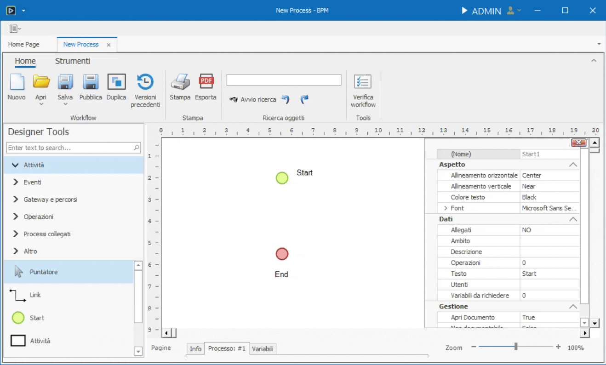
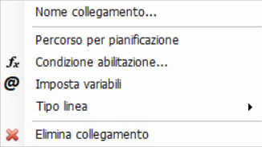
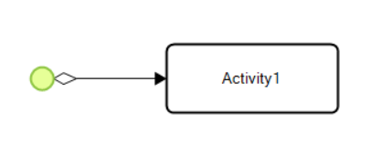

# Link

Il **_Link_** è un collegamento tra un elemento e un altro.  

Una volta selezionato dal Designer Tools, passando il cursore sopra un elemento, appariranno dei cerchi gialli. Selezionando un cerchio e tenendo premuto il tasto sinistro, inizierà il tracciamento del link.  

Mentre si sta tracciando, passando il cursore su un elemento differente dal primo, è possibile collegarlo ad uno dei punti del destinatario.

Fatto ciò, i due elementi saranno collegati: spostandoli all'interno del canvas, il link rimarrà ancorato ad essi. 

!!! tip "Note sul Routing"
    Durante la creazione dei link:  
      
      - I **punti di ancoraggio** sono visibili come **puntini gialli** sugli oggetti.

      - Durante il **drag-and-drop**, una linea **verde** indica che il collegamento è valido; una **rossa** segnala che non è permesso.

## Funzione del Link

Nel disegno di un processo BPM, i **link** rappresentano i collegamenti logici tra task, stati, operazioni o altri elementi del processo. Un link collega il **termine** di un'attività con l'**inizio** della successiva. Sono fondamentali per determinare il flusso operativo e includono sia **componenti funzionali** che **componenti grafiche**.

Cliccando sul collegamento con il tasto destro del mouse, si aprirà il menù contestuale contenente una lista di proprietà e parametri per configurarlo e personalizzarlo:

### Nome collegamento
Permette di assegnare un'etichetta testuale al link, utile per identificare percorsi alternativi o indicare il significato logico del collegamento. Questo nome viene visualizzato nel canvas vicino alla linea e non modifica la logica del processo.

### Percorso per Pianificazione
Se spuntato, il processo, al suo inizio, riterrà il collegamento come percorso default per determinare le attività future.

### Condizione abilitazione
Definisce una condizione (espressa tramite formula nel dialog) che deve essere vera affinché il link venga percorso. È una forma compatta per gestire **flussi condizionati**, alternativa all'uso del [Gateway](../gateways/intro.md).  
Quando è presente una condizione, compare un piccolo **rombo** grafico all'inizio del link.
Se da un elemento, sono collegati più **_Link_** con uscite diverse, essi sono trattati come un percorso [inclusive](../gateways/inclusive.md). 

### Imposta variabili
Consente di impostare valori su variabili nel momento in cui il processo percorre quel link. È uno dei diversi modi per iniettare logica personalizzata nel flusso, alternativo all’uso di operazioni nei task o stati.

### Tipo di Linea
La parte grafica del link può essere personalizzata per migliorare la leggibilità del disegno del processo. 
Le tipologie disponibili sono:

- **Linea diretta**  
  Segmento lineare semplice, senza deviazioni.

- **Linea ortogonale automatica**  
  Percorso generato automaticamente composto solo da segmenti orizzontali e verticali.

- **Linea ortogonale manuale**  
  Come la precedente, ma con controllo manuale del routing. L’utente definisce i punti intermedi.

- **Linea poligonale**  
  Percorso libero composto da segmenti arbitrari, da configurare manualmente.

> 💡 La modalità più utilizzata in fase iniziale è quella **ortogonale automatica**, eventualmente modificata successivamente in manuale per una migliore pulizia grafica.

### Elimina collegamento
Permette di eliminare il collegamento selezionato, in alernativa si può cancellare anche premendo il tasto **`canc`** da tastiera.

## Regole di connessione
- Ogni punto può essere condiviso da più link contemporaneamente.
- Tuttavia, **non può essere usato sia come punto di partenza che di arrivo** (un punto utilizzato per un link in uscita non può essere usato per un link in entrata, e viceversa).
- Alcuni oggetti (es. **gateway**) supportano più ingressi o più uscite secondo logiche specifiche.
- Le [**operazioni**](../operations/intro.md) accettano un solo input e un solo output.

## Superamento dei limiti di routing
In situazioni dove le regole limitano la costruzione desiderata, è possibile utilizzare una **attività con parametro `skip`** come elemento intermedio per aggirare i vincoli.
