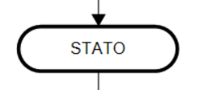

# Stato

Lo **Stato** è un'entità astratta all'interno del processo BPM che rappresenta un **punto significativo** nell’evoluzione del flusso, ma **non costituisce un'attività eseguibile (task)**. Si tratta di una **milestone logica** che fotografa la condizione globale del processo in un determinato momento.

Ogni processo definisce autonomamente i propri stati in funzione del dominio applicativo. Esempi comuni includono:

- `INSERITO`
- `IN APPROVAZIONE`
- `APPROVATO`
- `CONCLUSO`
- ...

## Caratteristiche principali

- Lo **Stato** non ha una logica esecutiva propria ma viene **raggiunto a seguito dell’esecuzione di uno o più task** o di transizioni definite nel flusso.
- Gli stati sono **esclusivi**: in un determinato momento, un processo può trovarsi in **uno e un solo stato**.
- La transizione da uno stato a un altro può essere **automatica** (guidata dalla logica del workflow) o **manuale** in base ad un'attivazione forzata da un utente owner del processo.

Nel pannello degli attributi sono presenti alcune voci specifiche per l'oggetto State, spiegate nel dettaglio [qui](../../panel.md#stato)

## Utilizzo

- Serve come **indicatore del progresso** del processo.
- Può essere utilizzato per **filtrare, classificare o monitorare** l’avanzamento dei processi nel sistema.
- Può essere inserito all'interno del workflow di processo: in questo caso si attiva automaticamente al completamento dei task ad esso precedenti.

## Menu contestuale

Nel menu tasto destro relativo al task sono presenti una serie di funzioni che permettono di regolare il funzionamento dello stato.

Personalizzazione dell'aspetto:

- Allineamento ➝ Permette di allineare l'oggetto con altri elementi.
- Colore ➝ Cambia il colore dell'elemento.
- Font ➝ Modifica lo stile del testo.

Modifica e gestione dell'oggetto:

- Sposta oggetto alla pagina... ➝ Permette di spostare l'oggetto in un'altra pagina.
- Taglia ➝ Rimuove l'oggetto dalla posizione corrente (pronto per incollarlo altrove).
- Copia ➝ Duplica l'oggetto per incollarlo in un'altra posizione.
- Modifica testo (F2) ➝ Permette di modificare il testo dell'elemento.
- Sposta testo ➝ Cambia la posizione del testo all'interno dell'oggetto.
- Imposta come oggetto di avvio ➝ Definisce l'elemento come punto di partenza nel flusso di lavoro.
- _Operazioni_ ➝ Permette di configurare azioni specifiche legate all'elemento. Negli stati, le operazioni si possono agganciare solo all'evento di 'attivazione' dello stato ovvero: il momento in cui stato è stato raggiunto dal workflow oppure quando questo è stato attivato manualmente dall'utente.

Altro:

- Elimina ➝ Cancella l'oggetto dal flusso di lavoro.

---

Per quanto riguarda gli stati, le operazioni si possono agganciare all'evento di 'attivazione' dello stato ==> il momento in cui lo stato è stato raggiunto dal workflow oppure quando questo è stato attivato manualmente dall'utente.

