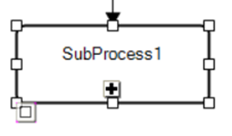
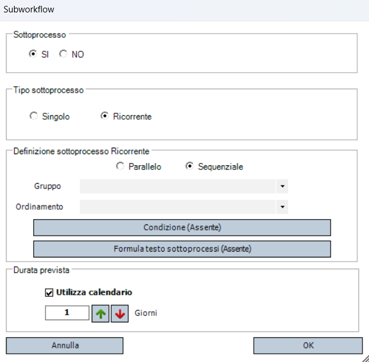

# Sottoprocesso

I **sottoprocessi** sono un tipo particolare di task, rappresentati anche graficamente in modo diverso, che funzionano come **contenitori** di processi secondari.  

## Utilizzo

- Aumentare la **leggibilità** e la **pulizia** grafica di processi complessi, isolando parti ripetitive o di dettaglio.
- **Riutilizzare logiche** che devono essere eseguite più volte in base a condizioni dinamiche.

## Pannello di configurazione e tipologie di sottoprocesso

Ci sono due modalità operative principali, in base alla configurazione scelta anche il relativo menu varia leggermente.  
I parametri che si possono impostare sono:

## Sottoprocesso Ricorrente
Quando serve **eseguire lo stesso sottoprocesso più volte, su dati diversi**.  
In pratica, il sottoprocesso "gira" su ogni riga di una tabella di variabili.  
La configurazione di un sottoprocesso ricorrente include:

### Modalità di esecuzione

#### Parallelo
Tutte le istanze vengono avviate nello stesso momento subito.

#### Sequenziale
Ogni istanza parte solo dopo che la precedente è completata.

### Gruppo
In questo campo è possibile specificare il gruppo di variabili su cui il sottoprocesso deve lavorare, le quali sono raggruppate sostanzialmente in una tabella.

### Ordinamento
Quest'opzione, *esclusiva* di un processo ricorrente *sequenziale*, permette di specificare l'ordine secondo il quale le variabili del gruppo scelto vengono elaborate dal sottoprocesso (sarebbe come ordinare la tabella prima di fornirla al sottoprocesso).

### Condizione
Permette di definire una formula logica che stabilisca se eseguire o meno una determinata istanza del sottoprocesso.
Se la condizione è falsa, le variabili della relativa riga vengono ignorate.

### Formula testo
Permette di definire una formula per la generazione del nome di ciascuna istanza del sottoprocesso, così che nella Todo list gli utenti capiscano a quale "riga" fa riferimento ogni task.

### Durata prevista
Se il sottoprocesso non è ancora esploso, ossia non sono ancora generate tutte le istanze, il BPM usa questa stima della durata "complessiva" come riferimento di *pianificazione*.

## Sottoprocesso Singolo
Si tratta di un **processo "figlio" isolato** dal flusso principale.  
Serve **solo per** questioni di **organizzazione e leggibilità**: la logica è definita dentro il sottoprocesso e viene eseguita una sola volta.  
Si può vedere come una "scatola nera" che puoi aprire per guardare il dettaglio tecnico.

Per questa tipologia di sottoprocesso è possibile definire se esso sia:

- Fisso
- _Customizzabile_: nel caso in cui avessimo un sottoprocesso vuoto nel quale verranno inserite attività custom. In questo caso è possibile anche configurare la _durata prevista_, analogalmente a quanto visto prima. 
