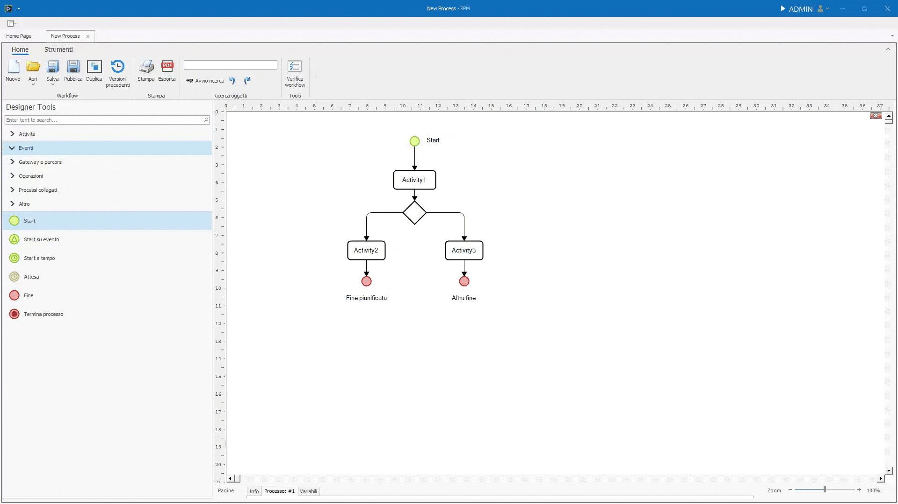
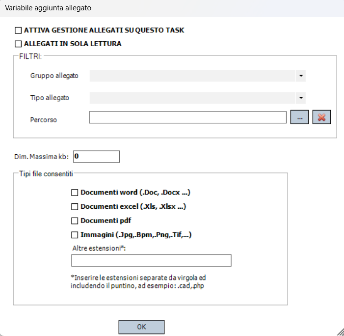

# Menù contestuale

Il **_Menù contestuale_** appare quando si preme il tasto destro del mouse su un oggetto nel canvas.  
Alcune opzioni saranno comuni a più oggetti, altre invece saranno differenti in base all'oggetto selezionato.

## Colore e font

Generalmente, in un oggetto è possibile cambiare:

* Colore e font della targhetta dell'elemento.
* Colore dello sfondo.
* Colore e spessore e del bordo.

## Allineamento
L'entrata Allineamento a sua volta ha 10 scelte, divise in 3 gruppi: 

#### Porta davanti e Porta dietro
Modifica lo **_Z-index_** di un oggetto: se un oggetto risulta sovrapposto ad un altro, per portarlo in avanti è sufficiente cliccare _Porta davanti_ per portarlo in primo piano. 
Lo stesso, ma al contrario, vale per _Porta dietro_.

#### Allinea
Permette di allineare gli elementi selezionati secondo il tipo di allineamento scelto, in base alla posizione dell'elemento su cui è stato cliccato il tasto destro. L'allineamento può essere verticale o orizzantale, sia agli estremi che al centro.

#### Distribuisci
Selezionando più oggetti(1)è possibile spostarli in massa distrubuendoli su uno dei loro assi utilizzando le due entrate _Distribuisci verticalmente_ o _Distribuisci orizzontalmente_.
{ .annotate }

1.  Per selezionare più oggetti è necessario tenere premuto ++ctrl++ o ++shift++ quando si va a cliccare, col tasto sinistro, su un elemento. Altrimenti, cliccando su una parte vuota del canvas e tenendo premuto, è possibile delineare un'area i cui elementi interno verranno selezionati.

## Manipolazione oggetto

Oltre a **_tagliare_** e **_copiare_** un oggetto, è possibile **_spostarlo da una pagina ad un'altra_** del processo tramite l'entrata _Sposta oggetto alla pagina ..._ .

## Manipolazione Testo e Label

Nel menù contestuale è presente l'entrata **_Sposta testo_** per spostare l'etichetta dell'oggetto dove si vuole nel canvas. Essa rimarrà ancorata al punto dove la si è spostata.
L'entrata **_Modifica Testo_** consente di modificare il testo della Label.

## Imposta come oggetto di avvio

Quest'entrata permette di impostare un oggetto come oggetto di avvio,rendendo l'oggetto su cui si è cliccato, il punto di partenza del processo.

!!! danger "Rimozione dello Start"
    È possibile rimuovere lo Start, ma è un comportamento non convenzionale e tendenzialmente sconsigliato in quanto il processo richiederà all'utente di inserire direttamente le variabili da richiedere.


## Utenti e responsabili

Tramite quest'entrata è possibile definire il ruolo degli utenti rispetto ad un'attività da svolgere. Si può lavorare sia su singoli utenti sia su **gruppi**. I ruoli possibili sono 3:

- **_Esecutore_** - chi dovrà svolgere effettivamente una determinata task.
- **_Responsabile_** - colui che assegnerà l'attività prima che venga eseguita (in caso il task sia configurato in questo modo).
- **_CC_** - utenti che devono vedere l'attività, ma senza poterci interagire.


## Variabili da richiedere

L'entrata **_Variabili da richiedere_** permette di definire i dati che gli utenti assegnati dovranno inserire.
Una volta cliccata, aprirà una nuova pagina dedicata all'inserimento delle variabili.  
Questa pagina, chiamata **Magazzino delle variabili**, viene trattata e approfondita nella sua sezione apposita [qui](../../variables/warehouse.md).
Per aggiungere una Variabile da richiedere, basta prenderne una dalla lista di sinistra e trascinarla nel canvas.
Così facendo, gli utenti a cui è assegnata la task, dovranno inserire i valori delle variabili così definite.




## Allegati da richiedere

È inoltre possibile definire gli allegati richiesti tramite l'entrata **_Allegati da richiedere_**.  
In questo caso non è possibile definire direttamente gli allegati da inserire, ma piuttosto, creare tramite un popup, dei filtri che vadano a scremare i possibili allegati inseribili.



Il popup presenta due checkbox:

- La prima, se spuntata, renderà funzionanti i filtri e le preferenze che vengono definite nel resto del popup.
- La seconda, invece, fa sì che gli allegati caricati non possano essere poi modificati.

Dopodiché una sezione dedicata ai filtri, 3 in particolare:

Il **_Gruppo allegato_** e il **_Tipo Allegato_**, definibili dal menù delle impostazioni alla sezione **_Configurazione_**, nel segmento **_Allegati_**, permettono di accettare solo allegati che appartengono a questi gruppi o tipi.

Il **_Percorso_** permette di filtrare gli allegati sulla base del percorso file in cui sono memorizzati, il quale deve appartenere a una delle cartelle interne al processo.  
Per crearne una è necessario cliccare la voce **_Allegati_** dalla [**barra degli strumenti**](../toolbar.md).  
Da lì si apriranno le impostazioni generali del processo relative agli allegati. Cliccando tasto destro sulla lista delle cartelle, sarà possibile crearne una nuova. Una volta fatto, sarà presente tra le scelte disponibili per determinare il percorso degli allegati di una task.

Sotto i Filtri, è possibile gestire la **_Dimensione Massima in KB_** (Dim. Massima kb), tramite un input numerico.
Il numero immesso sarà il tetto massimo per la dimensione di un file.  

Nella parte bassa troviamo invece il gruppo relativo ai Tipi di file consentiti.  
Tramite una serie di checkbox è possibile definire le estensioni dei file che possono essere accettati.  
La casella di testo finale permette di specificare ulteriori estensioni in caso ce ne fosse bisogno. 

!!! tip "Tali estensioni vanno separate dalla virgola e devono includere il punto"

``` title="Esempio di altre estensioni" linenums="1"
.cad,.php,.bat
```

## Operazioni

L'entrata relativa alle **_Operazioni_** apre un popup che permette di eseguire delle operazioni in diversi momenti della task.  
In base all'elemento su cui si apre il popup, i momenti in cui sarà possibile svolgere un'operazione saranno diversi.  
Per svolgere un'operazione basta trascinarla dalla colonna **_Operazioni disponibili_** a quella del momento in cui si desidera svolgerla.(1) 
{ .annotate }

1. Il titolo della colonna è il momento in cui verrà svolta l'operazione.

Le [**_Operazioni_**](./operations/intro.md) sono azioni specifiche e complesse che vengono svolte in ordine Top to Bottom.


## Pianificazione e Scadenze
Questa finestra permette di impostare i dettagli di pianificazione, scadenza e priorità relativi a una specifica attività.   
È diviso in 3 schede principali:

### Pianificazione e Scadenze
Permette di impostare la **durata prevista** e la **scadenza** di una task.
Presenta inoltre 3 checkbox per la gestione della pianificazione:

- _Da confermare_
- _Rileva inizio_
- _Utilizza calendario_

### Dati Attività

Consente di associare variabili ai campi relativi a una pianificazione aggiornata dell'attivit
consente di associare variabili a campi specifici relativi ai dati effettivi di un'attività.
permette di configurare le variabili per i dati effettivi dell'attività, ovvero i valori realmente registrati. I campi configurabili sono:
consente di associare variabili a campi specifici relativi ai dati pianificati 


I campi configurabili si dividono in 3 gruppi:

1. _Date **Aggiornate** Attività_: 
    * Data _inizio_ aggiornata: permette di collegare una variabile alla data di inizio aggiornata dell'attività nel calendario.
    * Data _fine_ aggiornata: permette di associare una variabile alla data di fine aggiornata dell'attività nel calendario.
    * _Durata_ aggiornata: permette di collegare una variabile che rappresenta la stima della durata aggiornata dell'attività (in giorni).


2. _Date **Effettive** Attività_ 
    * Data _inizio_ effettiva: permette di collegare una variabile alla data di inizio effettiva dell'attività nel calendario.
    * Data _fine_ effettiva: permette di associare una variabile alla data di fine effettiva dell'attività nel calendario.
    * _Durata_ effettiva: permette di collegare una variabile che rappresenta la stima della durata effettiva dell'attività in giorni.


3. _Date **Previste** Attività_
    * Data _inizio_ prevista/pianificata: permette di collegare una variabile alla data di inizio pianificata dell'attività nel calendario.
    * Data _fine_ prevista/pianificata: permette di associare una variabile alla data di fine pianificata dell'attività nel calendario.
    * _Durata_ prevista/pianificata: permette di collegare una variabile che rappresenta la stima della durata pianificata dell'attività in giorni.


### Dati Aggiuntivi
Qui troviamo 3 campi:

* **Scadenza** dell'attività, configura una variabile per rappresentare la data di scadenza a calendario dell'attività.

* **Priorità** dell'attività, consente di associare una variabile alla priorità assegnata all'attività.

* **Colore** dell'attività, consente di associare una variabile al colore assegnato all'attività nella todo list.


## Formula di validazione

La **_Formula di validazione_** è una formula che determina se è possibile continuare o meno con la task successiva del processo.
Cliccando su questa entrata, verrà aperto il popup per la scrittura della formula.  
Le formule di validazione degli elementi del canvas sono in una relazione **AND** con le altre formule definibili dalla barra degli strumenti della pagina delle variabili.


## Escalation

L'**_Escalation/Timeout_** è un'entrata del menù contestuale specifica di alcuni elementi.  
Con il suo utilizzo è possibile, dopo un determinato numero di giorni inserito dall'utente, eseguire le 3 azioni seguenti:

* Non variare l'attività
* Riassegnare l'attività, cedendo ad altri utenti la possibilità di mandare avanti il processo
* Terminare l'attività

Dall'Escalation è poi possibile far partire un [link](./activities/link.md) specifico, il quale indica al processo la strada alternativa da percorrere se l'escalation si verifica effetivamente, ad esempio in caso di riassegnazione o chiusura della task.


## Configurazione

L'entrata **_Configurazione_** è differente per ogni elemento e viene approfondita nelle sezioni relative ai singoli elementi.