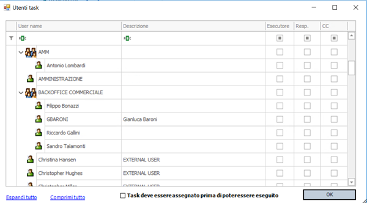
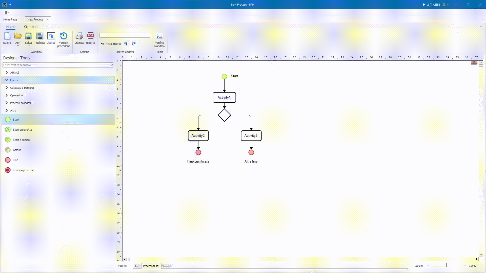
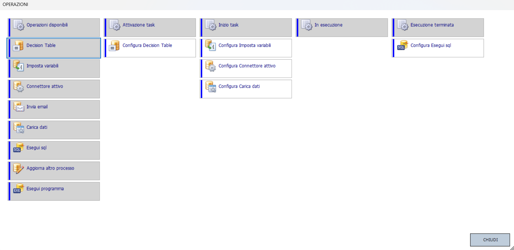
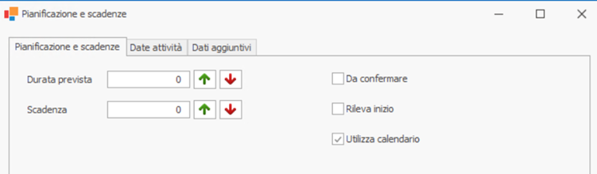
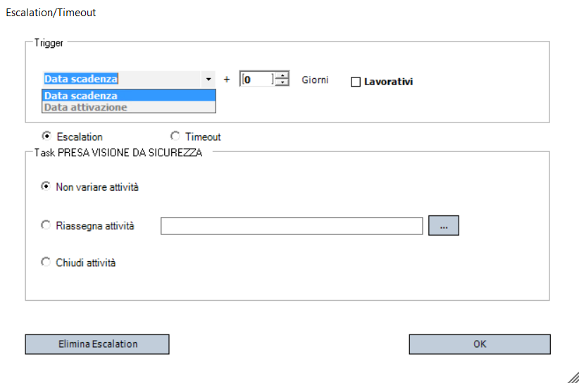
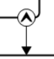

# Menu contestuale

Il **_Menu contestuale_** appare quando si preme il **tasto destro del mouse su un oggetto** nel canvas.  
Le _opzioni visibili saranno differenti per ciascun tipo di oggetto selezionato_, ma alcune di essere saranno invece comuni a tutti gli oggetti.


## Allineamento
L'entrata Allineamento a sua volta ha 10 scelte, divise in 3 gruppi: 

### Porta davanti e Porta dietro
Modifica lo _Z-index_ di un oggetto: se un oggetto risulta sovrapposto ad un altro, per portarlo in avanti è sufficiente cliccare _Porta davanti_ per portarlo in primo piano.   
Lo stesso, ma al contrario, vale per _Porta dietro_.

### Allinea
Permette di allineare gli elementi selezionati secondo il tipo di allineamento scelto, in base alla posizione dell'elemento su cui è stato cliccato il tasto destro. L'allineamento può essere verticale o orizzantale, sia agli estremi che al centro.

### Distribuisci
Selezionando più oggetti(1)è possibile spostarli in massa distrubuendoli su uno dei loro assi utilizzando le due entrate _Distribuisci verticalmente_ o _Distribuisci orizzontalmente_.
{ .annotate }

1.  Per selezionare più oggetti è necessario tenere premuto <kbd>ctrl</kbd> o ++shift++ quando si va a cliccare, col tasto sinistro, su un elemento. Altrimenti, cliccando su una parte vuota del canvas e tenendo premuto, è possibile delineare un'area i cui elementi interno verranno selezionati.


## Colore e font

Tramite questa voce è possibile cambiare:

- Colore e font dell'**etichetta** dell'elemento.
- Colore dello **sfondo**.
- Colore del **bordo**.


## Manipolazione oggetto

- **Taglia**: Rimuove l'oggetto dalla posizione corrente e lo salva temporaneamente in memoria per poterlo incollare altrove.
- **Copia**: Salva in memoria l'oggetto per incollarlo in un'altra posizione, duplicandolo.
- **Sposta oggetto alla pagina ...**: permette di spostare l'oggetto in un'altra pagina del processo.


## Manipolazione testo e label

- **Sposta testo** per spostare l'etichetta dell'oggetto dove si vuole nel canvas. Essa rimarrà ancorata al punto dove la si è spostata.
- **Modifica Testo** consente di modificare il testo dell'etichetta. Azione eseguibile anche da tastiera tramite il tasto <kbd>F2</kbd> sull'oggetto selezionato.

## Imposta come oggetto di avvio

Quest'entrata permette di impostare un oggetto come oggetto di avvio,rendendo l'oggetto su cui si è cliccato, il punto di partenza del processo.

!!! danger "Rimozione dello Start"
    È possibile rimuovere lo Start, ma è un comportamento non convenzionale e tendenzialmente sconsigliato in quanto il processo richiederà all'utente di inserire direttamente le variabili da richiedere.


## Utenti e responsabili



Tramite quest'entrata è possibile definire il ruolo degli utenti rispetto ad un oggetto su cui è necessario svolgere una qualsiasi azione da parte di un dipendente.  

Si può lavorare sia su **singoli utenti** sia su **gruppi** di utente.

Oltre ad utenti/gruppi statici è possibile gestire **variabili** di tipo **UserType**, identificate dal simbolo @ all’inizio del nome e descritte più in dettaglio [qui](../../variables/types/usertype.md).  
L'uso di queste variabili consente il **routing dinamico** dei task sulla base dei dati del processo in corso e garantiscono la massima flessibilità nei workflow complessi, adattandosi automaticamente a chi deve realmente gestire l'attività.

Nella parte inferiore della ffinestra di configurazione è inoltre presente il flag:

-	_Task deve essere assegnato prima di poter essere eseguito_

Non selezionato: Il primo utente disponibile tra gli esecutori può prendere in carico o eseguire direttamente il task. Nessuna assegnazione preventiva è necessaria.
Selezionato: Il responsabile deve assegnare esplicitamente il task a un esecutore. Solo l'assegnatario potrà poi eseguire l'attività.

I ruoli assegnabili a utenti o gruppi sono 3:

- **_Esecutore_** - chi dovrà svolgere effettivamente la task.
- **_Responsabile_** (opzionale) - colui che assegnerà l'attività ad un esercutore prima che venga eseguita (in caso il task sia configurato in questo modo).
- **_Utenti in copia (CC)_** - utenti che ricevono aggiornamenti sull'andamento del task ma non hanno responsabilità operative dirette.


## Variabili da richiedere

L'entrata **_Variabili da richiedere_** permette di definire i dati che l'utente dovrà inserire o visualizzare durante l'esecuzione dell'oggetto.  

Una volta cliccata, aprirà una nuova pagina dedicata all'inserimento delle variabili, a partire dalla struttura globale delle variabili di processo.  
Questa è una versione limitata dell'editor variabili di processo/documento, chiamato **Magazzino delle variabili** e approfondito [qui](../../variables/warehouse.md), in cui:

- Non è possibile creare nuove variabili.
- Si possono solo selezionare variabili esistenti definite a livello di processo o documento.

Per aggiungere una variabile da richiedere, basta prenderne una dalla lista di sinistra e trascinarla nel canvas.
Così facendo, gli utenti a cui è assegnata la task, dovranno inserire i valori delle variabili così definite.




## Allegati da richiedere

Tramite l'entrata **_Allegati da richiedere_** à inoltre possibile definire gli allegati richiesti e gestiti nell'oggetto.
In questo caso non è possibile definire direttamente gli allegati da inserire, ma piuttosto, creare tramite un popup, dei filtri che vadano a scremare i possibili allegati inseribili.


Il popup presenta due checkbox:

- La prima, se spuntata, renderà funzionanti i filtri e le preferenze che vengono definite nel resto del popup. Inoltre, farà si che l'utente assegnato a questo oggetto vedrà durante l'esecuzione un tab con l’albero degli allegati associati al processo/documento.

- La seconda, invece, determina se gli allegati caricati possano essere successivamente modificati o se solamente visti.

Dopodiché una sezione dedicata ai filtri, 3 in particolare:

Il **_Gruppo allegato_** e il **_Tipo Allegato_**, definibili dal menu delle impostazioni alla sezione **_Configurazione_**, nel segmento **_Allegati_**, permettono di accettare solo allegati che appartengono a questi gruppi o tipi.

Il **_Percorso_** permette di filtrare gli allegati sulla base del percorso file in cui sono memorizzati, il quale deve appartenere a una delle cartelle interne al processo.  
Per crearne una è necessario cliccare la voce **_Allegati_** dalla [**barra degli strumenti**](../toolbar.md).  
Da lì si apriranno le impostazioni generali del processo relative agli allegati. Cliccando tasto destro sulla lista delle cartelle, sarà possibile crearne una nuova. Una volta fatto, sarà presente tra le scelte disponibili per determinare il percorso degli allegati di una task.

Sotto i Filtri, è possibile gestire la **_Dimensione Massima in KB_** (Dim. Massima kb), tramite un input numerico.
Il numero immesso sarà il tetto massimo per la dimensione di un file.  

Nella parte bassa troviamo invece il gruppo relativo ai **_Tipi di file_**_ consentiti.  
Tramite una serie di checkbox è possibile definire le estensioni dei file che possono essere accettati.  
La casella di testo finale permette di specificare ulteriori estensioni in caso ce ne fosse bisogno. 

!!! tip "Tali estensioni vanno separate dalla virgola e devono includere il punto"

``` title="Esempio di altre estensioni" linenums="1"
.cad,.php,.bat
```

!!! note "⚡ Nota: "
    in BPM gli allegati sono organizzati in "cartelle" logiche, anche se fisicamente sono salvati nello stesso spazio.

## Operazioni



Nel contesto di un processo BPM, le operazioni rappresentano **attività automatiche** (come esecuzione di query SQL, invio di mail, chiamate a web service, ecc.) che possono essere inserite nel workflow esattamente come un task manuale.  
Le operazioni configurabili sono diverse e vengono illustrate in dettaglio nella sezione dedicata, che puoi trovare [**qui**](./operations/intro.md).

Invece di utilizzare un oggetto per ciascuna operazione come di norma, il sistema consente anche di associare direttamente le operazioni già disponibili nel BPM a momenti di vita specifici dell'oggett, tramite l'entrata **_Operazioni_** del menu contestuale.

Questo comporta diversi vantaggi:

- **Leggibilità**: permette di evitare di appesantire il disegno del flusso con dettagli tecnici di integrazione o automazione, che restano contestualizzati dentro l'oggetto.
- **Centralizzazione**: gestione delle logiche tecniche all'interno di punti strategici, senza sporcare il disegno principale del workflow.
- **Modularità**: ogni oggetto può avere comportamenti automatici senza bisogno di ulteriori nodi nel processo.

Quest'entrata apre una schermata di configurazione dove, in base all'oggetto su cui lo si apre, sarà possibile configurare l'operazione da svolgere in momenti differenti. 
Per assegnare un'operazione basta trascinarla (drag & drop) dalla colonna **_Operazioni disponibili_** a quella del momento in cui si desidera svolgerla (1).  
Le operazioni assegnate vengono poi svolte in ordine *Top to Bottom*.
{ .annotate }

1. Il titolo della colonna è il momento in cui verrà svolta l'operazione.

I momenti di vita dell'oggetto a cui si possono agganciare le operazioni sono:

1.	**Attivazione**
    - Quando l'oggetto diventa disponibile per l’utente, subito dopo il completamento dei task precedenti.
    > Tipico uso: inviare notifiche agli utenti o ad altri sistemi.

2.	**Inizio**
    - Opzione esclusiva dell'oggetto Attività.
    - Scatta solo se il task ha attiva la proprietà 'Rileva inizio'.
    - Parte quando l’utente inizia effettivamente l'attività dalla sua todo list.
    - In caso contrario, questo evento non viene lanciato.

3.	**In Esecuzione**
    - Scatta subito prima del completamento del task.
    - Dopo il click su "COMPLETATO" da parte dell'utente, ma prima delle formule di validazione.

4.	**Esecuzione Terminata**
    - Scatta dopo il completamento definitivo del task e dopo il superamento delle validazioni.
    - L’effetto è simile a un normale avanzamento nel flusso, ma senza dover disegnare ulteriori task.
    - La differenza con il precedente è sottile, ma in questo caso siamo sicuri che il flusso abbia già superato le formule di validazione senza bloccarsi.


## Pianificazione e Scadenze

Questa finestra permette di configurare i parametri temporali dell'attività, come: i dettagli di _pianificazione_, le _scadenza_ e le _priorità_.   
È fondamentale per una gestione efficace delle scadenze e per il corretto funzionamento delle automazioni del processo.  
È diviso in 3 schede principali:

### Pianificazione e Scadenze



Permette di impostare:
- **Durata prevista**: il numero di giorni previsti per completare il task. 
- **Scadenza**: Definisce il termine massimo entro cui il task deve essere completato, calcolato in giorni a partire dalla data di inizio.  

Presenta inoltre 3 checkbox per la gestione della pianificazione:

- **Da confermare**: se abilitato, indica che la pianificazione deve essere approvata manualmente.
- **Rileva inizio**: se selezionato, il sistema attiva la rilevazione della data inizio effettivo da parte dell’utente, ossia quando inizia l'attività dalla sua todo list. _Necessaria_ se si vuole assegnare un'operazione all'evento di _Inizio task_.
- **Utilizza calendari**: se abilitato, il calcolo della durata e delle scadenze considera solo i giorni lavorativi definiti nel calendario aziendale (esclude weekend, festività, ecc.). 

### Dati Attività
Consente di associare variabili a campi specifici relativi ai dati aggiornati/effettivi/pianificati di un'attività.  
I campi configurabili si dividono in 3 gruppi e sono:

1. _Date **Aggiornate** Attività_: 
    * Data _inizio_ aggiornata: permette di collegare una variabile alla data di inizio _aggiornata_ dell'attività nel calendario.
    * Data _fine_ aggiornata: permette di associare una variabile alla data di fine _aggiornata_ dell'attività nel calendario.
    * _Durata_ aggiornata: permette di collegare una variabile che rappresenta la stima della durata _aggiornata_ dell'attività (in giorni).

2. _Date **Effettive** Attività_ 
    * Data _inizio_ effettiva: permette di collegare una variabile alla data di inizio _effettiva_ dell'attività nel calendario.
    * Data _fine_ effettiva: permette di associare una variabile alla data di fine _effettiva_ dell'attività nel calendario.
    * _Durata_ effettiva: permette di collegare una variabile che rappresenta la stima della durata _effettiva_ dell'attività in giorni.

3. _Date **Previste** Attività_
    * Data _inizio_ prevista/pianificata: permette di collegare una variabile alla data di inizio _pianificata_ dell'attività nel calendario.
    * Data _fine_ prevista/pianificata: permette di associare una variabile alla data di fine _pianificata_ dell'attività nel calendario.
    * _Durata_ prevista/pianificata: permette di collegare una variabile che rappresenta la stima della durata _pianificata_ dell'attività in giorni.


### Dati Aggiuntivi


Qui possiamo mappare le variabili di processo a 3 campi:

* **_Scadenza_** dell'attività: associa la scadenza calcolata a una variabile del processo per poterla usare altrove (es. notifiche).

* **_Priorità_** dell'attività: associa una variabile di processo alla priorità del task. Possiamo mappare valori specifici con la funzione Mappatura valori.
!!! danger Attenzione
    Se non configuri correttamente questa mappatura, il task potrebbe risultare senza priorità e comportarsi in modo anomalo nelle liste.

* **_Colore_** dell'attività: definisce dinamicamente il colore con cui il task verrà visualizzato nella todo list, in base a una variabile del processo.


## Formula di validazione

La **_Formula di validazione_** è una formula che determina se è possibile continuare o meno con la task successiva del processo.
Cliccando su questa entrata, verrà aperto il popup per la scrittura della formula.  
Le formule di validazione degli elementi del canvas sono in una relazione **AND** con le altre formule definibili dalla barra degli strumenti della pagina delle variabili.


## Escalation



**_Escalation/Timeout_** è una voce del menu contestuale esclusiva dell'oggetto [_Attività_](./activities/task.md).

Quando un task supera il tempo previsto (scadenza o durata massima), è necessario definire come il processo deve reagire.

La data di trigger del timeout/escalation può essere configurata in due modi:

- Data di **scadenza** + N giorni: scatta dopo un certo numero di giorni dalla scadenza prevista.
- Data di **attivazione** + N giorni: alternativa utile quando vuoi gestire il timeout a partire dall'inizio dell'attività e non dalla scadenza.

I giorni possono essere impostati come giorni lavorativi o qualsiasi tramite l'apposita spunta.

Nella finestra di configurazione è possibile definire il comportamento automatico del sistema in questi casi.

Quando il task supera il limite impostato, sono 3 le azioni sul task stesso che si possono configurare:

-  **Non variare** l'attività: lascia il task aperto, senza fare nulla.

-  **Riassegnare** l'attività: sposta il task su un altro utente o gruppo cedendo ad altri utenti la possibilità di mandare avanti il processo (es. scalando il problema ai livelli superiori).

-  **Terminare** l'attività: termina automaticamente il task come annullato.

### Attivare flusso alternativo

All'attivazione del trigger dell'escalation/timeout è poi possibile anche reindirizzare il processo su un nuovo percorso.   
Alcuni esempi concreti tipici sono: invio di notifiche/promemoria, assegnazione di nuovi task a chi deve gestire l'eccezione...

Per configurare il **flusso alternativo** è necessario creare un _link 'speciale'_ a partire da un punto specifico del task, indicato dal simbolo:



questo collegamento indicherà al processo la strada alternativa da percorrere in caso si verifichi l'escalation/timeout.

!!! note "⚡ Nota operativa"
    Dal punto di vista tecnico non cambia nulla scegliere Timeout o Escalation, il sistema reagisce allo stesso modo anche se l'icona è diversa nei due casi.  
    La distinzione serve solo per dare un'indicazione "semantica" su cosa si sta gestendo:

    - Timeout → il task semplicemente è scaduto.
    - Escalation → serve l'intervento di livelli superiori o alternative di processo.


## Configurazione

L'entrata _Configurazione_ è totalmente differente per ogni oggetto e viene approfondita nelle sezioni relative ai singoli elementi.


## Eliminazione

Tramite questa funzione è possibile **cancellare** l'oggetto selezionato dal canvas.  
In automatico vengono cancellati anche tutti i _collegamenti_ che hanno l'oggetto come punto di partenza o di arrivo.  

Si può anche utilizzare direttamente il tasto <kbd>canc</kbd> da tastiera.


## Extra: Oggetti tipo Link

Utilizzando il menu contestuale su oggetti di tipo [link](./activities/link.md) si possono vedere altre opzioni specifiche per questo elemento:

 - _Percorso per abilitazione_
 - _Condizioni di abilitazione_
 - _Imposta variabili_
 - _Tipo linea_
 - _Elimina collegamento_

Gli scopi di tutte queste voci sono spiegati nel dettaglio nella sezione dedicata ai link, che puoi trovare [**qui**](./activities/link.md).