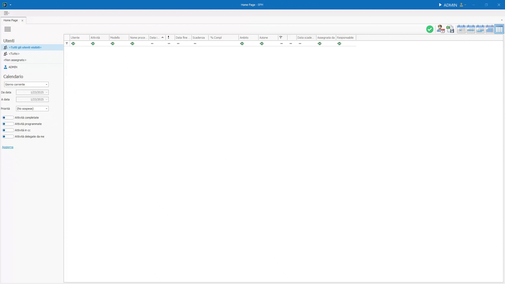
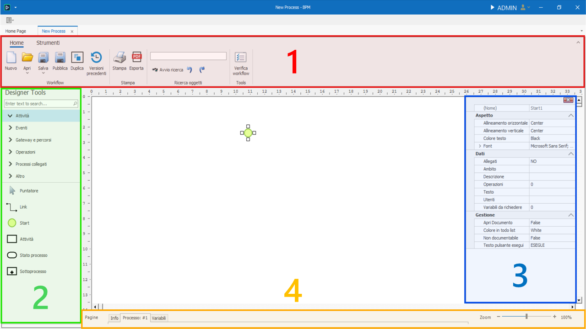

# Designer di processi

Il Designer di processi del BPM è uno strumento grafico e interattivo che consente agli utenti di progettare, modellare e ottimizzare i processi aziendali attraverso un'interfaccia visiva. Si tratta di un ambiente di sviluppo no-code o low-code pensato per trasformare procedure complesse in flussi di lavoro organizzati e automatizzati.

## Creare un processo

Un processo, chiamato anche Workflow, è un diagramma di flusso dove ogni forma o immagine che lo compone svolge una determinata azione.  

Tramite il Designer è possibile disegnare tali processi in modo intuitivo tramite semplici azioni di drag & drop.  

Creare un nuovo modello di processo è semplice: basta recarsi nel pannello delle impostazioni in alto a sinistra, poi cliccare la voce **Modelli di Processo** ed infine cliccare **Nuovo modello di processo**.

---

## Gli strumenti del Designer

Gli strumenti del Designer sono suddivisi in più sezioni: 

1) Una [barra superiore degli strumenti](toolbar.md) in cui troviamo tools generali per la manipolazione del processo, degli elementi e dei loro attributi.

2) Una sidebar di sinistra, chiamata [Designer Tools](./designer-tools/intro.md), che contiene una serie di strumenti per disegnare il processo tramite drag & drop.

3) Una sidebar di destra in cui possiamo vedere tutti gli attributi relativi all'elemento attualmente selezionato. In caso di chiusura accidentale, è possibile riaprire tale pannello premendo F4.

4) Una sezione nella parte inferiore contente le etichette delle diverse pagine di lavoro attualmente aperte e una scroll bar per regolare lo zoom su queste pagine.
Inizialmente la pagina selezionata è quella del processo, in cui troviamo tutti gli elementi grafici del flusso. Subito a sinistra troviamo la [Pagina Info](pagina-info.md) per la configurazione delle impostazioni di processo. Sulla destra invece troveremo man mano tutte le altre finestre di lavoro aperte, ad esempio quella relativa alle variabili di progetto o quelle delle variabili delle singole attività.

---

## Costruire un modello di processo

Quando creiamo un nuovo modello di processo non troveremo il canvas completamente vuoto, ma sarà già presente un singolo elemento, un punto di inizio, detto Start.

Nella maggior parte dei casi, un flusso ha un inizio e almeno una fine.

L'inizio, può essere sovrascritto: cliccando tasto destro su un altro elemento presente sul canvas, dal menù contestuale si può scegliere l'opzione **Imposta come oggetto di avvio**. Così facendo il flusso inizierà dall'elemento impostato come oggetto di avvio.

!!! danger "Rimozione dello Start"
    È possibile rimuovere lo Start, ma è un comportamento non convenzionale e tendenzialmente sconsigliato in quanto il processo richiederà all'utente di inserire direttamente le variabili da richiedere.

Dalla sidebar di sinistra, sarà ora possibile iniziare a disegnare il processo trascinando direttamente gli oggetti sul canvas. 

Ogni elemento può o deve essere collegato ad altri elementi o a se stesso tramite i **Link**, frecce orientate che indicano i vari percorsi che il processo può instradare.  

Selezionando uno degli oggetti disegnati, sulla destra si aprirà il pannello degli attributi ad esso riferiti. 
Ogni oggetto ha delle proprietà, alcune di esse sono comuni a tutti, mentre altre sono specifiche del tipo di oggetto.   

