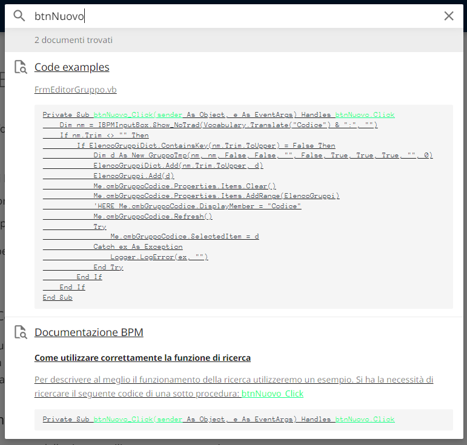

# BPM Documentation

In this Wiki, you can find the information you need to:

* Solve a problem
* Discover functionalities you require
* Make your workflows more efficient
* Understand the main features of the tool

To request the addition of a specific topic to this Wiki, [create an issue on the appropriate GitHub repository](https://github.com/centrosoftware-dev/bpm-docs/issues).

## How the search works
Since this Wiki is hosted on GitHub Pages, we cannot rely on search engines to browse it and find what we need.  
The search feature is, therefore, the best tool for navigating the documentation.

### How to correctly use the search function
To better explain how the search works, we will use an example.  
Suppose you need to search for the following code of a sub-procedure:

```vb.net title="btnNuovo_Click" linenums="1"
Private Sub btnNuovo_Click(sender As Object, e As EventArgs) Handles btnNuovo.Click
```

The search will yield results as long as you enter the beginning of a word as text.



N.B. A "word" is defined as any sequence of characters found between two empty spaces.

For instance, if you were to search for the code above by entering the word "Nuovo" in the search bar, you would not get any results, as "Nuovo" is not the beginning of a word.


### How to know which terms to search for
Unfortunately, the only way is trial and error, using the most relevant words for the topic you want to search for.

> Damn programmers: you really want to make yourselves hated! :angry_face_flat:

Unfortunately, this is our burden.  
For any questions about functionalities, problems, and errors, contact me on Microsoft Teams (mandreoli), via Email (mandreoli@centrosoftware.com), or simply by opening an issue on the [documentation GitHub repository](https://github.com/centrosoftware-dev/bpm-docs/issues).
