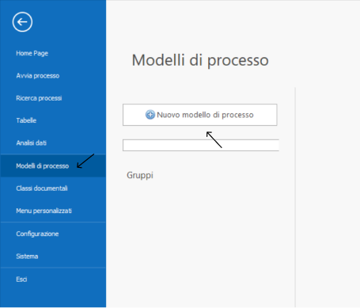

# Il Designer

Il Designer e Costruttore di Flussi del BPM è uno strumento grafico e interattivo che consente agli utenti di progettare, modellare e ottimizzare i processi aziendali attraverso un'interfaccia visiva. Si tratta di un ambiente di sviluppo no-code o low-code pensato per trasformare procedure complesse in flussi di lavoro organizzati e automatizzati.

## Creare un processo

Un processo, chiamato anche Workflow, è un diagramma di flusso dove ogni forma o immagine che lo compone svolge una determinata azione.  

Tramite il Designer è possibile disegnare tali processi.  

Creare un nuovo modello di processo è semplice: basta recarsi nel pannello delle impostazioni in alto a sinistra, poi cliccare la voce **Modelli di Processo** ed infine cliccare **Nuovo modello di processo**.

## Gli strumenti del Designer

Gli strumenti del Designer sono suddivisi in più sezioni: una barra superiore, una sidebar di sinistra, chiamata Designer Tools e una sidebar di destra, contenente tutti gli attributi di un elemento.

Nella barra superiore troviamo:  

+ **Nuovo**, per creare un nuovo modello.
+ **Apri**, per importare un modello da una repository o da un file locale.
+ **Salva**, in una repository, in locale o, se si volesse salvare il disegno del processo, come immagine.
+ **Pubblica**, le modifiche apportate al modello, una volta salvate, per essere esportate ai processi attivi vanno pubblicate.
+ **Duplica**, viene creata una copia del modello in modifica.
+ **Stampa o Esporta**, similmente al salvataggio come immagine, qui il modello viene stampato fisicamente o virtualmente in versione PDF.
+ **Ricerca oggetti**, tramite una textbox, vengono evidenziati gli elementi la cui descrizione coincide col testo scritto al suo interno.
+ **Verifica Workflow**, tramite un popup vengono elencate gli avvertimenti e gli errori all'interno del processo corrente.

Nella sidebar di sinistra abbiamo una serie di strumenti per disegnare il processo.

Nella sidebar di destra si trovano tutti gli attributi relativi all'elemento attualmente selezionato.

Gli approfondimenti sugli elementi del Designer Tools e i loro attributi si trovano nella sezione [Designer Tools e Pannello Attributi](../Designer/DesignerTools-Attributes.md).

## Costruire un modello di processo

Dalla sidebar di sinistra, trascinando un oggetto sul canvas, esso verrà disegnato nel processo.

Queste attività possono o devono essere collegate tra loro. Ogni singola attività ha delle proprietà. Alcune di esse sono comuni a tutte le attività, mentre altre sono specifiche per le singole attività.  

Ogni elemento va collegato col precendente o con se stesso tramite i **Link**, delle frecce che indicano i vari percorsi che il processo può instradare.  

Selezionando uno degli oggetti disegnati, sulla destra si aprirà il pannello degli attributi ad esso riferiti.  
In caso di chiusura accidentale, è possibile riaprire tale pannello premendo F4.  

Nella maggior parte dei casi, un flusso ha un inizio e almeno una fine.

!!! danger "Rimozione dello Start"
    È possibile rimuovere lo Start, ma è un comportamento non convenzionale e tendenzialmente sconsigliato in quanto il processo richiederà all'utente di inserire direttamente le variabili da richiedere.

L'inizio, quindi, può essere sovrascritto: cliccando tasto destro su un elemento presente sul canvas, dal menù contestuale si può scegliere l'opzione **Imposta come oggetto di avvio**. Così facendo il flusso inizierà dall'elemento impostato come oggetto di avvio.