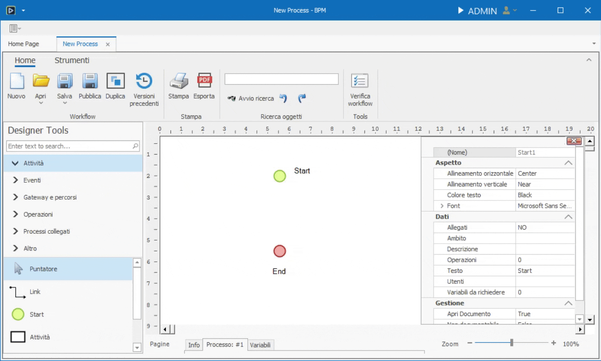

# Designer Tools e Pannello Attributi

In questa pagina verranno descritte dettagliatamente tutte le sezioni e gli elementi al loro interno.  

Il Designer Tools è il pannello che si trova sulla sinistra, mentre il Pannello Attributi si apre una volta che viene selezionato un elemento presente sul canvas.  

## Designer Tools
Il Designers Tools è suddiviso in 6 sezioni.  

Alla sommità è situata la search bar. Digitando al suo interno è possibile filtrare gli oggetti delle varie sezioni. I risultati della ricerca appariranno nella propria sezione. Se più oggetti corrispondono col termine ricercato, verranno mostrati nelle proprie sezioni, se diverse, collassate.

### Attività

Sezione contenente i principali elementi di un flusso.

#### Puntatore

Cliccandolo, riporta le funzionalità del mouse a quelle standard: click per tasto sinistro e menù contestuale per tasto destro.  

Non essendo trascinabile nel canvas e, quindi, **non essendo un elemento**, non possiede attributi.

#### Link

Il link è un collegamento tra un elemento e un altro.  

Una volta selezionato dal Designer Tools, passando il cursore sopra un elemento, appariranno dei cerchi gialli. Selezionando un cerchio e tenendo premuto il tasto sinistro, inizierà il tracciamento del link.  

Mentre si sta tracciando, passando il cursore su un elemento differente dal primo, è possibile collegarlo ad uno dei punti del destinatario.

Fatto ciò, i due elementi saranno collegati: spostandoli all'interno del canvas, il link rimarrà ancorato ad essi.  

Cliccando sul collegamento con il tasto destro del mouse, si aprirà il menù di contesto contenente una lista di proprietà:

* Nome Collegamento, aprirà un dialog dove poter inserire il nome del link che verrà mostrato nel canvas.
* Percorso per Pianificazione, se spuntato, il processo, al suo inizio, riterrà il collegamento come percorso default per determinare le attività future.
* Condizioni Abilitazione, complementari al Percorso per Pianificazione, le condizioni di abilitazione decidono se un Link sia percorribile o meno. Tale decisione è basata sulle formule scritte nel dialog che si apre una volta cliccata l'opzione.
* Imposta variabili, è possibile impostare delle variabili quando il link viene attraversato, arrivando a destinazione coi nuovi valori assegnati.
* Tipo Linea, è possibile decidere tra le varie opzioni il comportamento del link all'interno del canvas.
* Elimina Collegamento

Nel pannello degli attributi di un link inoltre sono disponibili tutte le caratteristiche legate al font del nome di un collegamento.  

#### Start

Lo Start è il punto di inizio di ogni flusso manualmente azionato.  

