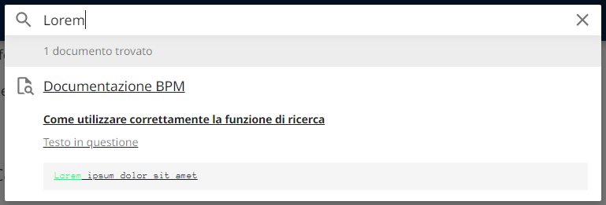

# Documentazione BPM

# **SITO IN COSTRUZIONE**

Questa documentazione aiuta a:

* Risolvere una problematica
* Scoprire funzionalità di cui si ha bisogno
* Rendere più efficienti i tuoi workflow
* Capire il funzionamento delle feature dello strumento

Per richiedere l'aggiunta di uno specifico argomento, [scrivi una issue a riguardo sul GitHub apposito](https://github.com/centrosoftware-dev/bpm-docs/issues).

## Come funziona la ricerca
In quanto questa documentazione è hostata sulle pagine di GitHub, non è possibile avvalersi dei motori di ricerca per scandagliarla e trovare ciò che si cerca.
La ricerca, quindi, è lo strumento migliore per navigare la documentazione.

### Come utilizzare correttamente la funzione di ricerca
Per descrivere al meglio il funzionamento della ricerca verrà mostrato un esempio.  
Si ha la necessità di ricercare il seguente testo:

``` title="Testo in questione" linenums="1"
Lorem ipsum dolor sit amet
```

La ricerca darà risultati affinché inseriremo l'inizio di una parola.



N.B. per parola è intesa una qualsiasi successione di caratteri che si trova tra due spazi vuoti.  

Infatti, se si cercasse  nella barra la parola "sum", non si otterrebbero risultati, in quanto "sum" non è l'inizio di una parola.


### Come sapere quali termini cercare 
Purtroppo, l'unico modo è provare per tentativi, utilizzando le parole più significative dell'argomento da cercare.
 
Per ogni dubbio su funzionalità, problemi ed errori, contattatemi su Microsoft Teams (mandreoli), per Email (mandreoli@centrosoftware.com) o più semplicemente aprendo una issue sul [GitHub della documentazione](https://github.com/centrosoftware-dev/bpm-docs/issues).