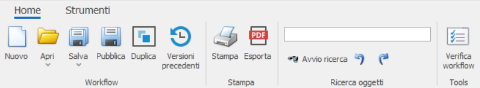
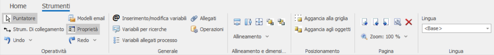

# Barra degli strumenti

## Home

Qui sono presenti le principali azioni relative al modello di processo, suddivise in quattro sezioni:

### **Workflow**

##### Nuovo

Per creare un nuovo modello.

##### Apri

Per importare un modello da una repository o da un file locale.

##### Salva

Salva il modello in un repository o in locale; permette anche di salvare il disegno come immagine.

##### Pubblica

Per pubblicare le modifiche apportate al modello, una volta salvate, per essere esportate ai processi attivi vanno pubblicate.

##### Duplica

Viene creata una copia del modello in modifica.

### **Stampa**

##### Stampa o Esporta

Similmente al salvataggio come immagine, qui il modello viene stampato fisicamente o virtualmente in versione PDF.

### **Ricerca oggetti**

Tramite una textbox, vengono evidenziati gli elementi la cui descrizione coincide col testo scritto al suo interno.

### **Tools**

##### Verifica Workflow

Mostra in un popup gli avvertimenti e gli errori rilevati nel modello corrente.

---

## Strumenti

Qui troviamo i principali strumenti per il design del flusso di lavoro e per la gestione delle variabili del processo, divisi in 5 sezioni:

### **Operatività**

##### Puntatore

Il bottone [Puntatore](puntatore.md) serve per tornare alla modalita standard del cursore. 

##### Strumento di collegamento

Permette di creare dei [Link](../elementi/link.md) tra gli elementi del modello.

##### Undo

Permette di annullare l'ultima operazione svolta o di scegliere quante annullarne in una sola volta, mostrando un elenco di brevi descrizioni delle ultime azioni compiute.

##### Modelli email

Lo strumento Modelli email apre in un dialog un popup che consente la creazione, la modifica, la duplicazione e l'eliminazione dei modelli email.

##### Proprietà

Permette di visualizzare/nascondere il pannello degli attributi sulla destra.

### **Generale**

##### Inserimento/modifica variabili

Cliccando su questo pulsante si apre il [Magazzino delle variabili](../../parti-comuni/editor-variabili/magazzino-delle-variabili.md).

##### Variabili per ricerche

Permette di scegliere dal magazzino delle variabili quali utilizzare per le ricerche.

##### Variabili allegati processo

Permette di visualizzare e modificare le variabili relative agli allegati del processo.

##### Allegati

Permette di inserire ed eliminare gli allegati del processo tramite un dialog, creando anche le apposite directory.

### **Allineamento e dimensioni**
Qui troviamo diverse diversi pulsanti e dropdown per modificare le dimensioni, l'allineamento e il piano su cui si trovano gli elementi selezionati.

### **Posizionamento**

Questa sezione contiene due proprietà del canvas utili per la parte grafica:

##### Aggancia alla griglia

Attivando questa proprietà il canvas diventa puntinato: lo spostamento e il ridimensionamento degli oggetti sarà guidato dai punti sul piano di disegno.

##### Aggancia agli oggetto

Attivando questa proprietà lo spostamento e il ridimensionamento degli oggetti sarà guidato dai bordi degli altri oggetti.

### **Pagina**

In questa sezione sono presenti 5 pulsanti e il dropdown per lo zoom del canvas.

##### Nuova pagina

Il primo bottone, Nuova pagina, crea una nuova pagina nel processo.

##### Pagina precedente e Pagina successiva

Il secondo e terzo bottone servono per cambiare la pagina visualizzata, andando alla precedente o alla successiva.

##### Imposta pagina

Il quarto bottone, Imposta pagina, apre un dialog che mostra le varie impostazioni del canvas/pagina.  
Dal popup è possibile impostare i margini e il formato della pagina, basato sullo standard A dei fogli per stampanti, e il loro orientamento, se Portrait o Landscape.  
In basso e possibile gestire l'orientamento delle [Swim lane](../elementi/elementi-grafici.md#gruppo-e-swim-lane), scegliendo tra verticale e orizzontale.

##### Elimina

Quest'ultimo bottone serve ad eliminare la pagina corrente.

!!! note "Requirement per cancellazione"
    È possibile cancellare solo pagine vuote.

### **Lingua**

Dall'ultima sezione è possibile scegliere la lingua tramite dropdown.
