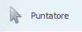

# Puntatore

Cliccando sopra alla relativa icona:

le funzionalità del mouse verranno riportate a quelle standard: 

- **click** per il tasto sinistro 
- [**menu contestuale**](menu-contestuale.md) per il tasto destro.  

Non essendo trascinabile nel canvas e, quindi, **non essendo un elemento**, non possiede attributi.

