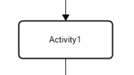

# Attività (Task)

Un'attività rappresenta un'**unità operativa da eseguire** all'interno di un processo.  
Ogni task, prima o poi, finisce nella **todo list** di una o più persone a cui è assegnata, diventando così visibile e gestibile nel flusso di lavoro.

## Utilizzo
 - Definisce le **azioni** da eseguire all'interno di un flusso di lavoro.
 - Permette agli **utenti** di **interagire con il processo**: eseguendo azioni, assegnando valori alle variabili tramire i relativi campi o anche semplicemente permettendogli di visualizzare dati significativi.

## Caratteristiche principali

### Utenti e responsabili
Ogni attività può essere **assegnata** a uno o più **utenti** o **gruppi**.  
È possibile definire queste logiche tramite un'entrata del menu contestuale o del pannello degli attributi dell'oggetto.  
Questa finestra di configurazione, comune anche ad altri oggetti, e descritta in [Utenti e responsabili](../designer/menu-contestuale.md#utenti-e-responsabili).   
> In contesti meno formalizzati, è possibile semplificare questa logica: ad esempio, il primo utente che visualizza il task può prenderlo in carico ed eseguirlo direttamente, senza passaggi intermedi o ruoli formali.

### Variabili associate al task
Ogni task è associato a un insieme di **variabili**, ovvero dati o informazioni necessari per la sua corretta esecuzione.  
Queste possono essere:

- **In lettura**: informazioni che l’esecutore deve conoscere.
- **In scrittura**: dati che devono essere compilati o aggiornati durante il completamento dell’attività.

Quando una variabile viene **associata ad un task**:

- Alcune proprietà della variabile (descrizione, obbligatorietà, posizione, formule di validazione, ecc.) possono essere **personalizzate localmente**, cioè solo per quel task, tramite il relativo pannello degli attributi.
- Le modifiche NON influenzano la definizione della variabile a livello di processo.

Questo meccanismo consente di **riutilizzare** le stesse variabili in task diversi con configurazioni diverse.

Esempi pratici:

- Una variabile "Note" può essere obbligatoria in un task ma facoltativa in un altro.  
- Una variabile "Importo" può avere diverse formule di validazione in base al task.

!!! danger "**Attenzione**"
    Una variabile deve già esistere nel processo per poter essere associata al task. Se manca, va prima creata a livello di processo/documento.

### Importazione di variabili
Per semplificare la configurazione, esistono degli strumenti per importare intere pagine/gruppi di variabili contemporaneamente.  
Ovviamente non è possibile importare variabili che non siano già presenti a livello di processo.

L'importazione può avvenire tramite due voci della barra degli strumenti:

- **Importa variabili** per importare variabili dal magazzino, già definite a livello di processo.
- **Importa/Esporta**, che contiene le voci per importare variabili da un file locale, descritte nella [barra degli strumenti dell'Editor delle variabili](../../parti-comuni/editor-variabili/barra-degli-strumenti.md#importa).

!!! note Ricorda
    L'importazione di una pagina è particolarmente utile quando esiste una struttura standard di dati da raccogliere, riducendo il rischio di errori manuali e velocizzando l'implementazione dei task.

## Menu contestuale

Nel menu relativo all'oggetto **Attività**, accessibile tramite tasto destro, sono presenti una serie di funzioni che permettono di configurarne il funzionamento del task stesso. 

Per questo elemento sono disponibili le funzioni standard descritte nel [menu contestuale](../designer/menu-contestuale.md).  
Inoltre però troviamo alcune voci **esclusive** dell'oggetto _Attività_:

- **Inizio**: un evento dell'attivita al quale si puo assegnare un'operazione; scatta solo se e attiva l'opzione _Rileva inizio_ in [Pianificazione e scadenze](../designer/menu-contestuale.md#pianificazione-e-scadenze).

- **Escalation**: questa voce e descritta nella sezione [Escalation](../designer/menu-contestuale.md#escalation).
