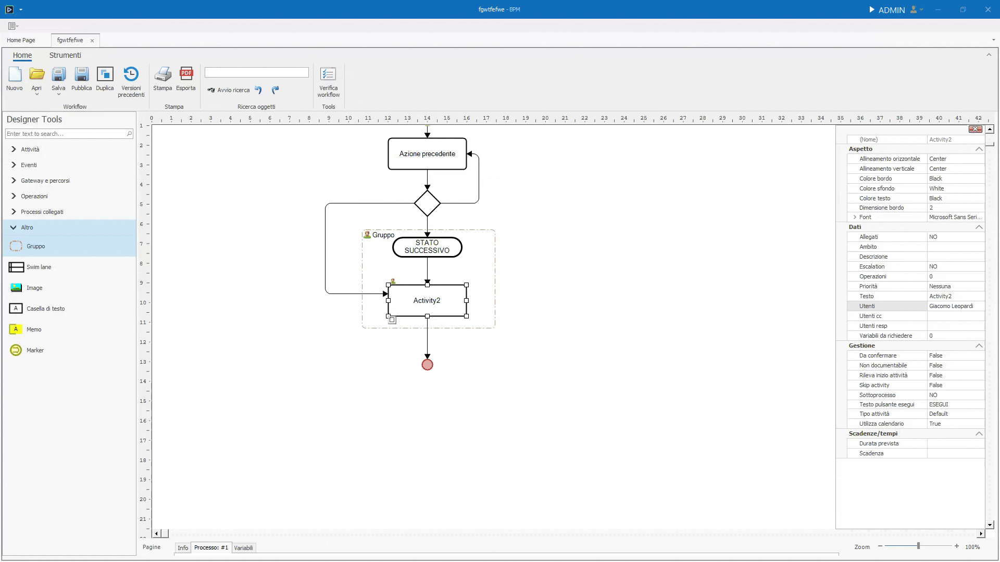

# Elementi grafici

Gli elementi grafici organizzano e documentano il disegno senza rappresentare necessariamente un'attivita eseguibile.

## Gruppo e Swim lane

**Gruppo** raccoglie elementi e puo associare utenti al contenitore. **Swim lane** suddivide il disegno in corsie, ciascuna con i propri utenti associati.

Se un'attivita interna ha utenti diversi da quelli del contenitore, prevalgono gli utenti assegnati direttamente all'attivita.

## Immagine, Casella di testo e Memo

**Immagine** inserisce un elemento visivo statico nel canvas. **Casella di testo** aggiunge testo libero. **Memo** aggiunge una nota e puo essere collegato a un'attivita.

## Marker

**Marker** collega pagine diverse del disegno. E utile quando il modello viene suddiviso in pagine, per esempio per facilitarne la stampa.
