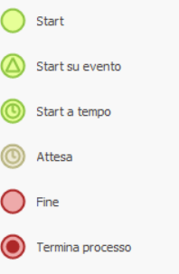

# Eventi

Gli eventi rappresentano punti di avvio, attesa o conclusione del flusso. Gli eventi che avviano un modello possono richiedere variabili, allegati e operazioni secondo la propria configurazione.

{ width=160 }

Gli eventi sono di due tipi:

- **nativi**: Start, Start a tempo, Attesa, Fine, Termina processo;
- **legati a un connettore**: Start su evento, che avvia il processo quando un connettore rileva qualcosa fuori da BPM.

## Start

**Start** è il punto di inizio di un flusso avviato dall'esterno del motore: da un utente, dai menu di BPM, oppure da un'applicazione con le [API standard](../../integrazione/api-standard/processi.md#createnewprocess). Un modello può contenere più Start; in questo caso, all'avvio viene richiesto quale utilizzare.

Lo Start può configurare variabili e allegati da richiedere, utenti e responsabili, e operazioni eseguite durante o al termine dell'esecuzione.

## Start su evento

**Start su evento** (icona con il triangolo) avvia un'istanza di processo senza che nessuno la richieda: è il motore di BPM a mettersi **in ascolto** e ad avviare il processo quando si verifica l'evento.

L'evento è fornito da un [connettore](../../integrazione/connettori/index.md). Nella configurazione dello Start su evento si sceglie il connettore e l'evento, poi si collegano i parametri:

- i **parametri di ingresso** dicono cosa ascoltare e come: per esempio quale cartella monitorare, o quale casella di posta e cosa fare della mail dopo averla letta;
- i **parametri di uscita** vengono scritti nelle variabili del processo appena avviato: per esempio nome, percorso e dimensione del file arrivato, oppure mittente, oggetto, testo e allegati della mail.

Le attività successive del processo lavorano poi su questi dati: allegare il file, leggerne il contenuto, smistarlo.

Esempi: [IncomingFile](../../integrazione/connettori/file-system.md) avvia un processo per ogni file che arriva in una cartella; [IncomingMail](../../integrazione/connettori/mail.md) per ogni mail che arriva in una casella.

L'ascolto degli eventi si attiva, si disattiva e si controlla da una finestra dedicata del menu di configurazione.

## Start a tempo

**Start a tempo** avvia periodicamente un'istanza di processo. La configurazione definisce descrizione, frequenza giornaliera, settimanale o mensile e orario di avvio.

## Attesa

**Attesa** sospende l'avanzamento fino al momento configurato. È possibile indicare un numero di giorni, un giorno della settimana o del mese e un orario.

## Fine e Termina processo

**Fine** conclude il percorso corrente. **Termina processo** conclude anche gli altri rami paralleli e i sottoprocessi ancora attivi.

