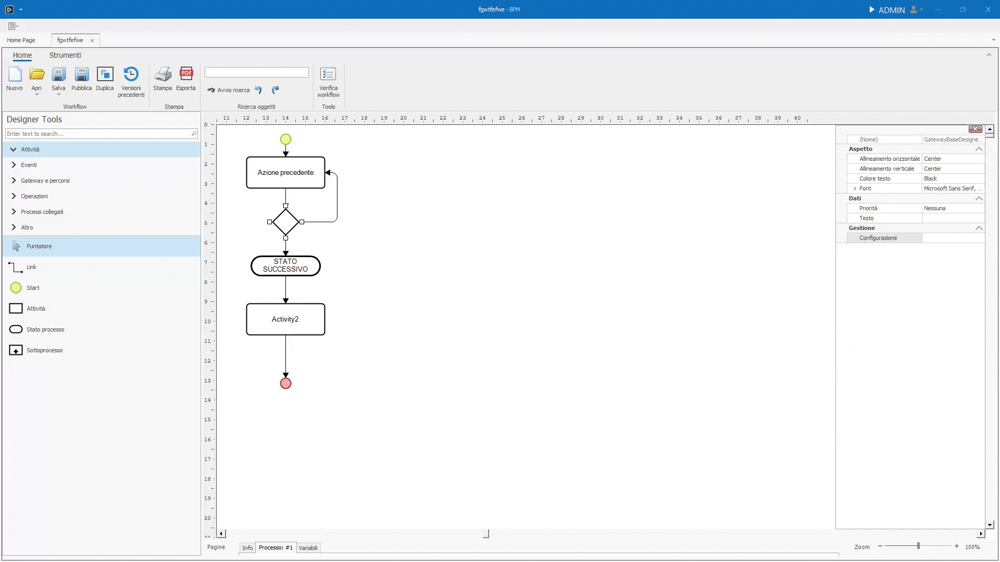

# Gateway e percorsi

I gateway instradano l'istanza di processo su percorsi differenti o sincronizzano ramificazioni precedenti.

## Percorsi alternativi (exclusive)

Questo gateway seleziona un solo percorso. Ogni uscita puo avere una condizione configurata tramite formula e una delle uscite puo essere indicata come predefinita.

Se piu condizioni risultano vere, viene percorso il primo percorso applicabile. Questo comportamento deve essere verificato sul prodotto corrente.

## Percorsi paralleli (parallel)

Questo gateway attiva tutte le ramificazioni in uscita. Le uscite non hanno condizioni perché devono essere percorse tutte.

## Percorsi liberi (inclusive) e Complex

Questi gateway possono attivare piu uscite quando le rispettive condizioni risultano vere. Le differenze precise tra i due oggetti devono essere documentate.

## Sincronizza

**Sincronizza** riunisce ramificazioni precedenti. Il parametro **Number to pass** indica quanti percorsi devono raggiungere l'elemento prima che l'istanza possa proseguire.
