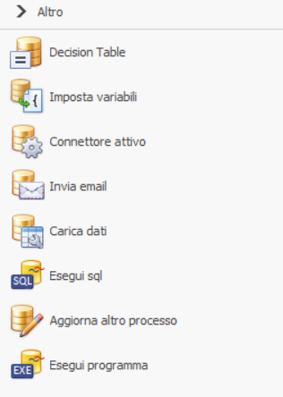

# Operazioni

Le **operazioni** sono le attività automatiche di un processo: non richiedono un utente, le esegue il motore di BPM.

Un'operazione si usa in due modi:

- **nel flusso**, come oggetto del diagramma, collegata alle altre attività;
- **agganciata a un momento del ciclo di vita** di un altro oggetto, per esempio all'attivazione o alla conclusione di un'attività, o al raggiungimento di uno stato. Si configura nella finestra **Operazioni** dell'oggetto e non appesantisce il disegno.

## Tipi di operazione

{ width=200 }

| Scopo | Operazione | Cosa fa |
|---|---|---|
| Logica del processo | **Decision Table** | Valorizza variabili in base a una tabella di regole. |
| | **Imposta variabili** | Imposta o calcola variabili con uno script. |
| Comunicazione | **Invia email** | Invia una mail a partire da un modello. |
| Processi | **Aggiorna altro processo** | Modifica un'altra istanza di processo. |
| Dati esterni | **Carica dati** | Legge dati da una tabella o vista e li copia nelle variabili. Vedi [Carica Dati](../../../integrazione/carica-dati.md). |
| | **Esegui sql** | Esegue un'istruzione SQL, tipicamente di scrittura. Vedi [Esegui SQL](../../../integrazione/esegui-sql.md). |
| Estensioni | **Connettore attivo** | Esegue una funzione di un [connettore](../../../integrazione/connettori/index.md). |

## Connettore attivo

**Connettore attivo** è la porta d'ingresso a tutte le funzioni dei connettori di tipo *operazione*. Nella sua configurazione si sceglie il connettore e la funzione da eseguire, per esempio Web API del connettore Web Service o SaveAttachmentToFileSystem del connettore File System. BPM presenta allora i parametri della funzione, da valorizzare con valori fissi o da collegare alle variabili del processo, in ingresso e in uscita.

Le funzioni disponibili dipendono dai connettori installati e attivi: integrazione con altri sistemi, gestione di PDF e fogli di calcolo, funzioni del documentale, intelligenza artificiale.

## Nomi interni

Ogni oggetto del diagramma ha un nome interno, assegnato alla creazione, che compare per esempio nelle risposte delle [API standard](../../../integrazione/api-standard/processi.md#getprocess). Il prefisso indica il tipo di oggetto:

| Oggetto | Nome interno |
|---|---|
| Connettore attivo | `ActiveConnector1`, `ActiveConnector2`, … |
| Imposta variabili | `SetVar1`, … |
| Invia email | `SendEmail1`, … |
| Start su evento | `EventConnector1`, … |
