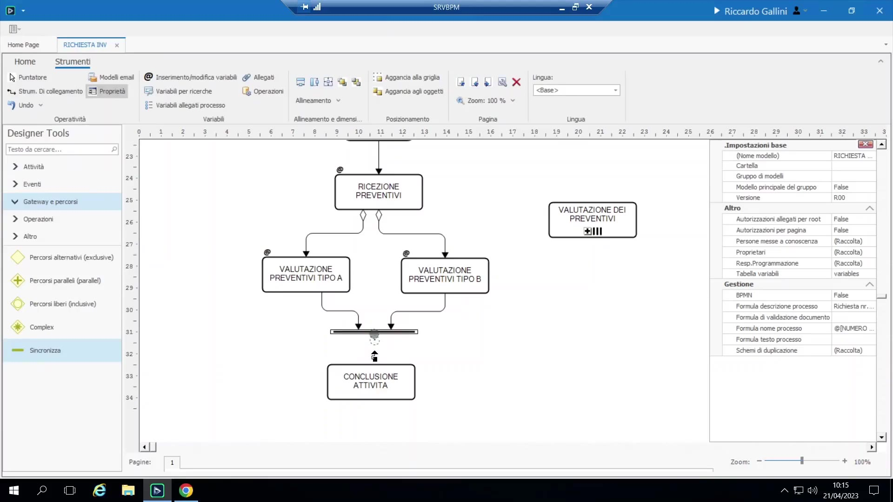
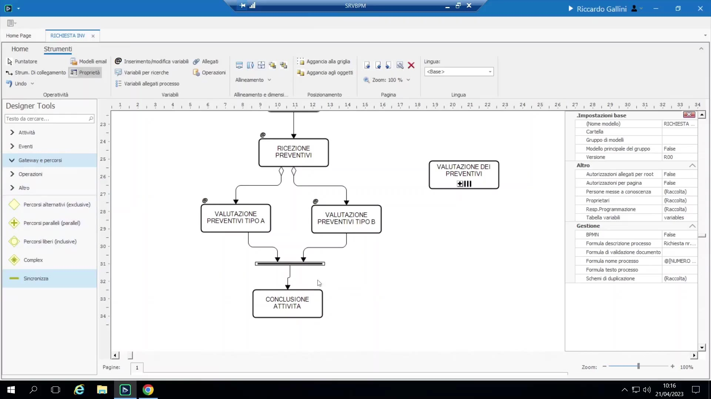
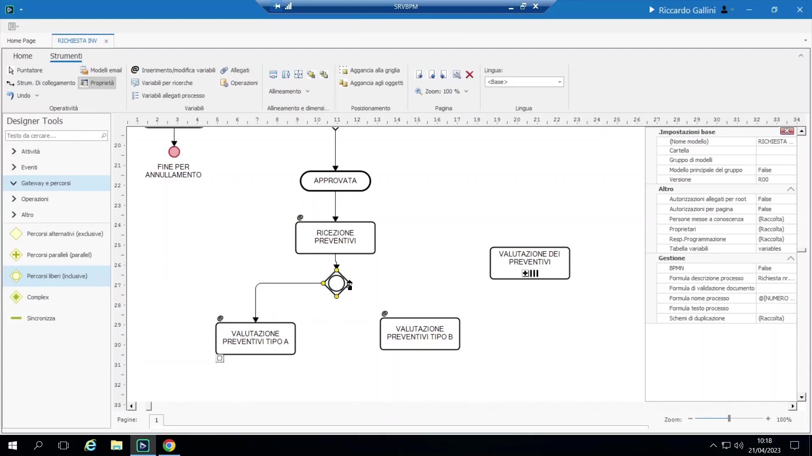

# Gateway e sincronizzazione dei rami

## Sbarra di sincronizzazione (oggetto storico)

È l'oggetto storico di BPM per ricongiungere rami paralleli — visivamente un "cancello" che si apre solo quando tutti i rami entranti configurati sono arrivati.

{ loading=lazy }

Modalità di configurazione:

- **TUTTE:** attende ogni ramo che è stato *configurato* come entrante, indipendentemente dal fatto che sia stato effettivamente avviato in quella istanza.
- **TUTTE PIANIFICATE** (tutte lanciate): attende solo i rami effettivamente avviati in quell'istanza — fondamentale quando il gateway di diramazione a monte è condizionale (es. un gateway inclusivo che potrebbe aprire solo uno dei due percorsi). Usare "TUTTE" in quel caso porterebbe il processo in stallo (deadlock).

    { loading=lazy }

- La sbarra di sincronizzazione può inoltre portare una **formula di attivazione personalizzata** al posto di TUTTE/TUTTE PIANIFICATE, per i casi che richiedono una logica arbitraria: esempio reale citato, progetto "Veneta Cucine".

## Gateway in stile BPMN moderno

Lo stesso oggetto a forma di rombo assume tre significati diversi a seconda della configurazione:

{ loading=lazy }

- **Percorsi alternativi (esclusivo):** viene percorso esattamente un ramo in uscita; gli esiti sono mutuamente esclusivi.
- **Percorsi paralleli (parallelo/AND):** tutti i rami in uscita vengono sempre percorsi, senza condizioni.
- **Percorsi liberi (inclusivo/OR):** uno, alcuni o tutti i rami in uscita possono essere percorsi, in base alla condizione di ciascuno.

Configurazione: doppio clic (oppure tasto destro → Configurazione) per impostare una condizione su ciascun ramo in uscita. È possibile usare direttamente variabili booleane come condizione, oltre a espressioni più articolate.

Vincolo: un oggetto gateway è **o** una diramazione (1 ingresso → n uscite) **o** un ricongiungimento (n ingressi → 1 uscita) — il designer blocca (disegna in rosso il collegamento) qualunque tentativo di dargli entrambe le funzioni contemporaneamente. La stessa forma diventa automaticamente un "ricongiungimento" quando vi si collegano più link entranti verso un'unica uscita; usato come ricongiungimento non richiede alcuna configurazione (attende semplicemente il completamento dei rami che sono stati effettivamente avviati).

Richiamo — percorso di default ("diamantino"): il rombo nero indica il percorso predefinito/di fallback preso quando nessuna condizione esplicita risulta vera, in modo che il processo non resti mai bloccato.
