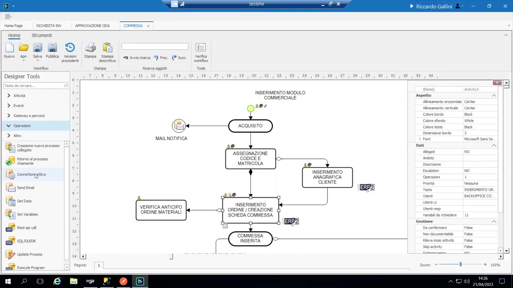
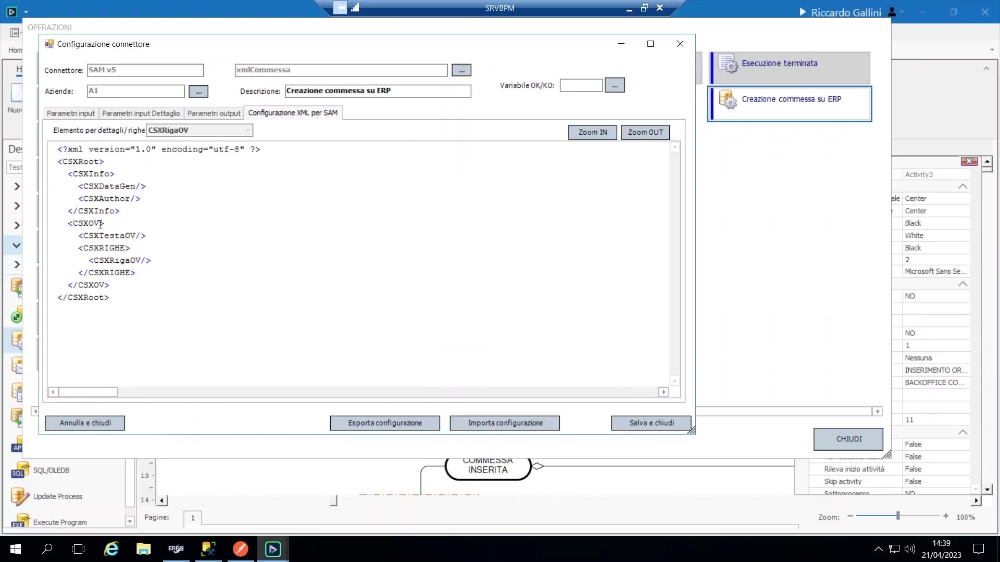
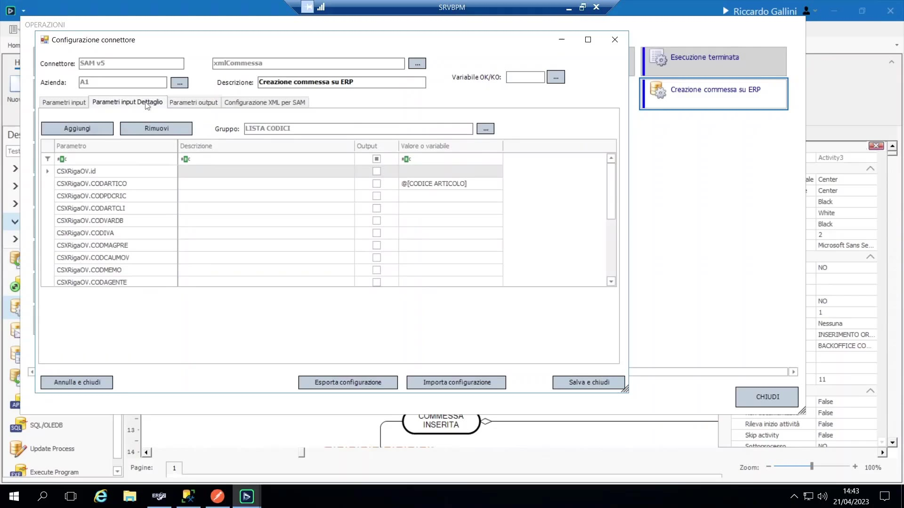
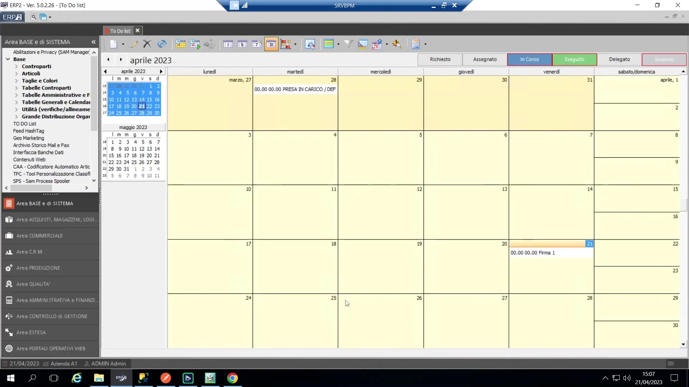
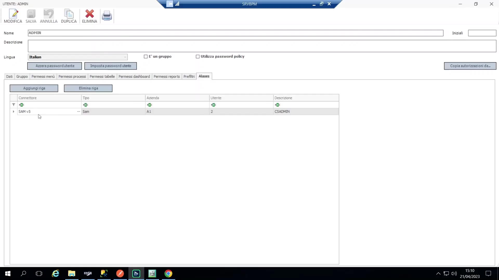
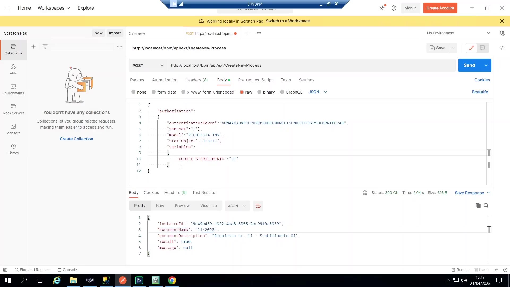
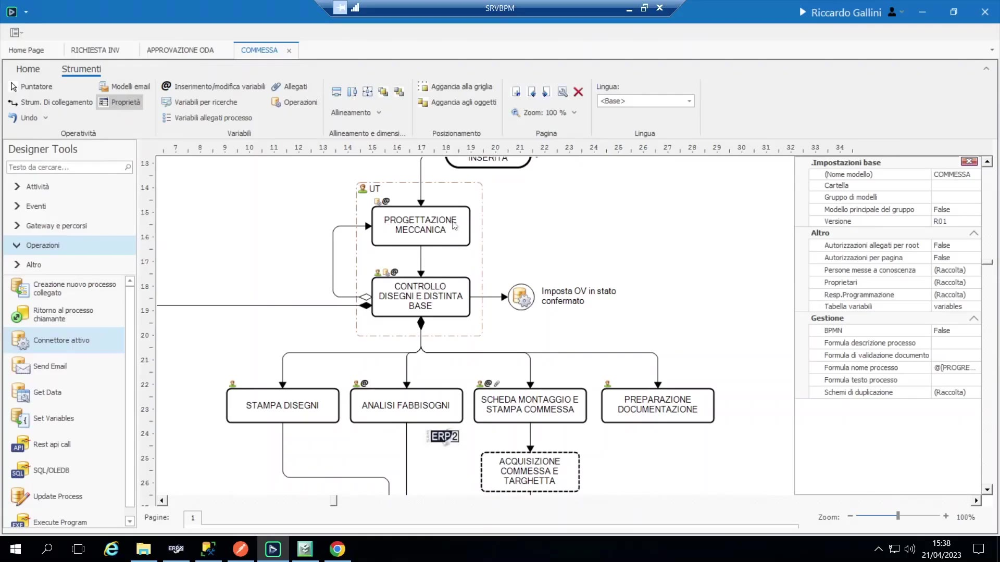

# Integrazione con SAM (ERP)

L'integrazione è articolata attorno a **quattro aspetti distinti**, trattati in sequenza:

1. BPM → SAM: scrittura di documenti/anagrafiche (connettore attivo).
2. BPM → SAM: lettura di tabelle (viste-tabella del connettore / SQL grezzo).
3. SAM → BPM: avvio di un processo da un evento lato SAM (web service/stored procedure/trigger).
4. SAM ↔ BPM: la to-do list di SAM che mostra le attività BPM.

## Architettura del connettore (generale)

Un "connettore" (es. "SAM v5", o il connettore separato "Globe") è modellato come un **plugin** installabile:

- **Definizione** (metadati che vivono nella configurazione BPM): quali aziende esistono, quali interfacce espone il connettore, e i parametri di connessione generali (URL del web service, dettagli di connessione al DB per ciascuna azienda — i connettori SAM usano un approccio *misto*: alcune operazioni via web service, altre via lettura diretta del DB).
- **DLL/plugin esterno**, che deve essere effettivamente installato sull'ambiente (normalmente incluso nell'installazione standard; altrimenti va richiesto come attività di setup) e che fa il lavoro reale dietro la definizione.
- Il connettore espone due tipi di interfaccia:
 - **Interfacce azione** — usate come *operazioni* trascinate nel flusso di processo; *scrivono* su SAM.
 - **Interfacce tabella** — usate come sorgenti di lookup in sola lettura su campi/griglie dati; espongono i dati SAM come se fossero una tabella/vista locale.
- Configurazione azienda/ambiente: Configurazione → connettori → spuntare **Attivo**, aggiungere un'azienda ("nuova azienda") e compilare i parametri per azienda (server DB, credenziali, DB marketing se rilevante, e l'endpoint web service di quell'azienda).

## Connettore attivo — BPM scrive su SAM

Un tipo di operazione, associata a uno specifico connettore, che scrive un documento o un'anagrafica in SAM (creare un cliente, creare una "commessa", registrare un "intervento", ecc.), inserita nel flusso come qualunque altra operazione. Per **SAM 5**, questa funzionalità è costruita sopra la funzione XML **Web Import** di SAM; per SAM 6 è previsto un supporto più ricco tramite web service JSON.

{ loading=lazy }

Configurazione guidata (es. "creazione commessa"):

{ loading=lazy }

1. Si trascina l'operazione connettore-attivo nel processo, si fa doppio clic, e si sceglie un'interfaccia XML preconfezionata (es. "xml commessa").
2. L'interfaccia arriva con un template preconfigurato e un insieme finito e fisso di **parametri di input** ("testata", raccomandati dalla documentazione tecnica di SAM stessa) — ciascuno si mappa su una variabile di processo, o si lascia come valore fisso letterale. Un campo obbligatorio mancante causa semplicemente il rifiuto della chiamata da parte del web import di SAM con un errore (BPM stesso non sa cosa l'XML "dovrebbe" contenere — è solo un pass-through).
3. Campi di testata aggiuntivi non presenti nell'elenco di default possono essere aggiunti tramite un piccolo helper (che conosce le colonne della tabella target) e mappati allo stesso modo.
4. **Parametri di output:** se l'interfaccia restituisce dei valori (non tutte lo fanno), possono essere mappati indietro su variabili di processo, es. catturando l'ID interno del nuovo documento / il numero documento in `numero_commessa`.
5. **Parametri di riga/dettaglio:** se il processo ha un gruppo corrispondente (es. "lista codici"), ogni riga del gruppo viene mappata automaticamente su un nodo di dettaglio XML ripetuto — permettendo di inviare in una sola chiamata un intero elenco di righe ordine/distinta (es. mappando `codice_articolo` → `csx riga OV / codice articolo`, `qta` → `qta1`). Tutto ciò che non è esplicitamente presente in BPM (es. logica dei prezzi) è lasciato interamente alla configurazione di SAM.

    { loading=lazy }

Estensibilità: le interfacce preconfezionate coprono un insieme deliberatamente finito di casi comuni (cliente, commessa, intervento, ecc.) — un nuovo template XML genuinamente diverso richiede una richiesta di sviluppo, non è qualcosa che un consulente/cliente possa cablare liberamente dall'interfaccia.

Requisito di attivazione: il **modulo Web Import** di SAM deve essere installato e raggiungibile — tipicamente un ticket sistemistico di routine, nessuna licenza aggiuntiva richiesta.

Alternativa/quando non usarlo: se non esiste un'interfaccia di connettore preconfezionata per ciò che serve, una semplice attività manuale che ricorda a un utente di inserire il record in SAM è un'alternativa legittima — automatizzarla solo per il gusto di farlo può essere in realtà peggio, se significa duplicare logica anagrafica (es. tutte le regole di onboarding cliente) che già vive correttamente dentro SAM. È più appropriato quando serve solo un record segnaposto leggero (es. uno stub cliente con un codice, per poter agganciare documenti contro di esso).

## Lettura dei dati SAM in BPM (connettori tabella)

Due opzioni per un campo/griglia dati agganciato a una tabella per leggere dati SAM:

- **Vista locale/accesso diretto a tabella esterna** — si costruisce una propria vista SQL con esattamente le colonne desiderate (un certo sforzo iniziale una tantum, ma piena flessibilità).
- **Connettore Dati (interfaccia tabella del connettore)** — si sceglie da un catalogo finito di viste preconfezionate incluse nel connettore; se manca una colonna necessaria, occorre richiederne l'aggiunta a monte, oppure **copiare la vista generata e personalizzare la copia** (modificare l'originale non è sicuro — vedi sotto).

Come vengono generate le viste preconfezionate: eseguire l'"aggiornamento database" del connettore genera automaticamente un insieme di viste SQL con prefisso `vvbpm...` dentro il database SAM (una per ogni interfaccia tabella esposta, es. la vista clienti).

Insidia critica: queste viste auto-generate vengono **rigenerate/sovrascritte** ogni volta che la definizione del connettore viene aggiornata — qualunque modifica manuale alla vista originale va persa. Il pattern sicuro è duplicare la vista sotto un proprio nome e puntare la propria personalizzazione alla copia.

## La to-do list di SAM mostra le attività BPM

Un modulo di SAM permette alle voci della to-do list BPM ("eventi BPM") di comparire integrate nella to-do list nativa di SAM, per gli utenti che lavorano su entrambi i sistemi e non vogliono cambiare applicazione.

- Doppio clic su un evento BPM dentro SAM mostra un popup di dettaglio dal vivo (nome processo/modello, attività corrente) recuperato **in tempo reale tramite un web service BPM** — nulla riguardo alle attività BPM è cache/salvato nel database di SAM, viene letto fresco ogni volta che si apre la schermata.
- Include lo stesso meccanismo di deep-link usato nelle mail per saltare direttamente a quell'attività nel client web BPM.
- **Sincronizzazione bidirezionale dal vivo:** avanzare un'attività in BPM (es. passare da "firma1" a "firma2") si riflette immediatamente come la stessa attività che compare nella to-do list di SAM — sono la stessa attività sottostante, non due copie mantenute separatamente.

    { loading=lazy }

- Lo stesso meccanismo/modulo è disponibile anche dentro la to-do list di **CRM1**.

Configurazione (lato SAM): Opzioni → cerca "BPM" → impostare il **percorso server BPM** (di nuovo: deve essere il vero hostname raggiungibile esternamente, non localhost) e una **chiave API generata da BPM**.

Generazione della chiave API (lato BPM): Configurazione → **Chiave Web API** — creare una nuova chiave (opzionalmente con data di scadenza); è la credenziale che ogni chiamante esterno (SAM, Postman, codice custom) deve presentare.

Mapping utenti: Configurazione → Utenti e Gruppi → ogni utente ha una sezione **"Alias"** che mappa la sua identità per ciascun connettore esterno (es. `css-admin` di SAM ↔ `admin` di BPM) — ogni connettore può avere il proprio mapping utenti indipendente.

{ loading=lazy }

## Pilotare BPM da SAM (SAM → BPM)

**Web service standard di BPM:** un insieme deliberatamente **piccolo** di endpoint HTTP che accettano body JSON in POST (descritti come "REST-ish" più che strettamente REST). Tenuto piccolo perché una singola chiamata generica `create-new-process`, parametrizzata sul nome del modello, copre già l'avvio di *qualunque* processo.

Endpoint principali:

- `create-new-process` — avvia una nuova istanza di processo (specifica modello, punto di partenza, variabili iniziali).
- `exec-task` — avanza/esegue un'attività attualmente presente nella to-do list di un utente (simula il clic su "Esegui").
- Caricamento di un allegato su un processo.
- Forzare l'avanzamento di un processo.
- Lettura dei dati variabili di un processo.
- Lettura della to-do list di un utente.

Prova pratica: non serve installare nulla — basta generare una chiave API e qualunque server BPM può essere chiamato. Dimostrato dal vivo con **Postman**:

{ loading=lazy }

```
POST {bpm-server}/api-ext-create-new-process
Body (JSON): { auth_token, user, model, start, variables{...} }
```

La risposta restituisce successo/fallimento più il nome del processo generato (secondo la regola di naming) ed eventuali messaggi di validazione.

Insidie confermate dal vivo:

- Omettere il punto di partenza su un modello multi-start restituisce un errore esplicito invece di sceglierne uno silenziosamente.
- Campi obbligatori/formule di validazione sono applicati esattamente come lo sarebbero dall'interfaccia utente — un payload incompleto/non valido restituisce `false` senza effetti collaterali.
- `exec-task` è funzionalmente equivalente a cliccare "Esegui" nella to-do list — usato ad es. per far avanzare un processo BPM quando avviene un evento corrispondente lato SAM, anche se il docente è cauto sull'affidarsi troppo a questo meccanismo perché *identificare correttamente* l'evento SAM scatenante è spesso la parte difficile.

Raccomandazione: le chiamate dirette ai web service sono il metodo **ufficiale e più robusto** per qualunque integrazione custom/plugin — restituiscono un vero risultato sincrono di successo/fallimento.

## Wrapper a stored procedure e trigger (percorso asincrono)

Perché esiste: SAM non ha un meccanismo nativo di evento/webhook in uscita, quindi l'*unico* strumento disponibile per intercettare un evento lato SAM (nuovo ordine, cambio di stato, ecc.) e far partire un processo BPM è un classico **trigger SQL**.

Meccanismo del wrapper a stored procedure: la stessa capacità di "creare processo" è esposta anche come semplice **stored procedure SQL** — ma invece di chiamare il web service in modo sincrono, scrive semplicemente una riga in una tabella di staging (`chiamate API`); un motore in background interno a BPM legge periodicamente quella tabella ed esegue esso stesso la vera chiamata al web service:

```sql
EXEC dbo.usp_bpm_create_process
 @user = 2, @model = 'richieste inv', @start = 1, @external_id = 1
```

Pattern d'uso dei trigger (progetti reali citati: un cliente del settore alimentare, e "Calzavara"): un trigger richiama la stored procedure quando accade un evento di business in SAM (es. un ordine viene approvato); il processo BPM risultante procede e, a ogni passo, usa l'**operazione SQL** per scrivere aggiornamenti di firma/stato indietro su SAM man mano che avanza.

Insidia chiave dell'asincronia: a differenza della chiamata diretta al web service, i trigger e il wrapper a stored procedure sono **fire-and-forget/asincroni** — non c'è un risultato immediato di successo/fallimento, la consegna tipicamente si completa in pochi secondi tramite il motore della tabella di staging, ma questo percorso richiede un **collaudo approfondito**, e la logica del trigger stesso può essere fragile (un bug nel trigger può "mandare in crash" la transazione SAM sottostante).

Convenzione — mantenere il trigger minimale ("External ID"): per evitare di riversare decine di campi in un trigger fragile, il team ha adottato una convenzione rigida: la stored procedure accetta **un solo parametro** — l'ID del documento sorgente — mappato in una variabile di processo BPM chiamata letteralmente **`external_id`**.

BPM si arricchisce da sé dopo l'avvio minimale via trigger, tramite un callback: come primissimo passo del processo (sullo Start, nelle operazioni), BPM richiama subito indietro SAM — usando **Get Data** oppure una **vista-tabella del connettore**, con chiave `external_id` — per recuperare tutti gli altri campi che il processo realmente necessita (ragione sociale del fornitore, indirizzo, termini di pagamento, righe ordine, ecc.). Questo sposta deliberatamente tutta la complessità dal trigger fragile verso gli strumenti BPM, più robusti e testabili.

Via di fuga per casi complessi: se il pattern standard trigger/SP/Get Data non è davvero sufficiente, il codice custom che chiama direttamente i web service è sempre disponibile come alternativa (un collega — Filippo Curati — ne aveva prototipato esattamente una).

## Buone pratiche e aneddoti reali sull'integrazione

- **Aneddoto — inseguire un evento di business "sfumato":** un cliente voleva un'attività avanzata automaticamente "quando viene inserita la distinta base" in SAM. Il docente spiega che si tratta di un obiettivo di automazione genuinamente difficile: non esiste un singolo evento di database inequivocabile che significhi affidabilmente "la distinta base è davvero finita", e le richieste dei clienti di "automazione totale" portano spesso aspettative poco realistiche che vanno gestite/ridimensionate a monte — meglio promettere meno che costruire qualcosa di fragile che si rompe silenziosamente su casi limite (articolo sbagliato, inserimento duplicato, lotto/partita sbagliati, ecc.).

    { loading=lazy }

- **Buona pratica — minimizzare l'accoppiamento:** evitare di progettare un'integrazione in cui i due sistemi interagiscono continuamente avanti e indietro per tutto il processo (ogni modifica al processo rischia allora di rompere anche il lato SAM). La forma ideale prevede che i due sistemi si parlino solo **all'inizio e alla fine** del processo (es. un trigger per lanciare, una scrittura finale di stato tipo "approvato"/"non approvato" invece di molti micro-stati intermedi sincronizzati avanti e indietro).
- SAM 6 dovrebbe supportare questa integrazione in modo più nativo/flessibile tramite veri web service JSON, riducendo la dipendenza dai workaround dell'era trigger/Web Import descritti sopra.
