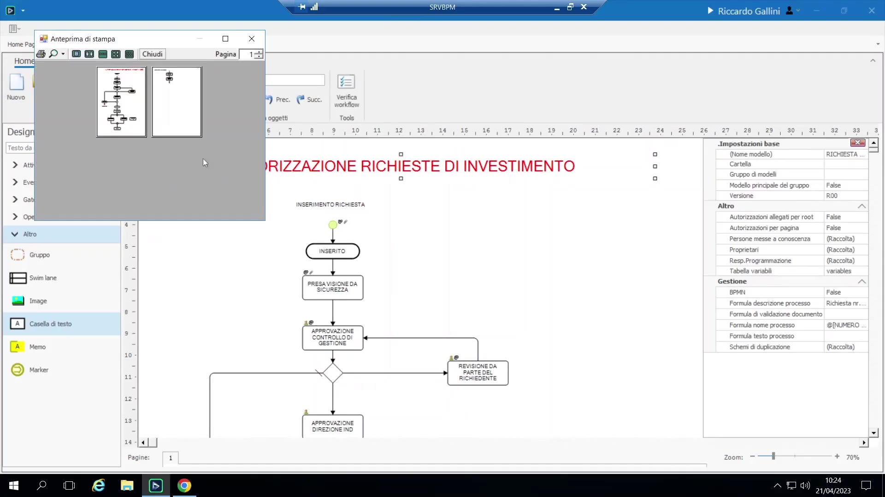
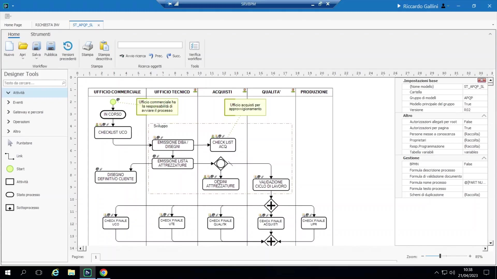

# Oggetti grafici, pagine multiple e swim lane

## Oggetti puramente grafici

- **Casella di testo:** testo libero personalizzabile (font, colore, bordo trasparente), es. un titolo del processo — puramente estetico.

    { loading=lazy }

- **Immagine:** es. il logo aziendale.
- **Pagina e margini:** Configurazione → Strumenti → pagina permette di impostare formato carta (A0–A4) e margini; la maggior parte dei processi viene disegnata su una pagina sovradimensionata ignorando i margini, ma se si vuole un diagramma di processo **stampabile** (es. come documentazione, esportabile in PDF con "stampa su PDF"), lo si impagina per rientrare in pagine reali.
- **Memo/post-it:** una nota libera agganciata vicino a un'attività per annotazioni in fase di progettazione; nessun effetto a runtime.

## Processi multi-pagina e oggetto Marker

Per processi molto lunghi/complessi, il canvas può essere suddiviso in più pagine (Nuova Pagina). L'oggetto **Marker** funge da "goto"/teletrasporto tra pagine: si posiziona un marker numerato nel punto in cui il flusso lascia la pagina 1 e un marker corrispondente nel punto in cui rientra sulla pagina 2. Non c'è limite al numero di marker/pagine. Utile soprattutto quando il diagramma deve restare leggibile/stampabile come documentazione.

## Swim lane

Corsie adiacenti e ordinate (come i "pool/lane" BPMN) usate per organizzare visivamente un processo per ruolo/reparto. Trascinando l'oggetto swim lane si crea un insieme di corsie contigue, rinominabili (es. "Inseritore," "Sicurezza," "Controllo di Gestione," "Dirtec").

Comportamento funzionale, non solo cosmetico: impostare gli **"utenti responsabili"** a livello di corsia (tasto destro) assegna automaticamente quell'utente/gruppo a qualunque attività posizionata nella corsia che non abbia già un'assegnazione esplicita propria; un'assegnazione esplicita a livello di attività prevale sempre su quella di corsia.

Configurazione:

- Colore dell'intestazione della corsia, ordine (sposta corsie su/giù).
- Orientamento: verticale (dall'alto in basso, la convenzione preferita dal docente) oppure orizzontale (la convenzione BPMN standard, usata quando i diagrammi devono avere un aspetto "da manuale").

Esempio di progetto reale: un processo multi-reparto (commerciale → tecnico → acquisti → qualità → produzione) impaginato con swim lane — molto leggibile su "chi fa cosa" a colpo d'occhio, ma il docente segnala che questo stile di diagramma è visivamente più disordinato ("a zig-zag") da disegnare e mantenere rispetto a un flusso lineare dall'alto in basso.

{ loading=lazy }

## Oggetto Gruppo (attività)

Un'alternativa alle swim lane per raggruppare/etichettare: supporta anch'esso l'assegnazione di "utenti responsabili" a tutto ciò che contiene, oppure può essere usato puramente come etichetta visiva/riquadro attorno a una sezione del diagramma (es. "ufficio tecnico").

## Undo vs. storico versioni

- L'**Undo** (~10 passi) è transitorio: copre solo la sessione di editing corrente, dall'apertura alla chiusura del designer.
- Lo storico di **pubblicazione/versioni** è permanente, salvato a database: ogni volta che si "Pubblica," BPM crea una nuova riga di versione numerata. Si può tornare a qualunque versione pubblicata precedente.
- Suggerimento: in fase di pubblicazione, BPM propone un campo libero **"Versione" / note di pubblicazione** dove annotare cosa è cambiato (es. "R01 dev — modificata attività 2"); utile come changelog informale, anche se il contatore di versione sottostante si incrementa comunque.
- Esiste anche uno strumento di pulizia dello storico (per installazioni grandi/datate) per eliminare vecchie versioni, con un controllo di sicurezza che impedisce di cancellare una versione su cui sono ancora attive istanze in esecuzione.
