# Operazioni automatiche

Concetto chiave: a differenza delle attività utente (rettangoli, che richiedono un intervento umano) e degli eventi (punti che semplicemente accadono), le **operazioni** sono cose che il motore BPM fa da sé, automaticamente. Possono essere trascinate direttamente nel flusso di processo come qualunque altro oggetto, oppure agganciate a un momento specifico del ciclo di vita di un'attività, oppure agganciate a livello dell'intero processo.

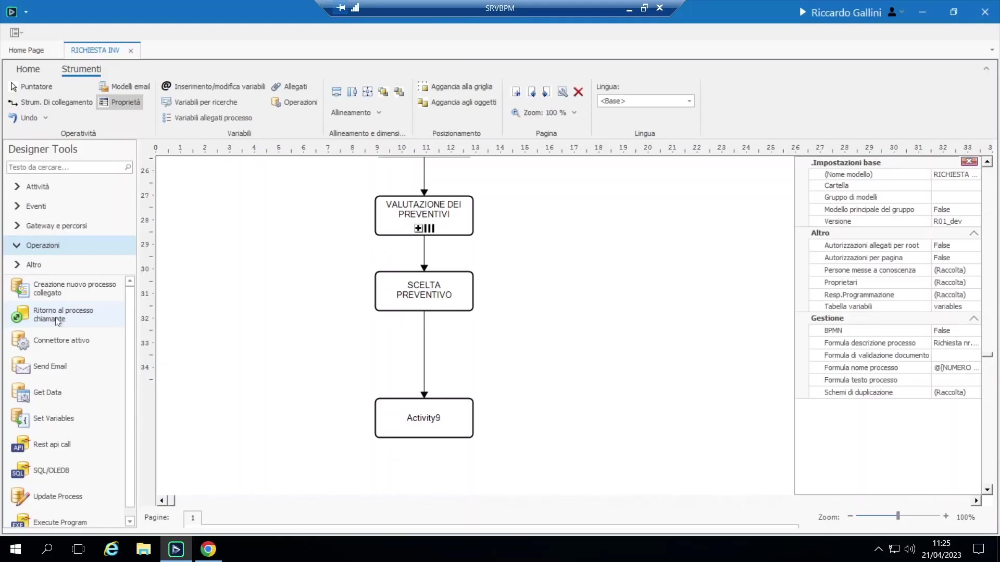{ loading=lazy }

## Operazione Invio Mail

- Si trascina l'operazione mail nel flusso, poi la si configura selezionando (o creando) un **template di mail**.
- I template di mail sono oggetti che vivono dentro il processo (da Configurazione, oppure direttamente dall'operazione) e sono riutilizzabili su più punti di invio.

    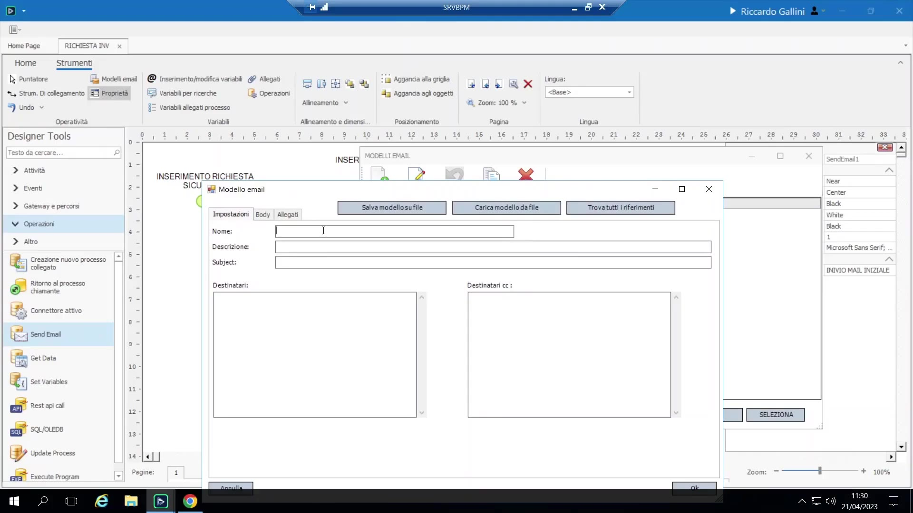{ loading=lazy }

- Costruzione del template: oggetto e corpo supportano l'inserimento di variabili di processo tramite tasto destro (il menu "generic" espone anche placeholder speciali — vedi sotto).
- **Destinatari:** possono essere un utente BPM fisso, un gruppo fisso, una variabile che contiene un indirizzo email grezzo (es. il campo email di un fornitore), oppure una variabile che contiene un riferimento a utente/gruppo BPM. I destinatari possono anche essere messi in copia conoscenza ("in propria conoscenza").
- **Allegati:** si possono allegare documenti di processo e/o report generati.
- **Placeholder generici utili nei template:**
 - `mia mail` (my own email) — l'email di chi è attualmente assegnatario dell'*attività* (permette di riusare lo stesso template su tante attività/assegnatari diversi).
 - `mia attività` (my activity) — il nome visualizzato dell'attività corrente.
 - **`link web al task`** — inserisce un URL cliccabile che porta direttamente alla schermata di esecuzione di quella specifica attività nel client web (bypassando del tutto la to-do list). Funziona anche per collegarsi all'intero processo o alla sua pagina allegati.

     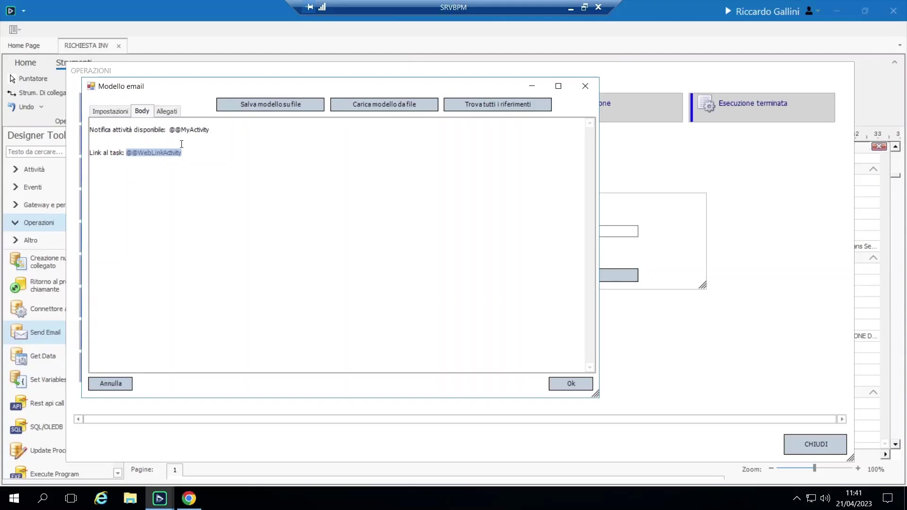{ loading=lazy }

- **Insidia comune:** il link diretto funziona solo se **Configurazione → parametri → "URL base link email"** è impostato sul vero hostname visibile esternamente del server; se lasciato a `localhost` (il default facile da dimenticare), ogni link nelle mail si rompe silenziosamente — particolarmente importante quando il server è esposto su un IP pubblico.
- In genere si consiglia di abilitare sempre il modulo web (non serve licenza aggiuntiva, solo un'attività di setup IIS per i sistemisti), perché è necessario affinché questi link diretti funzionino fuori dal client desktop.

## Operazioni agganciate al ciclo di vita di un'attività

Tasto destro su un'attività → **Operazioni** permette di agganciare qualunque operazione (stesso catalogo delle operazioni di flusso) a uno di quattro momenti:

- **Attivazione:** l'attività è appena diventata disponibile (compare nella to-do list di qualcuno — buon momento per una notifica "hai qualcosa da fare").
- **Inizio:** l'utente ha dichiarato esplicitamente di aver *iniziato* l'attività (scatta solo se "rileva inizio" è abilitato su quell'attività — vedi la sezione sulla pianificazione).
- **Esecuzione:** scatta appena prima che l'attività venga segnata come effettivamente completata (cioè "sta per completarsi").
- **Esecuzione terminata:** scatta subito dopo il completamento, appena prima che l'attività successiva si attivi.

Attivazione vs. Inizio, con precisione: attivazione = l'attività è *pronta*; inizio = l'attività è stata effettivamente *iniziata*. Sono deliberatamente due concetti separati, usati insieme al sistema di pianificazione.

Suggerimento pratico: posizionare operazioni puramente tecniche/di servizio (es. azzerare una variabile obsoleta) direttamente sull'attività, invece che come oggetto visibile nel flusso, mantiene il diagramma di processo focalizzato sulla logica di business invece di affollarlo di passaggi tecnici di "idraulica" interna.

## Set Variable / operazione formula inline ("un pezzo di scritto")

Un'operazione leggera che esegue un breve script per impostare una o più variabili — distinta da una formula di validazione (che restituisce solo vero/falso).

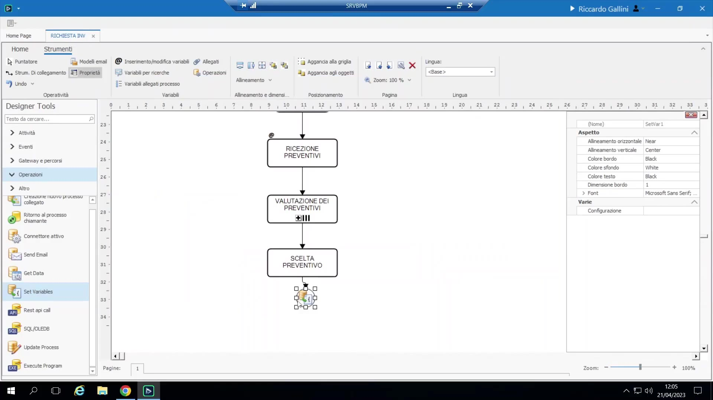{ loading=lazy }

Esempio guidato — azzerare un esito obsoleto in caso di rilavorazione: se un campo "esito approvazione" è impostato a "non approvato" e l'attività viene rimandata indietro al richiedente per revisione e poi torna all'approvatore, il campo mantiene silenziosamente il vecchio valore "non approvato" (fonte comune di confusione: molti si aspettano che torni vuoto). Un'operazione Set Variable agganciata a **Esecuzione Terminata** dell'attività azzera di nuovo il campo, costringendo l'utente a ridecidere consapevolmente, ed evita che il ciclo si ripeta all'infinito perché il controllo "campo obbligatorio" era già banalmente soddisfatto dal valore obsoleto:

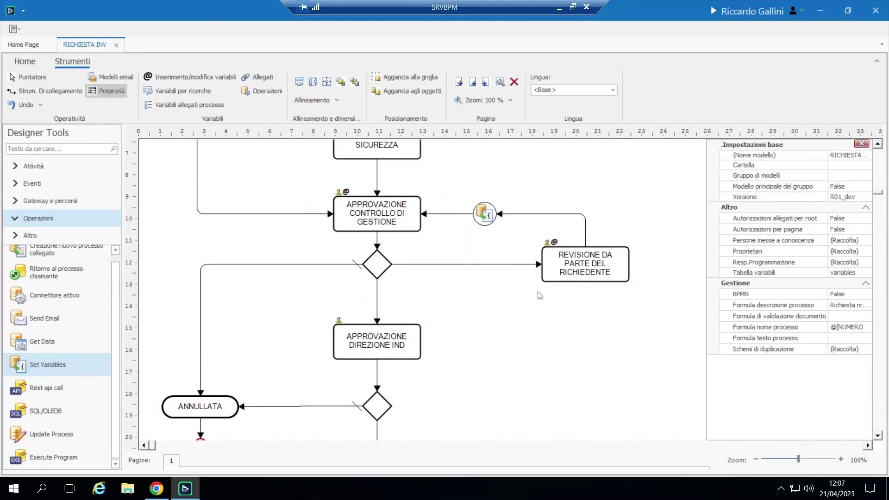{ loading=lazy }

```vb
' agganciata sull'attività "controllo di gestione", su esecuzione terminata
esito_approvazione = Blank
```

Esempio guidato — assegnazione automatica dell'approvatore in base all'importo:

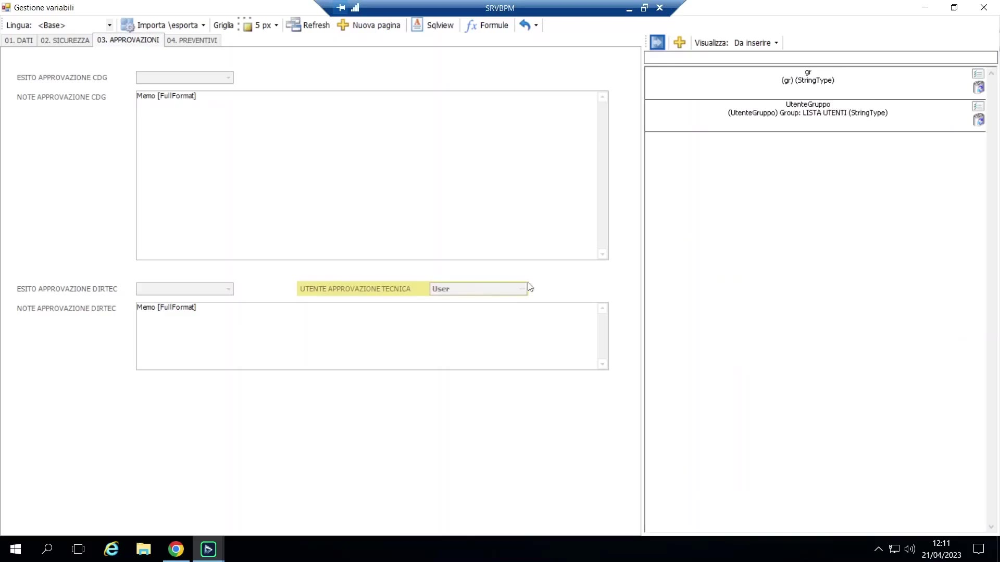{ loading=lazy }

```vb
If importo_richiesta < 1000 Then
 utente_approvazione_tecnica = "Dir Tech" ' può essere anche un gruppo
Else
 utente_approvazione_tecnica = "Dir Gen"
End If
```

Gli "utenti responsabili" dell'attività vengono poi associati alla variabile `utente_approvazione_tecnica` (variabile di tipo Utente) invece che a un gruppo fisso — una terza modalità di assegnazione, oltre a "assegna a gruppo" e "scegli manualmente una persona": l'**assegnazione guidata da regola**.

## Decision table

Un'alternativa più recente e dichiarativa alla scrittura manuale di una formula. Si definiscono colonne di input e colonne di output e un insieme di righe-regola; BPM genera il codice VB sottostante in automatico. Disponibile ovunque sia utilizzabile una formula/formula di validazione.

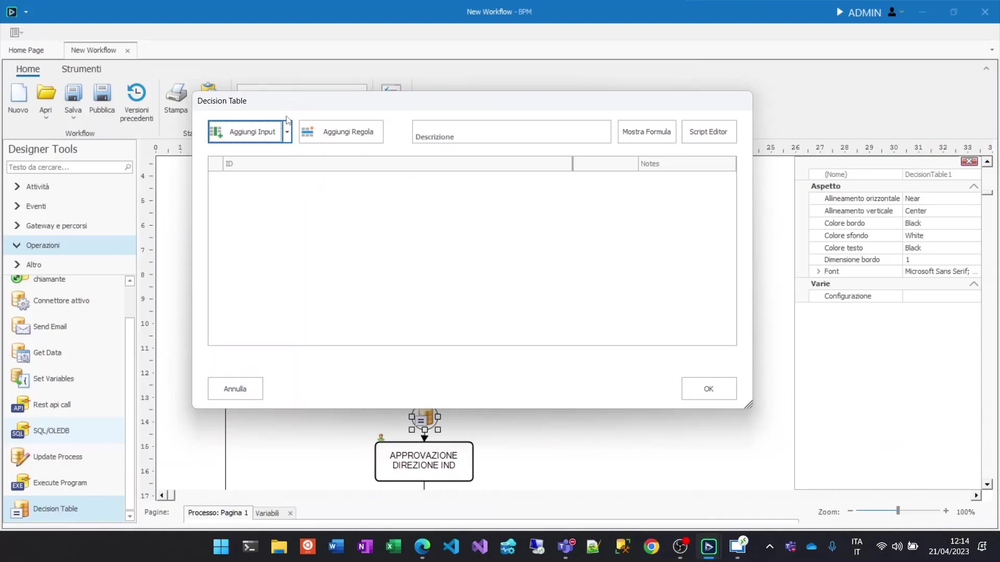{ loading=lazy }

Esempio guidato — stessa logica di assegnazione approvatore per importo, come tabella:

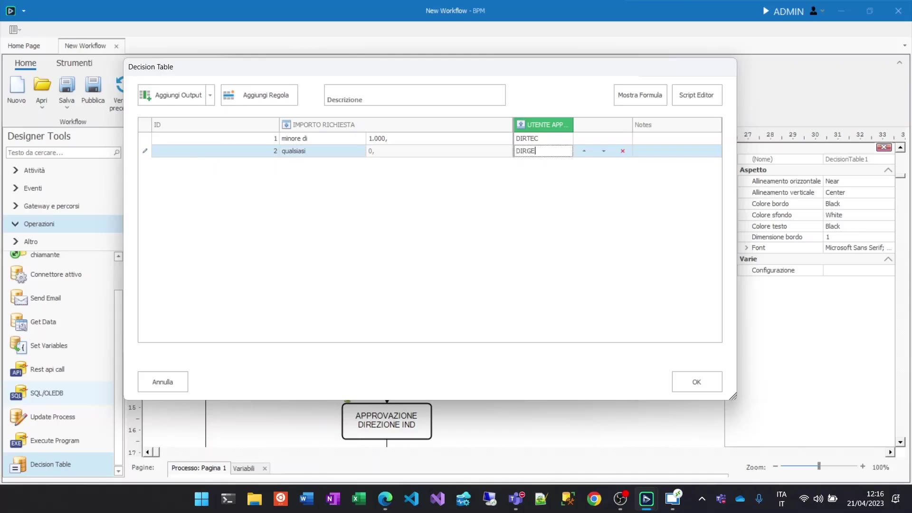{ loading=lazy }

| Importo Richiesta | → | Utente Approvazione |
|---|---|---|
| < 1000 | | Dir Tech |
| ≥ 1000 | | Dir Gen |

Estesa con una seconda colonna di input (Tipo Richiesta) per regole più complesse:

| Importo Richiesta | Tipo Richiesta | → | Utente Approvazione |
|---|---|---|---|
| < 1000 | Normale | | Dir Tech |
| ≥ 1000 | Normale | | Dir Gen |
| (qualunque) | Sicurezza | | Sicurezza |

- L'ordine delle righe conta e può essere modificato con le frecce su/giù (vince la prima riga che soddisfa le condizioni).
- Lo strumento è consapevole del tipo di variabile: per un campo a lista di valori propone i valori noti; per un campo di tipo Utente propone l'elenco di utenti/gruppi; in un contesto di formula di validazione sa già che l'output deve essere vero/falso.
- **Limite:** la decision table esprime solo condizioni semplici di confronto tra campi — non può esprimere logica procedurale come "scorri un gruppo e conta le righe corrispondenti" (vedi l'esempio della condizione di abilitazione sopra). Per quello serve ancora una formula.
- **Conversione bidirezionale:** un campo formula può essere convertito in decision table (come punto di partenza, se ci si blocca davanti a una formula vuota) e una tabella può essere riconvertita in formula quando la sua logica supera ciò che la tabella può esprimere. Il docente paragona questo utilizzo a partire da codice generato con ChatGPT: mai una risposta finita e affidabile, ma un utile sblocco iniziale.

    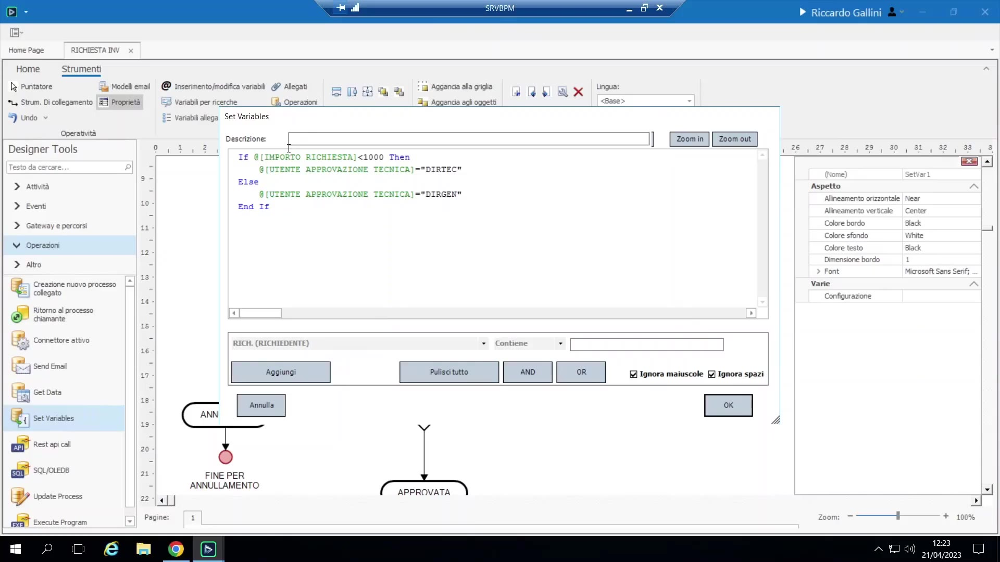{ loading=lazy }

## Operazione SQL ("SQL libero")

Un'operazione che esegue un'istruzione SQL arbitraria su una stringa di connessione esterna — non limitata al CRUD di una singola tabella, può eseguire stored procedure, join, qualunque cosa consenta l'SQL.

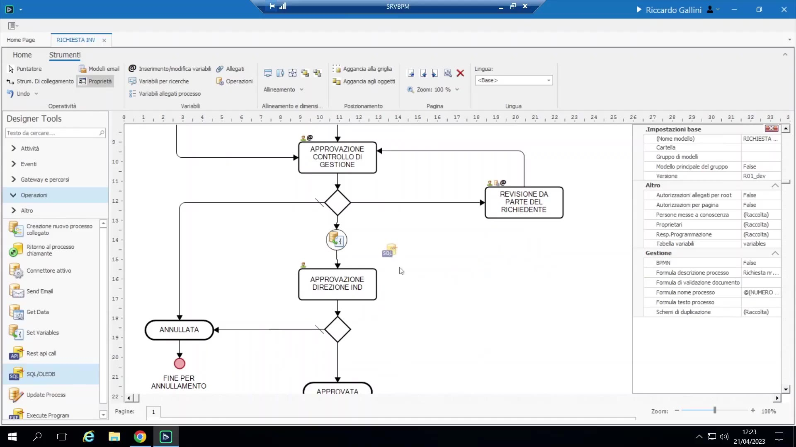{ loading=lazy }

Esempio guidato:

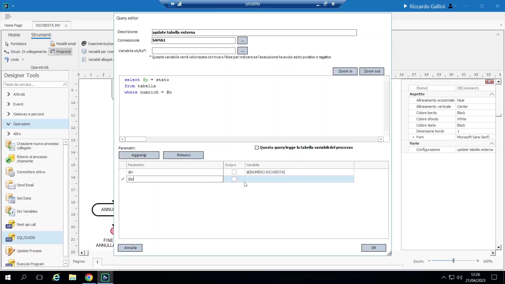{ loading=lazy }

```sql
UPDATE fornitori SET valore = 1 WHERE ID_numeric = @n
```

con `@n` legato come parametro di input a una variabile di processo; separatamente, una `SELECT` con un parametro di output (`@p`) scrive un valore restituito in una variabile di processo (es. `importo_richiesta`).

Caso d'uso: scrivere in un ERP esterno che un documento è stato firmato/approvato da un certo utente in un certo passaggio (es. "UPDATE ordine SET firmato_da =... WHERE ordine_id =..."), usato come alternativa più leggera al connettore dedicato quando non esiste un'interfaccia di connettore preconfezionata per quella scrittura.

Configurazione: la stringa di connessione si imposta una volta sola sotto **Configurazione → Connessione Esterna** (supporta target SQL Server/tipo ODBC), e viene riusata sia dall'operazione SQL sia da qualunque aggancio tabella sui campi.

## Aggiorna un altro processo

Permette di scrivere aggiornamenti di variabili su un'istanza di un *altro* processo in esecuzione, in qualunque punto del flusso — non solo al lancio (processo collegato) o al ritorno. Non richiede nemmeno che i due processi siano stati formalmente collegati. Si fornisce una regola di ricerca per trovare l'istanza target: per codice istanza interno BPM, oppure facendo corrispondere il valore di una variabile (es. "trova il processo il cui `numero_richiesta` = il mio"). Si mappano poi variabile sorgente → variabile destinazione, si impostano valori fissi, oppure si usa una formula di passaggio, come nella mappatura del processo collegato. **Attenzione:** se ci si accorge di dover ricorrere a questa operazione troppo spesso, è di solito il segnale di una duplicazione eccessiva di dati fra processi che andrebbe ripensata architetturalmente.

## Operazioni a livello di processo

Le operazioni possono essere agganciate non solo a una singola attività ma all'**intero processo** — vengono quindi eseguite automaticamente ogni volta che *qualunque* passaggio avanza, senza doverle cablare su ogni singola attività. Uso comune: aggiornare sempre lo stato su un CRM/ERP esterno, oppure sincronizzare sempre i nuovi allegati verso un repository documentale esterno ("documentale Globe"), a ogni avanzamento, senza chiedere conferma all'utente.

## Operazione Get Data

Un'alternativa strutturata e guidata a una query SQL grezza, per ricerche in sola lettura: si sceglie una tabella/vista sorgente, si fornisce il valore chiave, e si mappano le colonne restituite direttamente su variabili di processo — lo stesso identico meccanismo/interfaccia usato per l'aggancio tabella su un campo, ma invocato come operazione autonoma.

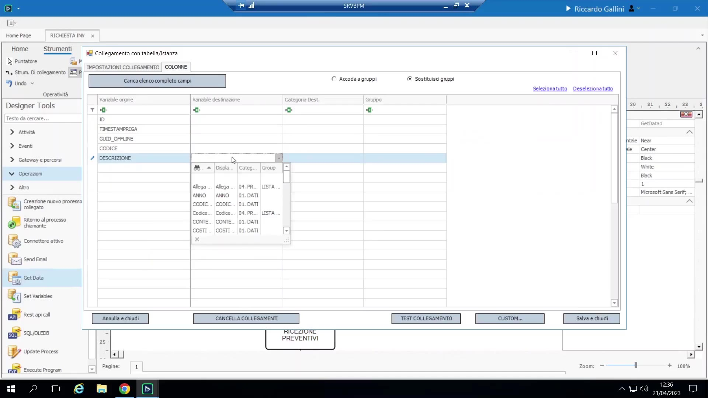{ loading=lazy }

Esempio guidato: dato un codice fornitore, si consulta la tabella fornitori e si precompila automaticamente la ragione sociale in una variabile `ragione_sociale` — comunemente usato proprio all'**inizio** di un processo, quando l'utente inserisce solo un codice e il resto dei campi anagrafici deve autopopolarsi.

Get Data vs. query SQL grezza: Get Data è più guidato (conosce i tipi di colonne/tabelle, meno soggetto a errori) ma limitato a una semplice ricerca puntuale per chiave; qualunque cosa richieda join, GROUP BY, più righe restituite o logica arbitraria richiede l'operazione SQL.
