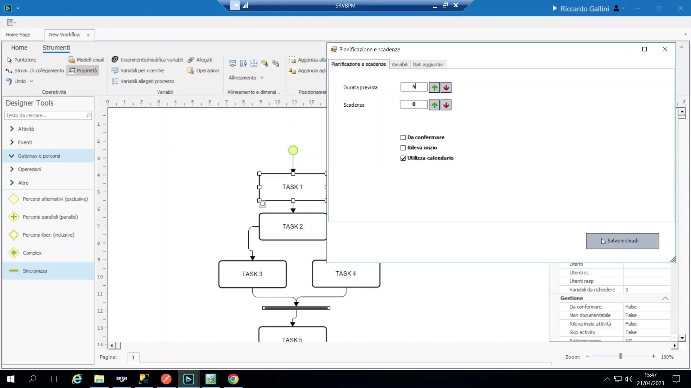
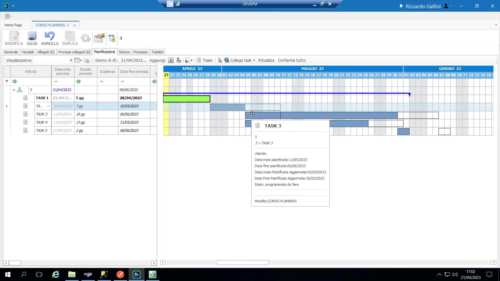

# Pianificazione e Gantt

## Concetto di base

Oltre a tracciare le date/orari effettivi di inizio/fine di ogni attività (cosa che BPM registra sempre di default), BPM offre un livello opzionale di **pianificazione/stima**: durate standard attese per attività, riepilogate automaticamente in un Gantt dal vivo che si aggiorna man mano che il processo procede realmente.

Caratteristiche importanti:

- Le durate sono espresse in **giorni di calendario** (tempo solare), *non* in unità di sforzo/capacità — non esiste in BPM un concetto di capacità/allocazione risorse.
- L'intera funzionalità è opzionale per ogni processo; può essere disattivata interamente tramite permessi quando non è utile per un dato processo (vedi Calendario e permessi, sotto).

## Impostare durate standard e Gantt auto-generato

1. Su ogni attività, si apre **Pianificazione e Scadenze** e si imposta una durata standard in giorni (es. 5, 7, 15, 2).

    { loading=lazy }

2. Non appena un'istanza di processo parte, BPM calcola immediatamente una stima Gantt dell'intero processo a partire da queste durate standard, visibile sotto la scheda **Pianificazione** del magazzino delle variabili.
3. Il motore del Gantt modella correttamente la struttura delle dipendenze — inclusi i rami paralleli (due attività affiancate, con logica finish-to-start che alimenta l'attività di ricongiungimento a valle solo dopo la conclusione del ramo parallelo *più lungo*) — "proprio come in Project".

## Aggiornamenti dal vivo mentre il processo procede

- Man mano che ogni attività viene effettivamente completata, la sua barra Gantt passa dalla durata pianificata originale (mostrata tratteggiata, come "baseline") alla durata compattata/reale, e **tutto ciò che sta a valle si sposta di conseguenza**.
- **Comportamento chiave — il piano spinge solo a destra, mai a sinistra:** se l'avanzamento reale va più tardi del previsto, la pianificazione "aggiornata" slitta più avanti; ma procedere *in anticipo* su un'attività non comprime automaticamente la stima al di sotto delle durate standard per le attività non ancora iniziate.
- Riprogrammare un'attività dalla vista to-do list/calendario (es. trascinando un'attività a una data successiva) rimodella immediatamente anche il Gantt a valle — perché le date della to-do list e le date del Gantt sono letteralmente lo stesso dato sottostante, non due sistemi separati.

## I tre insiemi di date

Per ogni attività, BPM traccia tre copie parallele dell'intervallo di date:

1. **Programmazione (iniziale/baseline):** il piano originale, punto zero.
2. **Aggiornamento:** la stima corrente, ricalcolata continuamente dal vivo.
3. **Effettiva:** popolata solo una volta che un'attività è realmente iniziata e/o terminata.

## Data scadenza — separata dalla durata

Concetto: un vincolo di scadenza rigido, imposto dall'esterno (mostrato come un pallino rosso sulla barra del Gantt), impostabile su **qualunque** attività — non solo l'ultima — usato per confrontare la pianificazione aggiornata dal vivo con una data promessa.

Indicazione emersa in sede di Q&A: il modo *corretto* di impostare una scadenza è agganciarla a una vera **variabile data** (qualcosa che l'utente inserisce, o che arriva da un sistema esterno come SAM) piuttosto che a una durata relativa del tipo "N giorni dopo l'inizio" — perché le durate rispondono a "quanto tempo richiede", mentre una scadenza è un vincolo esterno che va catturato come un proprio dato autonomo.

Caso d'uso: scadenze di milestone intermedie a metà processo — es. date di checkpoint del cliente dentro un progetto più lungo, non solo una singola data di fine.

## Rileva inizio (disaccoppiare inizio attività da attivazione)

Comportamento di default: senza questo flag, l'"inizio" di un'attività si assume coincidente con il momento in cui l'attività precedente è terminata (cioè attivazione = inizio).

Con "rileva inizio" abilitato su un'attività:

- La to-do list mostra un pulsante **"Inizia"** invece di saltare direttamente a "Esegui".
- Finché l'utente non clicca esplicitamente Inizia, la barra Gantt dell'attività ha un contorno sottile/non marcato e nessuna data di inizio effettiva.
- Una volta iniziata, la barra ottiene un bordo marcato e viene registrata una vera data di inizio effettiva.
- Caso d'uso: lavoro che è *pronto ma non ancora iniziato* — es. attività di progettazione/ingegneria che restano "disponibili" per un po' prima che qualcuno le prenda in carico — distingue "in coda" da "in corso".
- Questo si ricollega direttamente ai punti di aggancio delle operazioni Attivazione vs. Inizio: l'aggancio "Inizio" scatta in modo significativo solo su attività con rileva inizio abilitato.

## Agganciare date/durate a variabili di processo

Sia la **scadenza** sia la **durata pianificata** di un'attività possono essere agganciate a una variabile di processo invece che a un valore fisso di configurazione, rendendo il piano dinamico in base ai dati del processo invece che a un numero statico a livello di modello.

Esempi guidati:

- Scadenza: agganciare "data scadenza" (calendario) a una variabile "data consegna prevista" che il commerciale compila al momento dell'inserimento.
- Durata: un cliente reale aveva una variabile a lista di valori "difficoltà" (A/B/C), e una formula/decision table calcolava la durata standard a partire da essa (es. 5/7/10/12 giorni), che pilotava poi la durata pianificata dell'attività:

```vb
If difficolta = "A" Then
 Return 5
Else
 Return 10
End If
```

## Da confermare — aggiustamento della baseline iniziale

Concetto: un flag per attività che dà al **proprietario** del processo una finestra una tantum, proprio nel momento in cui l'attività diventa disponibile, per aggiustare manualmente le date pianificate di quella specifica istanza (trascinandole) prima di bloccarle definitivamente.

Flusso operativo:

1. L'attività diventa disponibile con stato "da confermare"; il proprietario può liberamente trascinare/aggiustare le sue date pianificate (e ogni effetto a valle) — questo tocca ancora la baseline *iniziale*, ma solo per questa istanza, non per il modello.
2. Il proprietario clicca **Conferma** (per singola attività, o "conferma tutto"): questo **congela** il piano aggiustato come baseline permanente dell'istanza ("versione 0" / punto di confronto).

    { loading=lazy }

3. Da quel momento in poi, ogni ulteriore scostamento viene tracciato solo nella pianificazione "aggiornata", relativamente a quella baseline congelata — la baseline confermata in sé non cambia mai più.

- Se un'attività non è marcata "da confermare", nasce già confermata, e il piano derivato dalla durata standard originale è semplicemente, fin dall'inizio, la baseline permanente.

## Calendario e permessi

- BPM ha un **calendario interno integrato** che tiene conto di weekend e festività; quando viene calcolata una durata attività di "12 giorni", questa copre di default 12 giorni *di calendario* (i weekend sono mostrati in grigio nel Gantt). Un flag per attività ("Utilizza Calendario") permette a un'attività di ignorare il calendario e contare i giorni trascorsi grezzi (es. un passaggio di processo genuinamente attivo 24/7). Il calendario in sé non è facilmente personalizzabile dall'utente finale — lo si usa o non lo si usa.
- L'intera vista di pianificazione/Gantt (visualizzazione e/o modifica) è vincolata da **permessi a livello di processo** ("visualizza pianificazione" / "modifica pianificazione") per utente/gruppo — per i processi in cui il Gantt non ha significato, è meglio nasconderlo del tutto piuttosto che mostrare un grafico confuso o irrilevante.
