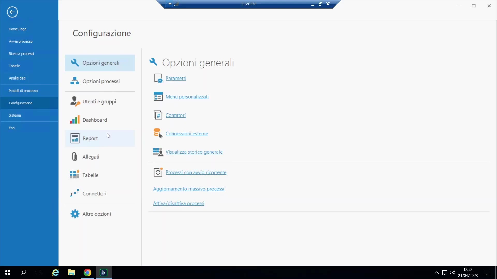
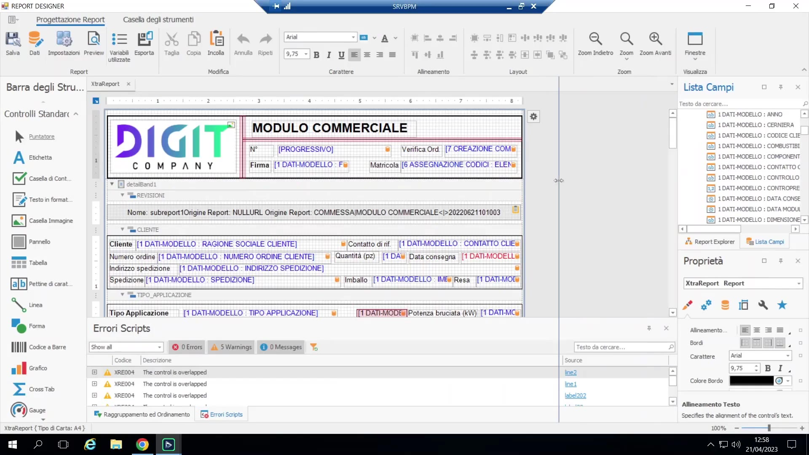
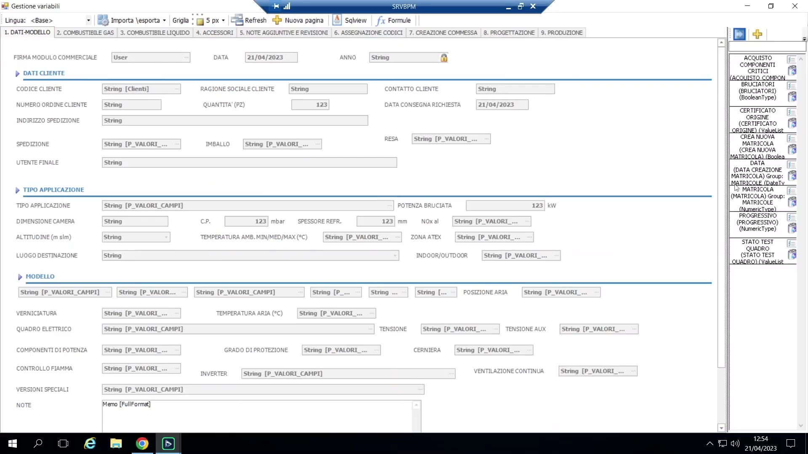
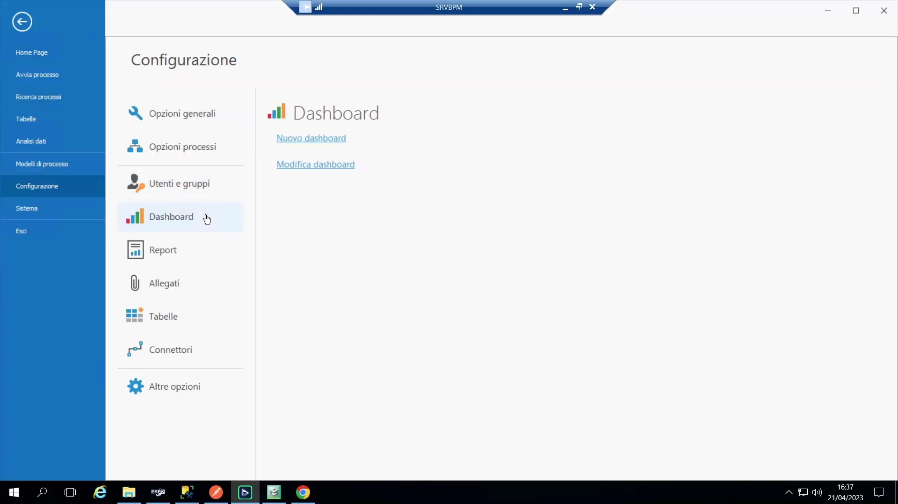
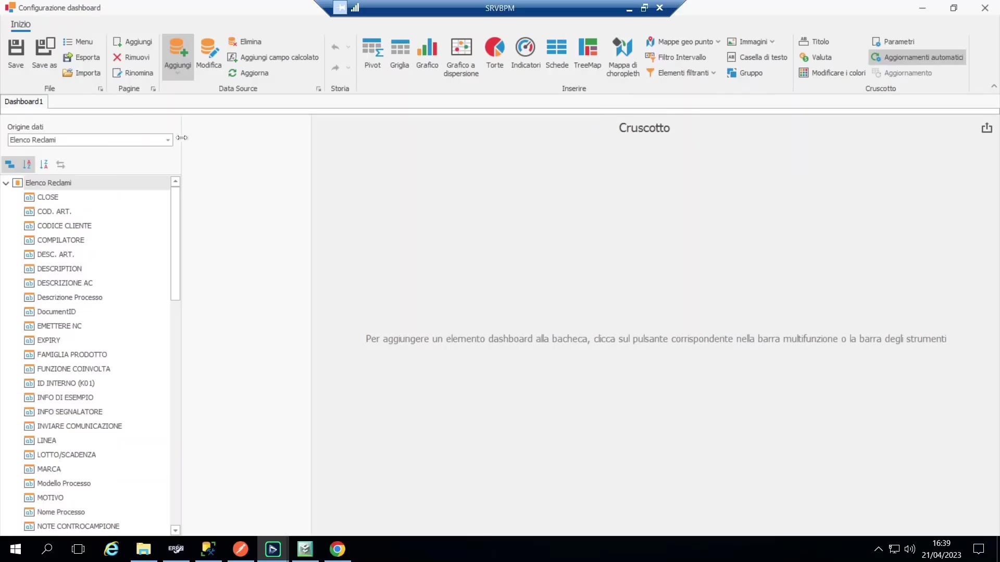
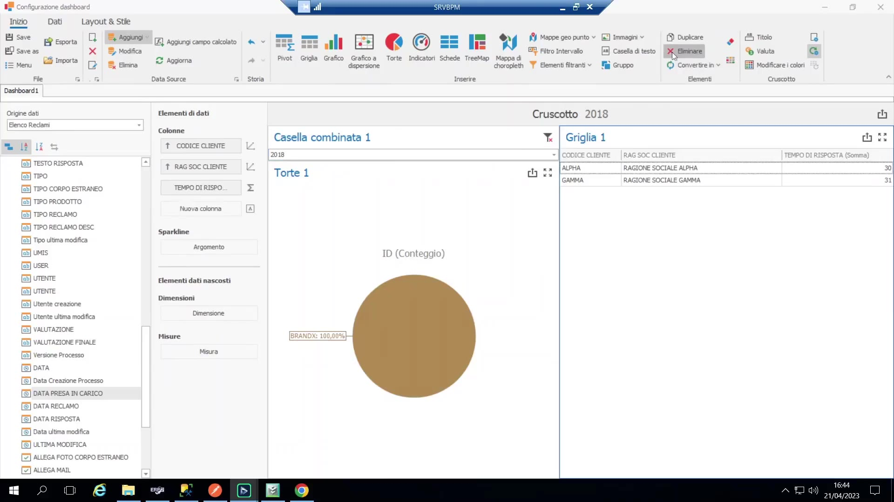
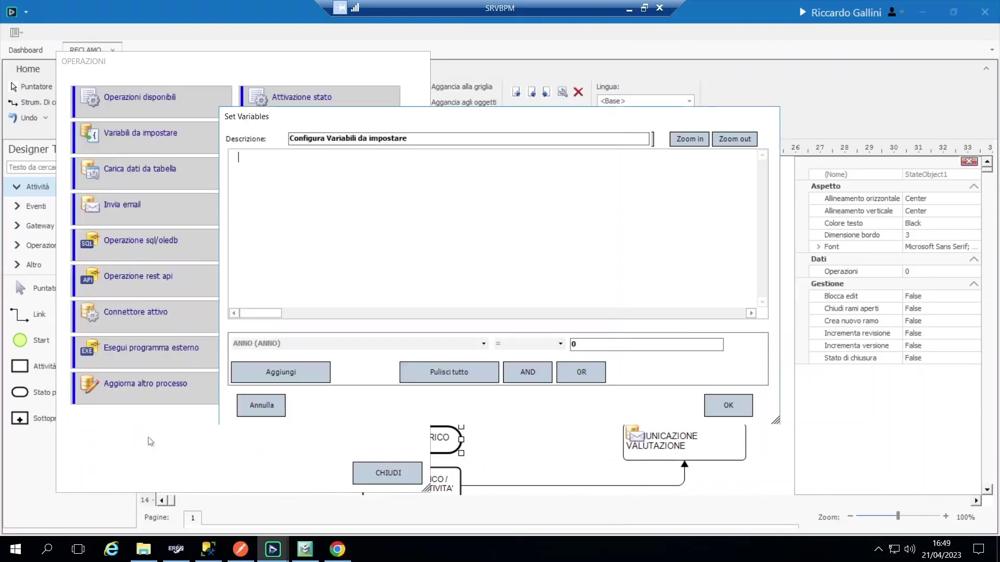

# Report e dashboard (analisi dati)

Due modalità complementari per estrarre/presentare i dati raccolti in un processo BPM, entrambe basate sulle **variabili di processo** come sorgente dati (nessuna estrazione dati separata necessaria).

{ loading=lazy }

## Report (documenti pixel-perfect)

Un designer di report di terze parti integrato (stessa famiglia di prodotto di Crystal Reports / dei generatori PDF usati in RGT e "Globe" di SAM) che permette di impaginare un documento in stile PDF e trascinare variabili di processo in segnaposto etichettati.

{ loading=lazy }

Caso di studio reale — "scheda commessa": prima di BPM, i commerciali di un'azienda compilavano a mano un modulo PDF/Word vuoto per ogni nuovo ordine/commessa, poi lo inviavano via mail in giro e inseguivano manualmente i colleghi ("hai inserito il numero di serie? hai fatto l'ordine?"). Il processo BPM ora replica e migliora questo flusso: la prima attività cattura ~70-80 campi direttamente in BPM (molti commerciali, anche via client web/mobile in trasferta), con molti campi trasformati da testo libero a **selezioni guidate da tabella** (vedi tabelle P_) — pur mantenendo testo libero dove serviva la flessibilità richiesta dal cliente.

{ loading=lazy }

Costruzione di un report:

- I campi presentati nel designer sono raggruppati per pagina/nome variabile, rispecchiando l'organizzazione delle variabili nel processo stesso.
- Trascinando una variabile sul canvas si crea un segnaposto agganciato; si aggiungono etichette statiche intorno.
- **Sezioni condizionali:** intere sezioni possono essere mostrate/nascoste in base a una condizione (es. mostrare una sotto-sezione "Gas1/Gas2" solo se quelle caselle sono selezionate) — utile per moduli con molti sotto-blocchi opzionali.
- **Report testata/dettaglio (gruppo):** con un po' di attenzione, un report può rendere una variabile di gruppo (es. elenco preventivi) come blocco "dettaglio" ripetuto, producendo più righe per pagina stampata.
- I report sono salvati nel database BPM (non nel filesystem) come parte del processo; un comando "Stampa" sull'istanza di processo in esecuzione rende i valori correnti nel template.
- Il docente precisa che questo non vuole competere con un vero strumento di reporting/BI — è una comodità integrata, dato che i dati sono già modellati dentro il processo.

## Dashboard (cruscotti)

Un altro componente analitico di terze parti integrato (basato su DevExpress) per costruire dashboard visive interattive sui dati di processo — distinto dai report PDF pixel-perfect visti sopra.

{ loading=lazy }

Costruzione passo-passo, punto per punto:

1. Si crea una nuova dashboard, si aggiunge una **sorgente dati** agganciata a un processo scelto (es. un processo "reclamo"), la si nomina (es. "elenco reclami") e si importano le variabili che si vogliono avere disponibili come campi.

    { loading=lazy }

2. Si trascinano widget sul canvas — es. una **Griglia** e un **Grafico a torta**; ogni widget, una volta selezionato, mostra delle zone di aggancio (colonne per la griglia; valori/argomenti per il grafico) da popolare trascinandovi i campi.
3. **Formattazione numerica:** opzioni integrate per abbreviazione unità K/M, separatore delle migliaia, cifre decimali.
4. **Grafico a torta:** si trascina un campo univoco (es. `ID`) su "valore" per ottenere un'aggregazione Count di default, e un campo categorico (es. "marca") su "argomenti" per suddividere per categoria.
5. **Elementi filtro:** un widget "casella combinata" agganciato a un campo (es. una data, raggruppata per giorno/mese/anno) funge da filtro incrociato per tutti gli altri widget della dashboard quando l'utente sceglie un valore.

    { loading=lazy }

6. **Campi calcolati:** es. un campo "tempo di risposta" calcolato come `data_risposta − data_apertura`, poi usato con un'aggregazione **Media** per mostrare il tempo di risposta medio.

Prerequisito per KPI significativi — catturare esplicitamente le date chiave: i timestamp grezzi di esecuzione delle attività non sono sempre la metrica che serve (es. "giorni per rispondere a un reclamo" andrebbe misurato da "preso in carico" a "risposto", non da creazione a chiusura del ticket). Il pattern usato: agganciare operazioni **Set Variable** (vedi sopra) a specifiche transizioni di attività che scrivono `Oggi` in variabili data dedicate (`data_presa_in_carico`, `data_risposta`) automaticamente, senza alcun input utente — queste alimentano poi i campi calcolati della dashboard.

{ loading=lazy }

Disponibilità: una volta salvata, una dashboard è disponibile agli utenti finali (senza la barra degli strumenti di progettazione) sotto il menu **"Analisi Dati"** (compare solo quando esiste almeno una dashboard/tabella, come per il menu delle tabelle personalizzate) — e la stessa identica dashboard è automaticamente disponibile anche nel **client web**, senza bisogno di ricostruirla.

Posizionamento: esplicitamente *non* un sostituto della BI (nessun cubo, tutto calcolato al volo) — il suo valore è la comodità, dato che i dati sono già connessi dentro BPM.
