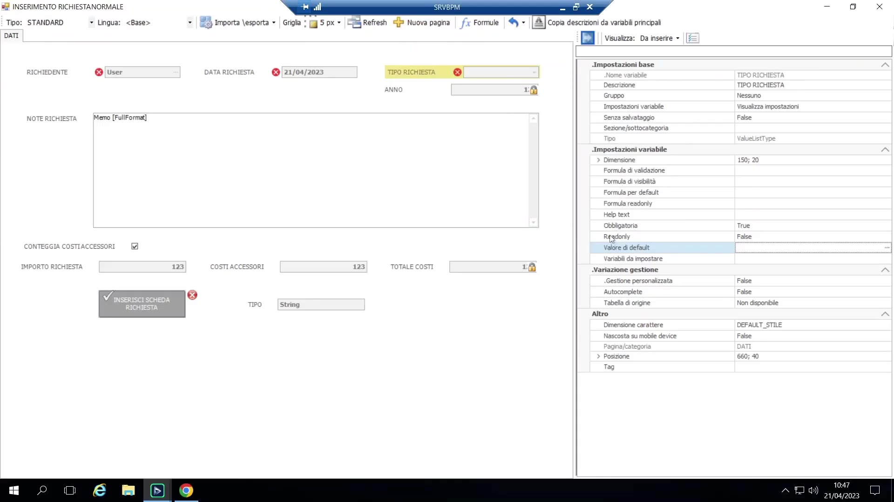
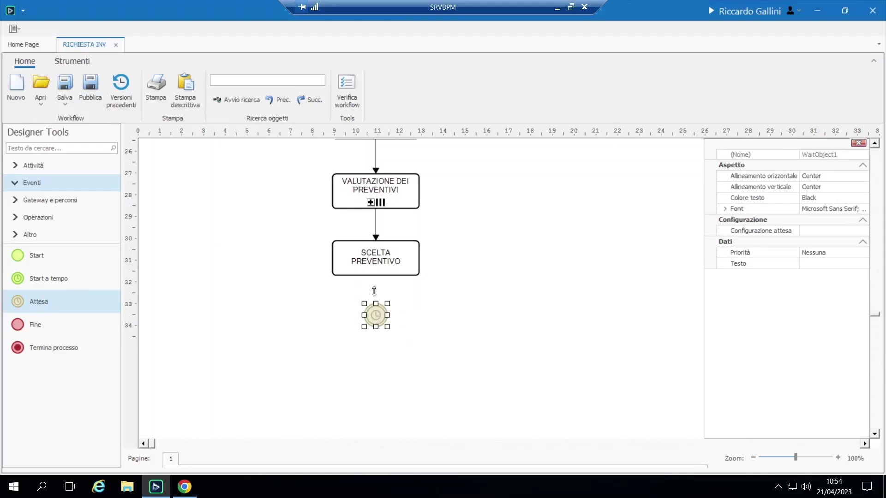
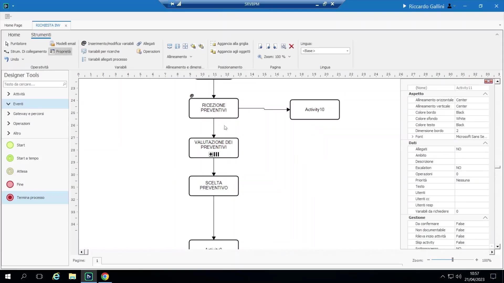
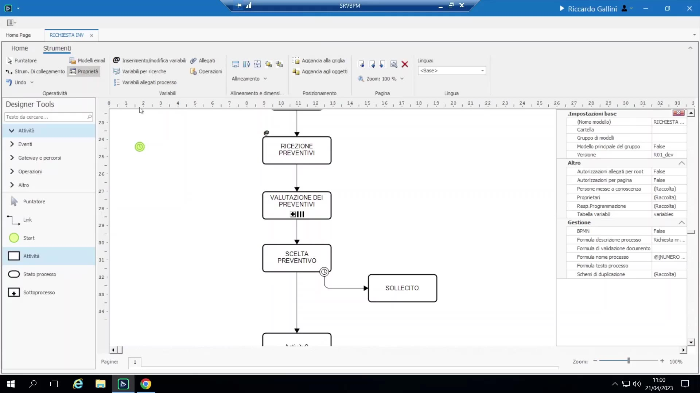

# Start multipli ed eventi

## Start multipli

Un processo può avere due o più oggetti Start distinti, ciascuno configurato in modo indipendente (proprie variabili richieste, valori di default, regole di validazione, permessi).

Esempio: "Inserimento richiesta normale" vs. "Inserimento richiesta sicurezza" — lo start sicurezza precompila/snellisce i campi in modo diverso (es. salta un passaggio di revisione, aggiunge un campo note dedicato).

{ loading=lazy }

All'avvio di un processo con start multipli:

- Comportamento di default: all'utente viene chiesto quale punto di partenza usare.
- **Restrizione per permesso:** si impostano gli "utenti responsabili" su ciascuno Start individualmente, così che solo il gruppo giusto possa usare quel punto di ingresso.
- **Associazione tramite menu personalizzato:** una voce di menu personalizzato ("menu personalizzati") può essere precablata su uno start specifico, dando a ogni punto di ingresso la propria voce di menu dedicata invece di una richiesta generica.
- **Via API/web service:** la chiamata `create-new-process` richiede un parametro esplicito di punto di partenza; ometterlo quando esistono start multipli restituisce un errore invece di sceglierne uno silenziosamente.

## Start a tempo (avvio schedulato)

Avvia un processo automaticamente secondo una pianificazione, invece che tramite un'azione utente (es. "ogni primo lunedì del mese alle 08:00"). Adatto a processi periodici/amministrativi (chiusure di fine periodo, controlli ricorrenti). Poiché non porta con sé variabili, la prima attività reale del processo deve comunque raccogliere i dati di lavoro effettivi.

## Evento Attesa (Wait)

Sospende il processo per una durata configurata (es. "attendi 5 giorni", oppure il pattern "il primo lunedì") e poi prosegue automaticamente — durante l'attesa **non esiste alcuna voce in to-do list** (a differenza della semplice pianificazione di un'attività fra 10 giorni, che invece resterebbe comunque nella to-do list di qualcuno per tutto il tempo).

{ loading=lazy }

Esempio reale: il processo interno di "welcome kit" (inserimento di un nuovo dipendente) usa l'evento attesa in più punti per scaglionare i passaggi di un certo numero di giorni.

## Fine vs. Termina Processo

- **Fine:** un semplice marcatore grafico di chiusura di un ramo — segnala visivamente "questo ramo del diagramma finisce qui", nessun effetto a runtime oltre a questo.
- **Termina Processo:** **uccide** effettivamente l'intera istanza di processo — qualunque attività parallela ancora aperta altrove nel processo viene chiusa forzatamente. Tipicamente usato su rami di eccezione/errore quando si decide che l'intera istanza vada interrotta.

    { loading=lazy }

## Eventi boundary: timeout ed escalation

Un evento agganciato al **bordo di un'attività** (non alla linea di flusso principale) — attiva un percorso alternativo dopo N giorni dalla data di attivazione dell'attività o da una scadenza, es. per attivare un promemoria o un passaggio di mano a un altro utente. Funzionalmente "timeout" ed "escalation" sono lo **stesso** meccanismo; le due icone differiscono solo per convenzione semantica (timeout = "questa attività sta impiegando troppo tempo, sollecita"; escalation = "passa di mano/alza il livello"). Corrisponde al concetto BPMN di "evento di confine" ("boundary event") — l'evento esiste perché l'attività è attiva, non perché il flusso principale l'ha raggiunto.

{ loading=lazy }
