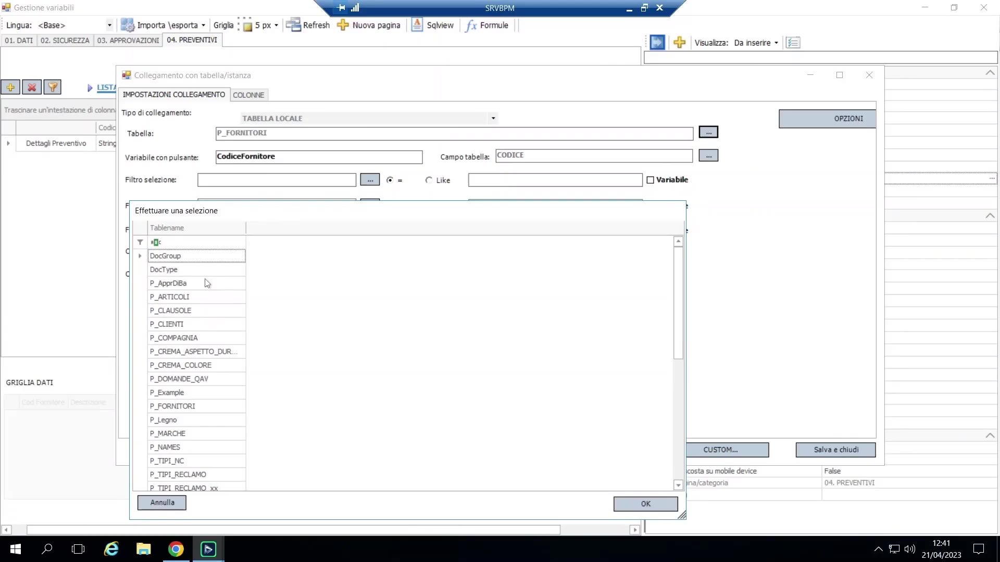
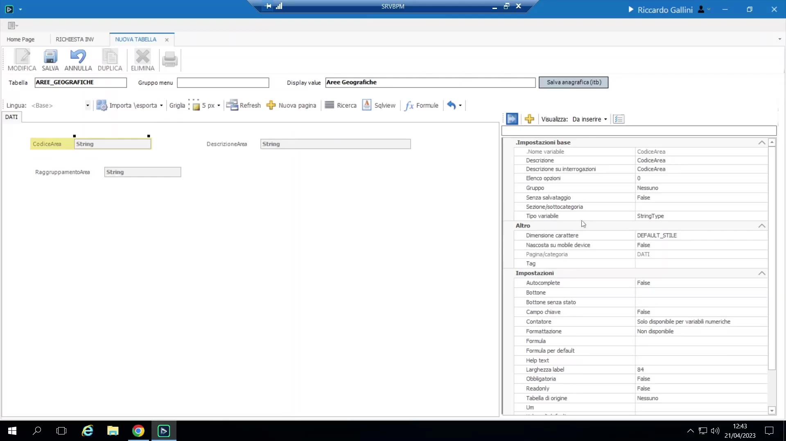

# Tabelle locali personalizzate (tabelle P_)

Oltre alle viste e liste di valori predefinite, BPM permette di definire tabelle di lookup completamente personalizzate direttamente nel designer. Salvandone una si genera automaticamente una vera tabella SQL con prefisso `P_` (es. `P_area_geografiche`).

{ loading=lazy }

Quando usarle:

- Una lista di valori non basta (servono più colonne, non solo codice+descrizione).
- I dati devono essere mantenuti da qualcuno diverso dal progettista del processo, o indipendentemente dal ciclo di pubblicazione di uno specifico processo.
- Serve filtro/ricerca su un elenco troppo lungo per una comoda dropdown.

Caso d'uso reale: usate frequentemente per tabelle di riferimento del reparto qualità (definizioni/standard non presenti nell'ERP principale).

Configurazione:

1. Configurazione → Tabelle → Nuova Tabella; le si dà un nome (gli spazi si convertono automaticamente in underscore per mantenere pulito l'identificatore SQL generato).

    { loading=lazy }

2. Si progettano le colonne con un editor molto simile a quello delle variabili di processo — ma con limiti reali: **niente gruppi/testata-dettaglio**, **niente formula di validazione**, meno funzionalità avanzate rispetto a una vera variabile di processo.
3. Salvando si crea la tabella SQL. Si popolano le righe direttamente da BPM (Tabelle → la tua tabella → Nuovo).
4. Si usa ovunque sia previsto un aggancio a "tabella locale" (aggancio campo, sorgente di una griglia dati, sorgente Get Data) — comparirà con il prefisso `P_`.
5. Se una tabella `P_...` esiste in SQL ma non è stata creata tramite il designer tabelle di BPM, BPM la elencherà comunque come sorgente di lookup, ma non se ne possono gestire i dati riga da BPM (nessun menu di inserimento valori) — utile se è popolata da un import esterno.

Permessi: le tabelle personalizzate sono soggette a permessi per utente/gruppo (visualizza/modifica), lo stesso meccanismo dei permessi di processo, configurato sotto Utenti e Gruppi.

Menu personalizzati: una tabella personalizzata può essere esposta come propria voce di menu (Configurazione → menu personalizzati → "visualizza tabella"), così l'utente finale può consultarla/mantenerla direttamente senza passare da un processo.

Guida alla scelta — lista di valori vs. tabella personalizzata:

- Usare una **lista di valori** *dentro il processo* quando logica/condizioni altrove nel processo dipendono dai suoi valori esatti — modificare la lista in seguito potrebbe altrimenti rompere silenziosamente quelle condizioni.
- Usare una **tabella personalizzata** quando le opzioni sono numerose, devono essere filtrabili/ricercabili, o chi le mantiene non deve avere il permesso di modificare il processo.
