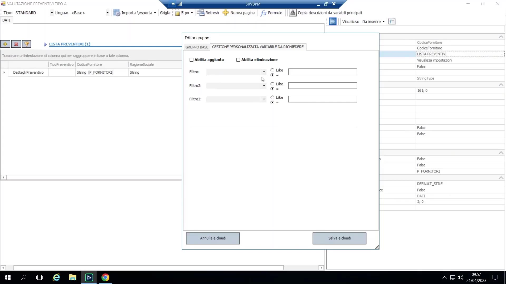
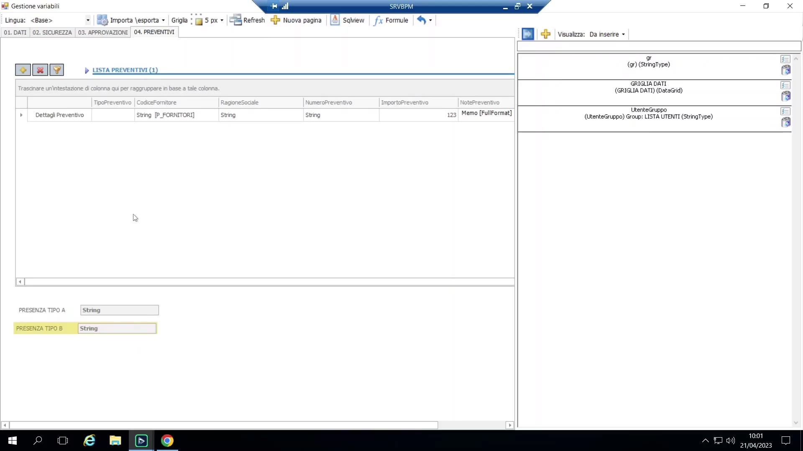
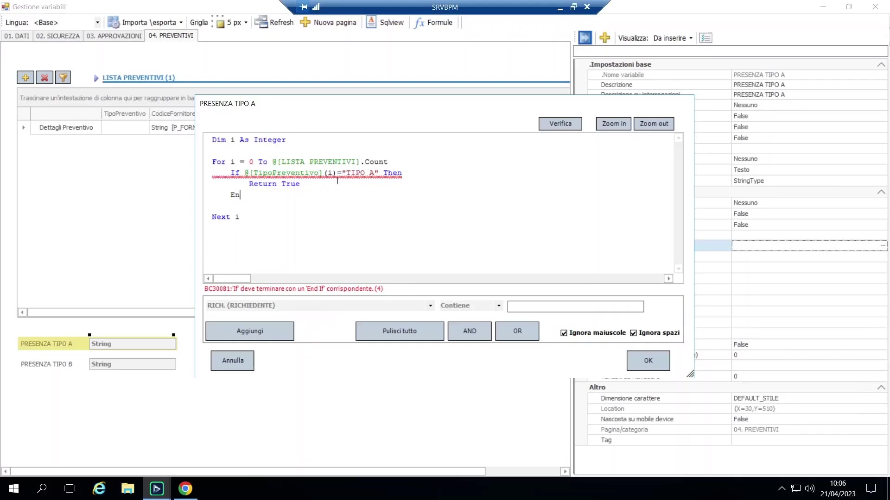
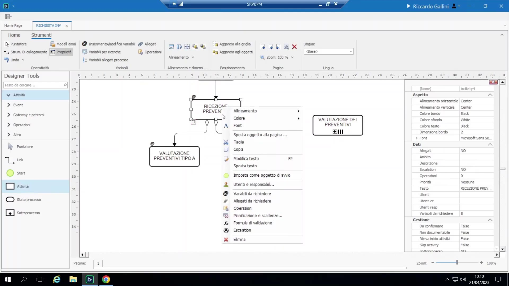

# Variabili avanzate: data grid e filtri su gruppo

## Griglia dati (data grid)

La griglia dati è un tipo di variabile di processo a sé stante, distinto sia dal campo semplice sia dal gruppo (testata/dettaglio). È un oggetto singolo che visualizza una griglia **in sola lettura**, agganciata a una tabella — locale o esterna.

Si usa per mostrare all'utente dati di contesto senza uscire dal processo: tutti gli ordini di un certo cliente, le righe di un ordine in approvazione, una tabella di budget, ecc. Non è una struttura di inserimento dati (per quello ci sono i gruppi): è una finestra di consultazione dal vivo.

Configurazione:

1. Si crea una variabile e se ne imposta il tipo su Griglia Dati, come per qualunque altra variabile.
2. Si apre la sua configurazione (la stessa schermata usata per l'aggancio tabella dei campi) e si sceglie la tabella sorgente (tabella locale P_, vista, o tabella esposta da un connettore esterno).
3. Si scelgono le colonne da esporre e, opzionalmente, se ne rinominano le intestazioni (utile quando i nomi colonna della sorgente sono criptici o in lingua straniera).
4. Si posiziona nella form/magazzino/variabili da richiedere come qualunque altra variabile, dandole spazio a schermo sufficiente.
5. Dopo la pubblicazione, aprendo un'istanza di processo la griglia appare popolata, filtrabile e raggruppabile come le altre griglie del prodotto, ma non editabile.

L'aggancio di una griglia dati usa lo stesso meccanismo di mappatura dell'aggancio tabella sui campi ("aggancio del tipo di quelle che si fanno per puntare una tabella") — cambia solo la resa a video (griglia persistente anziché combo/popup di ricerca).

## Filtro per attività su un gruppo

Un gruppo (testata/dettaglio, relazione 1-a-molti) può essere filtrato in modo **diverso per ogni attività/schermata** in cui compare, senza toccare i dati sottostanti.

Esempio reale citato dal docente: due attività parallele di revisione ("valutazione preventivi tipo A" / "tipo B") usano lo stesso gruppo "lista preventivi", ma ogni revisore deve vedere solo il proprio tipo. Un'altra applicazione concreta menzionata è un processo di controllo qualità che smistava i pezzi verso due reparti diversi in base al tipo di pezzo, con esattamente questo schema.

Configurazione, in "variabili da richiedere":

{ loading=lazy }

- Si seleziona una qualunque variabile appartenente al gruppo; le impostazioni locali permettono di disabilitare l'aggiunta/cancellazione righe (navigazione in sola lettura) e di applicare una **condizione di filtro** (es. `tipo preventivo = "tipo A"`).
- Si ripete l'operazione sull'attività parallela con il filtro opposto.

## Condizionare un percorso in base al contenuto di un gruppo

Si può usare una formula VB-script sulla **condizione di abilitazione** di un link per impedire al processo di percorrere un ramo quando un gruppo non contiene righe corrispondenti (es. non aprire il ramo "revisione tipo A" se non ci sono preventivi di tipo A).

Esempio guidato:

- Tasto destro dentro l'editor della condizione per navigare le variabili disponibili; selezionando un membro del gruppo vengono proposte espressioni helper preconfezionate (es. `Count(tipo preventivo) > 0`), ma un semplice conteggio sull'intero gruppo non è sufficiente quando serve contare solo le righe che soddisfano una condizione specifica.
- **Suggerimento — in BPM non esiste un debugger.** Non essendoci modo di eseguire passo-passo una formula, il docente consiglia di creare variabili helper "usa e getta" nel magazzino (es. `presenza tipo A`, `presenza tipo B`, di tipo stringa) solo per visualizzare cosa calcola una formula mentre la si scrive.

    { loading=lazy }

- La logica di conteggio va scritta come formula sulla stessa variabile helper (una "formula" sul campo, che si ricalcola automaticamente a ogni variazione dei dati):

```vb
Dim i As Integer
For i = 0 To lista_preventivi.Count - 1
 If tipo_preventivo(i) = "tipo A" Then
 Return "sì"
 End If
Next
Return "no"
```

{ loading=lazy }

- **Attenzione:** `Return` esce immediatamente dalla formula — a differenza di altri linguaggi (il docente cita Delphi come esempio), l'esecuzione non prosegue oltre un `Return`.
- La condizione di abilitazione del gateway a valle controlla poi semplicemente `presenza tipo A = "sì"`.

Pattern di accesso da ricordare: `variabile(i)` è il modo per indicare l'i-esimo valore di una variabile membro di un gruppo su tutte le righe — questo pattern ricorre costantemente nella logica basata su gruppi.

## Formula di validazione: a livello di campo vs. globale

- **Formula di validazione a livello di campo:** è agganciata a un singolo campo; viene verificata non appena quel campo viene modificato (es. rifiutare un importo > 1000). Il tasto per attivarla in genere si chiama "formula di attivazione" o "formula di validazione".
- **Formula di validazione globale:** è una formula separata per l'intera schermata, valutata solo quando l'utente clicca "completato" sull'attività. Si usa per regole di business trasversali a più campi, ad esempio "deve esistere almeno un preventivo di qualunque tipo prima di poter proseguire":

```vb
If Count(tipo_preventivo) = 0 Then
 MessageBox("Errore di validazione: necessario almeno un preventivo per proseguire")
 Return False
End If
Return True
```

{ loading=lazy }

Nota: `Return True` in fondo è tecnicamente opzionale/implicito, ma scriverlo esplicitamente evita ambiguità.
