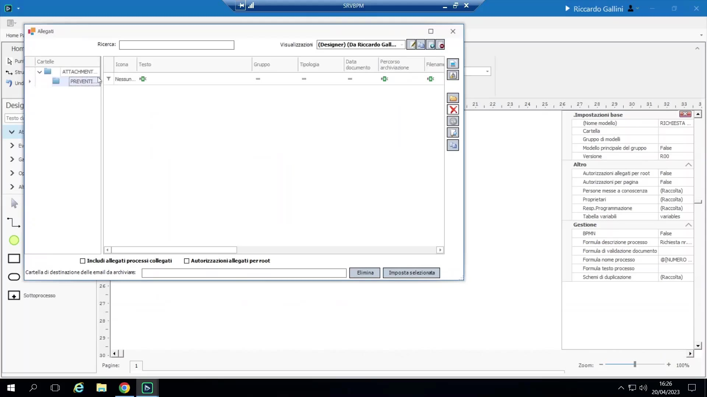
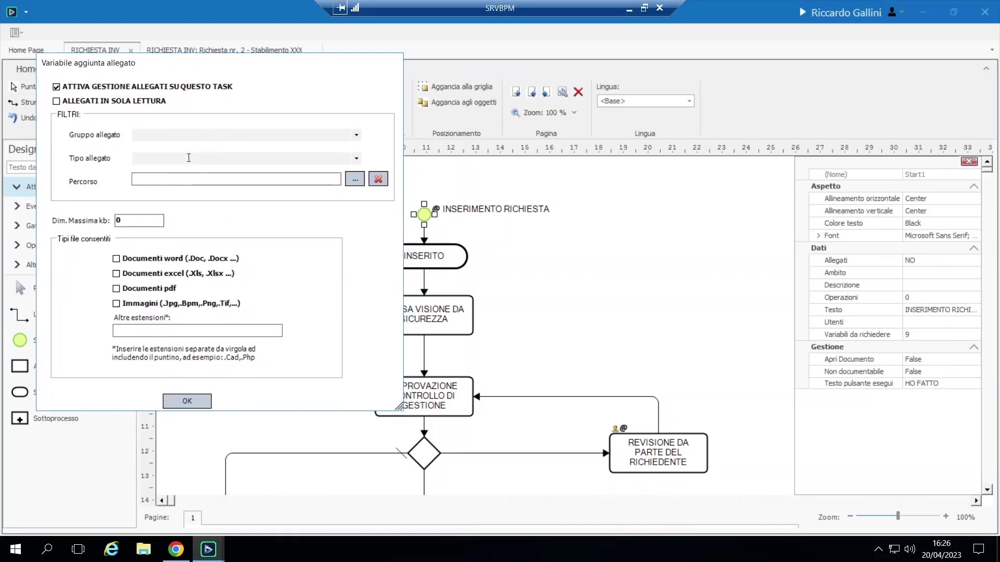
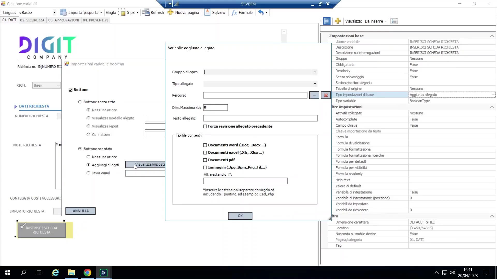
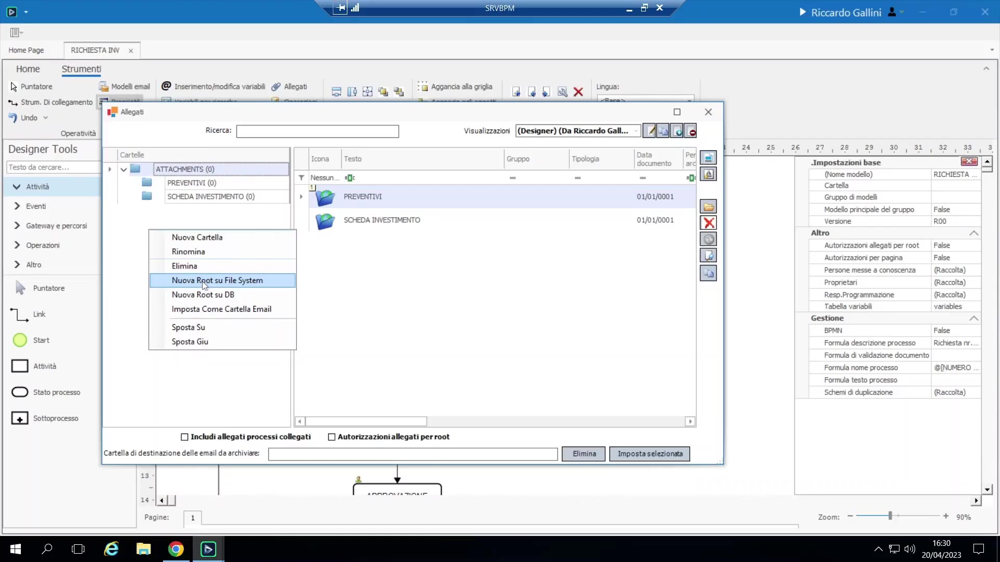

# Allegati

## Concetto

BPM ha una propria gestione documentale/allegati, sempre ambientata **all'interno di un processo** (un documento non vive mai standalone in BPM — è sempre parte del "dossier"/"plico" di un processo). I documenti possono essere organizzati in **cartelle virtuali** create dentro il tab Allegati del processo ("Visualizza elenco" vista a lista / "Visualizza struttura" vista ad albero), es. "Preventivi", "Scheda Investimento".

{ loading=lazy }

**Visualizzatore documenti integrato**: PDF, Word, Excel, e-mail (.msg) e immagini si anteprimano direttamente dentro BPM; altri tipi di file si aprono con doppio clic nell'applicazione associata dal sistema operativo. E-mail e allegati possono essere **trascinati direttamente da Outlook**, utile quando un processo è innescato da uno scambio di e-mail.

## Abilitare gli allegati per task

**"Allegati da richiedere"** è la controparte file-management di "Variabili da richiedere":

{ loading=lazy }

- Attiva/disattiva la gestione allegati per un dato task.
- Può fissare la cartella target di default del task (es. lo Start punta a "Scheda Investimento").
- Può essere impostato in **sola lettura** su un task puramente per esporre la visibilità dei documenti già raccolti senza permetterne la modifica (es. mostrare tutti gli allegati, in sola lettura, su un passo di revisione successivo).

Un **pattern di allegato obbligatorio**: si crea una variabile Bottone stateless (es. "Inserisci scheda richiesta"), la si configura in "Tipo impostazioni di base" come **Aggiunta allegati**, si sceglie una cartella target e opzionalmente si restringono le estensioni file ammesse, poi la si trascina nelle "variabili da richiedere" di un task e la si marca obbligatoria — pura configurazione, senza scripting, per forzare il caricamento di uno specifico documento richiesto prima che il processo possa avanzare. Applicabile sia a livello di processo (es. una "scheda investimento" PDF obbligatoria allo Start) sia a livello di riga di gruppo (es. un bottone "Allega preventivo" dentro ogni riga di preventivo in una griglia di dettaglio).

{ loading=lazy }

## Storage: Database vs. File System

Un nuovo processo nasce con una root di allegati **su database** di default ("Attachments" — lo stream del file memorizzato come tabella dentro il database di BPM stesso). Si possono creare **root aggiuntive**:

{ loading=lazy }

- **Su database**, oppure
- **Su file system**, dato un path di base (tipicamente una share di rete raggiungibile da tutti) che può essere **costruito dinamicamente da variabili di processo** (es. un pattern di path che combina stabilimento + numero richiesta), così BPM crea automaticamente a runtime una sottocartella reale per-istanza su disco — rispecchiando come molti clienti già organizzano i documenti su unità condivise per stabilimento/numero richiesta.

Root dei due tipi possono essere **liberamente mescolate** all'interno di uno stesso processo; visivamente, le cartelle file system hanno un'icona distinta (con tinta blu) nell'albero, ma funzionalmente, dall'interno di BPM, il caricamento drag-and-drop funziona identicamente in entrambi i casi. Il tasto destro su una cartella offre diverse capacità amministrative a seconda del tipo di storage.

**Avvertenze**:

- Gli allegati su DB sono interamente governati da BPM (cancellazione in BPM = definitiva; si applicano i permessi BPM).
- Gli allegati su file system restano accessibili/modificabili/cancellabili in modo indipendente **direttamente sulla share, fuori da BPM** — un vero gap, poiché il modello di permessi di BPM non governa i permessi a livello di file system (due sistemi di permessi da mantenere in parallelo). Opinione personale del docente: lo storage su FS è concettualmente la scelta "sbagliata" per un approccio corretto di gestione documentale (sicurezza/logging/accesso dovrebbero vivere in SQL), ma è pragmaticamente supportato e usato nella pratica, specialmente per un rollout iniziale più leggero quando un cliente ha già documenti organizzati su file system (rimandando la migrazione "corretta" al DB a una fase progettuale successiva).
- BPM può anche **pre-generare un intero albero di cartelle template** alla creazione del processo (rispecchiando una tipica struttura di cartelle di commessa/progetto — preventivi/disegni/schede tecniche/...), utile per clienti già abituati a queste convenzioni.
- Buona prassi per i path delle root FS: memorizzare il nome del server in una **variabile d'ambiente** invece di codificarlo in ogni formula di path (raramente fatto realmente sul campo); alcuni clienti mantengono invece una tabella SQL che mappa ogni processo ai propri path di root.

## Metadati e versionamento a livello di allegato

- Un allegato può avere **colonne di metadati personalizzate** (distinte dalle variabili di processo) che vengono legate al valore di una variabile di processo al momento del caricamento (es. aggiungere una colonna "Ragione Sociale" alla griglia allegati, legata alla ragione sociale del fornitore di quella riga di preventivo) — uno snapshot denormalizzato catturato sul file stesso.
- Gli attributi standard di un allegato includono **Revisione** e **Stato** (Attivo/Obsoleto). Il versionamento oggi è **solo manuale**: un allegato può essere marcato "Obsoleto" e la vista può essere alternata per mostrare/nascondere gli obsoleti (es. riallegare un documento revisionato quando un processo torna indietro in un loop) — non esiste un concatenamento automatico delle versioni.
- I caricamenti di allegati sono tracciati in **Storico** (sezione 6.5) esattamente come le modifiche alle variabili.
- Nessun limite di dimensione file rigido è imposto da BPM stesso (file molto grandi rischiano solo timeout/lentezza); una **dimensione massima** può essere esplicitamente configurata su un bottone "Aggiunta allegati".
- Gli allegati possono (argomento riservato a una sessione successiva) essere integrati con il prodotto documentale di Digit ("Globo"), così i file vivono lì invece che in BPM.
