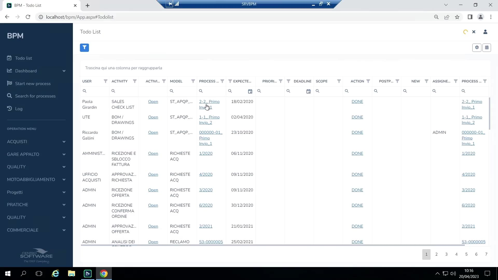

# Architettura

## I tre pilastri di ogni soluzione BPM

Ogni soluzione costruita in BPM si basa su tre elementi che ricorrono in tutto il prodotto:

1. **Il processo** — il diagramma di attività, gateway ed eventi.
2. **Utenti e gruppi** — chi fa cosa.
3. **Le variabili di processo** ("magazzino delle variabili") — i dati che il processo porta con sé.

## Client desktop vs. applicazione Web

- **Client desktop**: copre la modellazione/progettazione del processo, la configurazione (utenti, dashboard, report, strutture, opzioni di posta, allegati) e l'uso operativo (avvio/ricerca processi, To-Do List). È l'ambiente in cui il consulente passa la maggior parte del tempo di progettazione.

    { loading=lazy }

- **Applicazione Web**: solo operativa (To-Do List, avvio nuovo processo, ricerca, storico) — nessuna superficie di configurazione/progettazione. È stata recentemente riscritta secondo il tema visivo "Portale 6.0" e, secondo il docente, è destinata a raggiungere piena parità funzionale con il client fino a diventare il **client consigliato per gli utenti finali** (viene usato internamente anche in Digit). Storicamente il web era indietro su alcune funzionalità (es. la gestione allegati era diversa non solo esteticamente, ma anche funzionalmente); al momento della registrazione la parità è quasi raggiunta, con un residuo di lavoro stimato in circa un trimestre.
- Il web utilizza un **modello a pannelli impilati**: passando dalla To-Do List al dettaglio di un processo, la To-Do List resta "dietro" (recuperabile tramite un'icona di stack) invece di essere sostituita da una navigazione a pagina intera — così più record possono restare aperti contemporaneamente.
- Attenzione al layout: client e web usano font e spaziature diverse (il web è più "arioso", basato su Bootstrap); una schermata progettata in uno dei due ambienti va sempre verificata anche nell'altro prima del rilascio. Le preferenze di colonne/griglia (es. colonne della To-Do List) sono salvate **per utente ma separatamente** tra client e web.
- Il client desktop resta comunque l'ambiente primario per **progettazione/configurazione** e test rapidi in locale durante la costruzione di un processo.
