# Il Designer e gli oggetti di processo

## Layout e flusso di lavoro del Designer

Il Designer è organizzato in tre pannelli: la **palette degli oggetti/strumenti** (raggruppati in Attività, Eventi, Gateway, Operazioni/automazioni e altri oggetti di supporto), un **pannello proprietà** (contestuale a ciò che è selezionato — cliccando sull'area bianca del canvas compaiono le proprietà del processo, cliccando lo Start compaiono le proprietà dello Start) e il canvas stesso. Una ribbon in alto raccoglie i comandi di disegno/allineamento.

- Più modelli di processo possono essere aperti contemporaneamente in tab paralleli, e le tab possono essere affiancate in vista side-by-side (utile per confrontare o copiare elementi tra due modelli).

    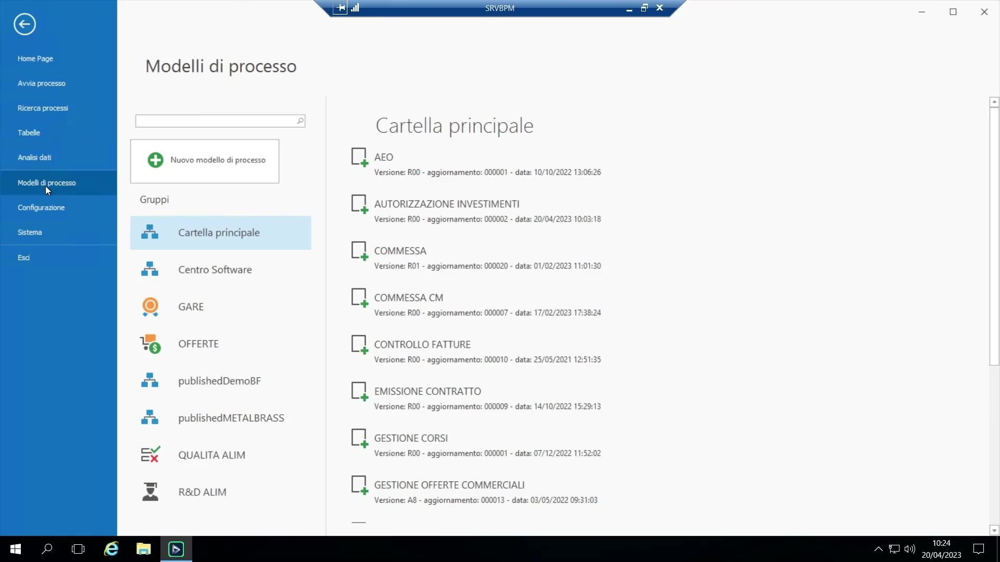{ loading=lazy }

- **Buona prassi**: abbozzare una versione grezza del processo rapidamente — anche in diretta con il cliente/l'utente business — prima di raffinare nomi, regole e dettagli. È una prassi iterativa normale, non un mancato lavoro di pianificazione: bozza → prova → correzione del tiro.

    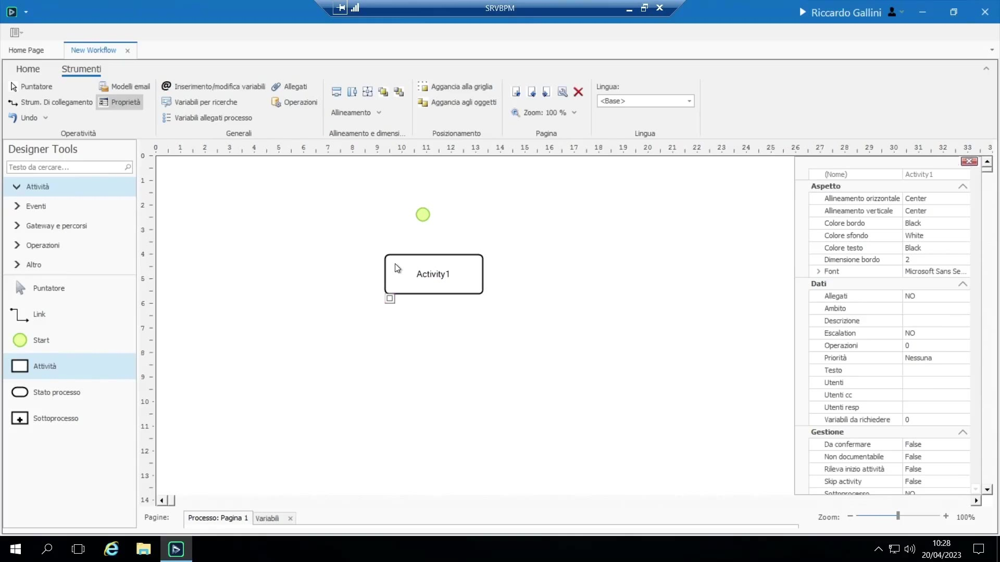{ loading=lazy }

- **Terminologia**: "Modello di processo" è il template/design riutilizzabile; "Processo" è un'esecuzione/istanza in corso di quel template.

## Le shape principali

| Shape | Significato |
|---|---|
| Cerchio verde | Evento di **Start** — dove inizia un'istanza di processo |
| Rettangolo | **Task/Attività** — lavoro da svolgere da parte di un utente/gruppo |
| Shape rotonda "stato" | **Stato** — un'etichetta di milestone/checkpoint (non è lavoro, è un marcatore di stato, es. "Inserito", "Approvata") |
| Rombo | Marcatore implicito di ramo su una freccia semplice condizionata, oppure l'oggetto **Gateway** dedicato |
| Box distinto | **Sotto-processo** — un mini-diagramma annidato, progettato separatamente |
| Cerchio "Fine" | Marcatore di fine opzionale, puramente cosmetico |

La notazione utilizzata è un **sottoinsieme dello standard BPMN** — non tutte le shape BPMN sono implementate, solo quelle con una funzionalità rilevante per BPM.

**Attività (Task)**

- Trascinando un'attività sul canvas le viene assegnato un codice interno permanente (Activity1, Activity2,...) usato come ID immutabile; il **nome visualizzato**, leggibile dagli utenti, si imposta separatamente con tasto destro > "Modifica testo" (es. "Presa in carico da ufficio sicurezza").

    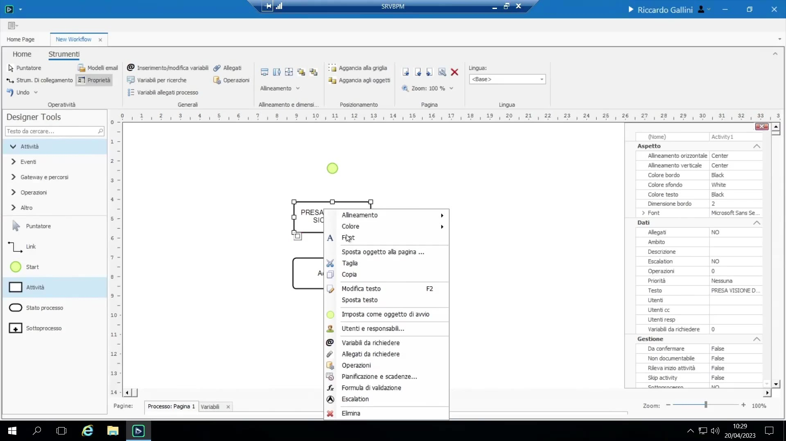{ loading=lazy }

- Consiglio: nomi chiari ma non troppo lunghi. Tasto destro > "Sposta testo" permette di staccare visivamente un'etichetta dalla propria shape (restando comunque logicamente collegata) — utile occasionalmente per l'evento di Start (es. rietichettarlo "Inserimento richiesta").
- Lo strumento **Link** disegna i collegamenti tra le shape, creando punti di ancoraggio; la ribbon offre strumenti di allineamento/uniformazione delle dimensioni per tenere ordinati i diagrammi grandi (i diagrammi sono visti dagli utenti finali, quindi la leggibilità conta).

    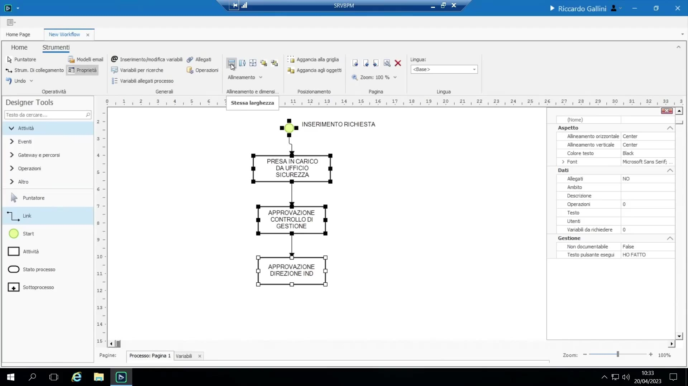{ loading=lazy }

**Stati (milestone)**

Un oggetto "Stato" marca un punto importante nel ciclo di vita complessivo del processo, indipendentemente da quale specifica attività sia in corso (es. "Inserito" all'inizio, "Approvata" alla fine, "Annullata" in caso di annullamento). Gli stati sono puramente etichette, senza alcun significato di sistema al di là dell'essere interrogabili/ricercabili in seguito (es. interrogare "tutte le richieste annullate").

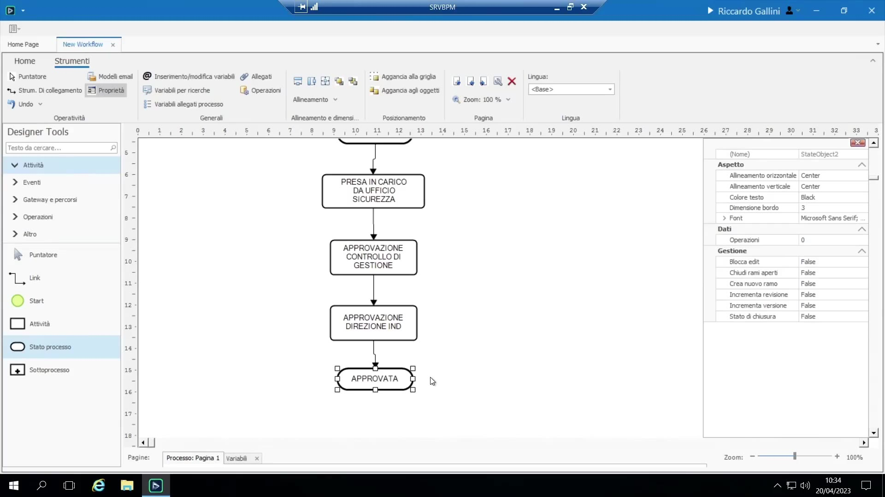{ loading=lazy }

**Fine vs. Termina processo**

- **Nessun oggetto di fine esplicito è necessario**: la regola generale di BPM è "quando non ci sono più attività da fare, il processo è concluso" — automaticamente, senza alcuna configurazione particolare.
- **Fine**: opzionale, puramente un marcatore visivo/di documentazione, senza alcun effetto funzionale.

    { loading=lazy }

- **Termina processo**: funzionalmente diverso — il raggiungimento di questo oggetto uccide/interrompe forzatamente ogni altro ramo ancora in corso di quella istanza di processo.

    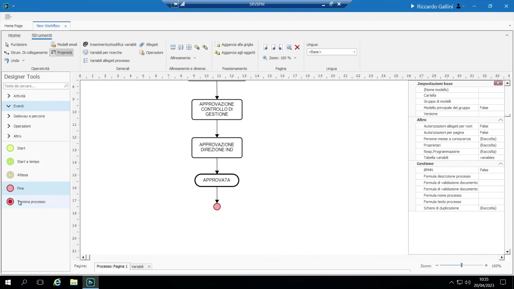{ loading=lazy }

## Diramazioni: condizioni e gateway

Esistono due modi — equivalenti ma con diversa chiarezza — per esprimere la logica di diramazione in BPM, entrambi basati sul **motore delle formule** (vedi 4.7):

1. **Freccia semplice condizionata** (il "baffetto"): tasto destro sulla freccia in uscita > "Condizione di abilitazione" e scrittura di una formula (es. `esito approvazione CDG = "Approvata"`). Compatta, ma il motore **non** impone la mutua esclusività — le condizioni in uscita possono sovrapporsi o lasciare vuoti; è responsabilità di chi progetta scrivere condizioni complementari.

    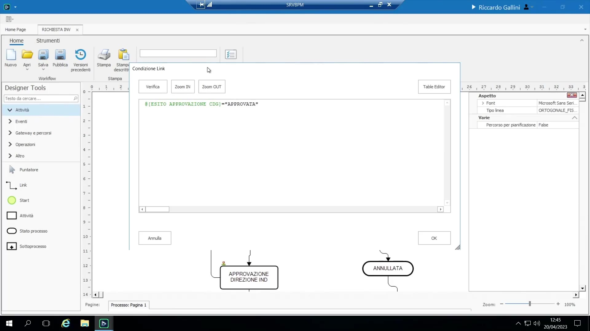{ loading=lazy }

2. **Oggetto Gateway** (il rombo in palette): doppio clic/tasto destro > "Configurazione" mostra *tutti* i percorsi in uscita e le relative condizioni in un'unica schermata; le valuta in ordine e prende il primo match vero, con un ramo marcabile come **default/"else"** (quindi N rami richiedono solo N−1 condizioni esplicite). Più "professionale" secondo lo standard BPMN e più autoesplicativo nel diagramma, particolarmente utile con 3 o più rami, al costo di un po' più di spazio nel disegno.

    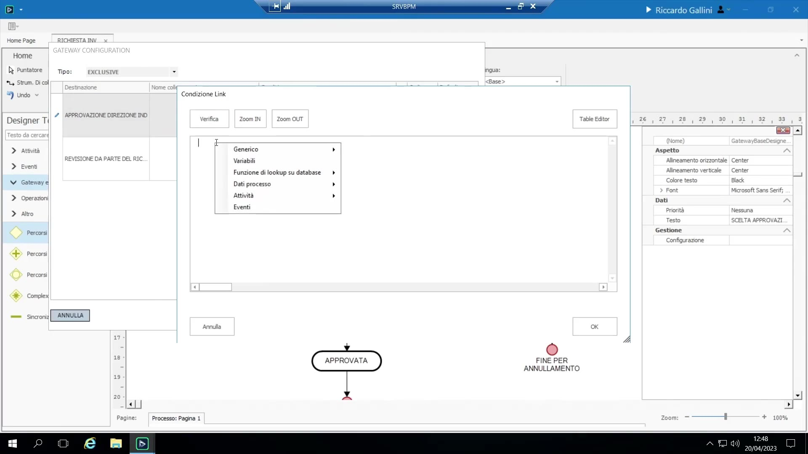{ loading=lazy }

Varianti di Gateway:

- **Esclusivo** (il rombo di default): esattamente un percorso in uscita si attiva — un if/else rigoroso.
- **Parallelo**: si dirama in rami simultanei (es. "Collaudo" e "Parte amministrativa" partono insieme dopo l'approvazione); la stessa shape Gateway si riusa a valle per **sincronizzare**/attendere che tutti i rami diramati finiscano prima che il flusso prosegua. Nota: è *possibile* disegnare più frecce non condizionate in uscita da un semplice task con lo stesso effetto, ma non è BPMN rigoroso — il Gateway è il modo pulito per esprimerlo.

    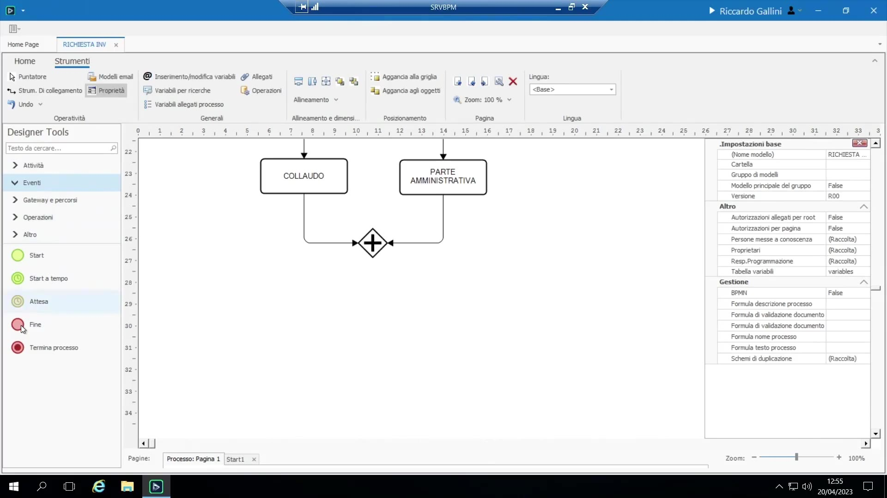{ loading=lazy }

- **Inclusivo**: una via di mezzo — un qualsiasi sottoinsieme (0, 1 o più) dei rami in uscita può attivarsi in base alle condizioni, utile quando i rami non sono né puramente alternativi (esclusivo) né puramente obbligatori insieme (parallelo).

    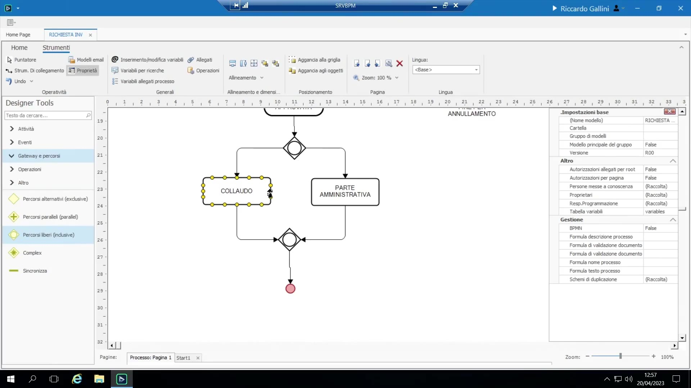{ loading=lazy }

## Visualizzazione a runtime

Consultando un'istanza di processo in esecuzione, il diagramma colora l'avanzamento:

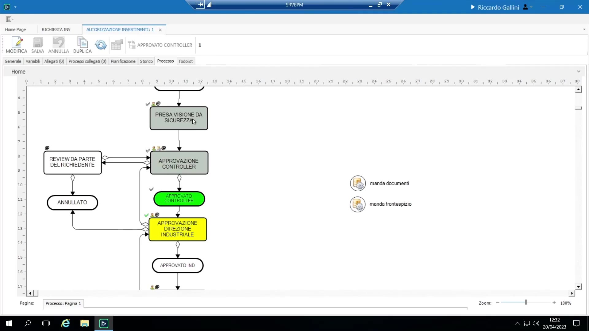{ loading=lazy }

- **Grigio** = attività già eseguita
- **Giallo** = attività in corso ("ha il pallino/token")
- **Verde** = stato attivo (un oggetto Stato attualmente in vigore)
- **Verde chiaro** = "pianificata" — attività che il motore sa già che raggiungerà in futuro (alimenta la **vista Gantt/pianificazione**); questo insieme si aggiorna dinamicamente man mano che i dati vengono raccolti, poiché il percorso futuro può dipendere da condizioni non ancora note
- Bianco = non ancora visitata
