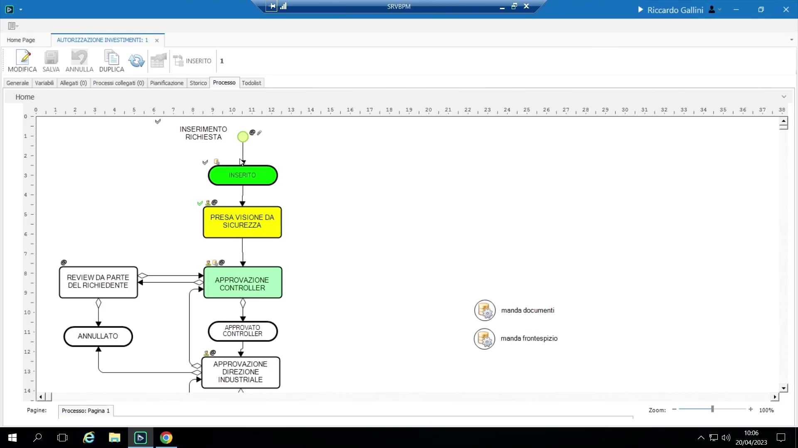
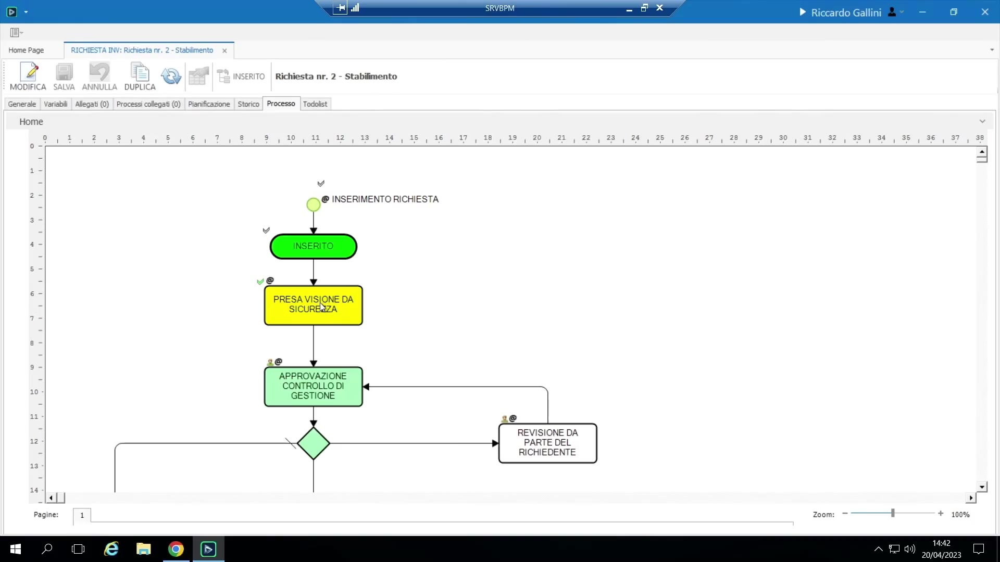
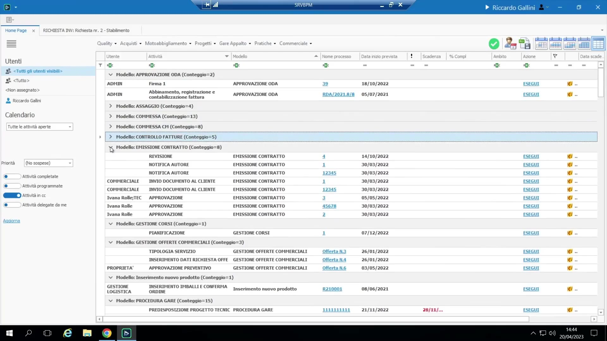
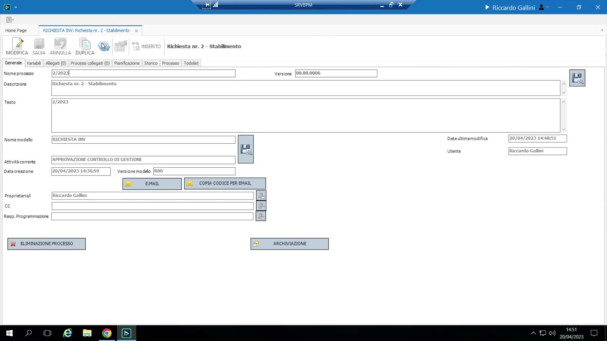
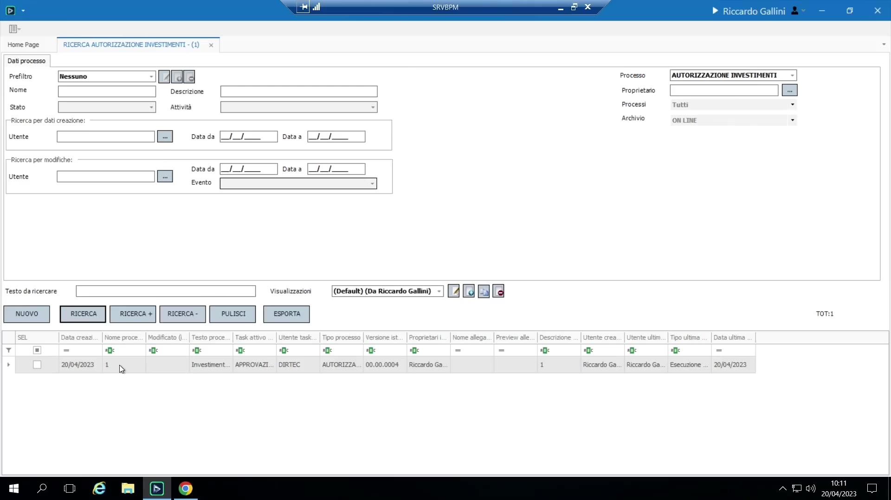
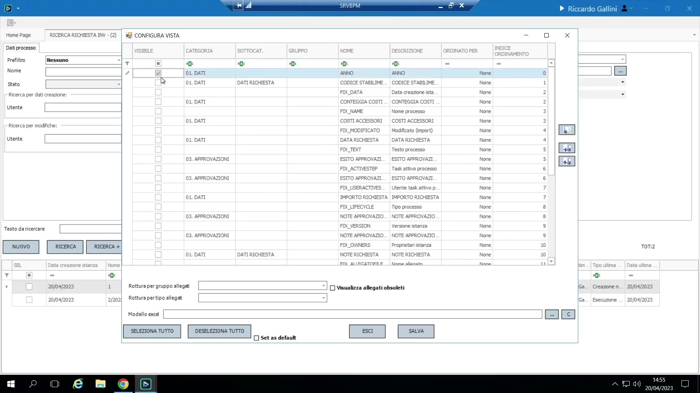
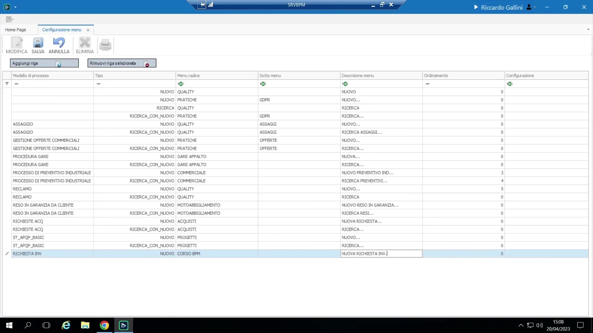
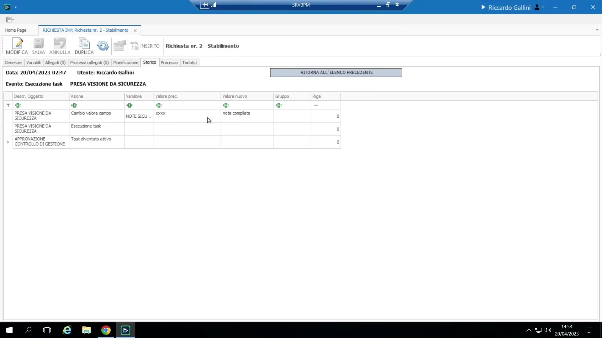

# Esecuzione e monitoraggio

## To-Do List

L'interfaccia concreta e quotidiana per partecipare ai processi. Si apre di default al login.

{ loading=lazy }

- **Filtri**: ambito utente ("Tutti gli utenti visibili" = l'amministratore vede tutti; "Tutto" = i propri task e quelli dei propri gruppi — il filtro normale per un utente comune), intervallo date (giorno/settimana/mese/tutti gli aperti) e **stato dell'attività**.
- **Tre stati di attività**, visibili sia qui che nel diagramma: **Eseguita** (completata), **In corso** (disponibile ora), **Pianificata** (futura/pianificata — verde chiaro).

    { loading=lazy }

- La griglia supporta il **raggruppamento** con tasto destro (es. per modello di processo) e il riordino delle colonne; le preferenze di layout sono **salvate automaticamente per utente**. Colonne di default: Utente, Attività, Modello, Nome processo, Data inizio prevista, Priorità (un'etichetta libera senza significato funzionale, utile solo per ordinamento/promemoria), Scadenza, % completamento.

    { loading=lazy }

- **Esecuzione di un task**: si clicca "Esegui" per compilare i campi (validati contro le regole di obbligatorietà/formula — un indicatore rosso blocca l'invio finché non è soddisfatto); **Completato** invia e fa avanzare il processo; **Salva/Salva e chiudi** persiste una bozza senza far avanzare il processo (i dati restano per dopo).

## Schermata di dettaglio/ispezione processo

Accessibile dalla To-Do List (soggetta ai permessi di visualizzazione/modifica — vedi sezione 9). Tab disponibili:

{ loading=lazy }

- **Variabili** — il magazzino completo, organizzato secondo la stessa struttura di pagine/tab progettata a monte.
- **Intestazione** (anagrafica) — campi di sistema fissi: nome processo, descrizione, modello sorgente, attività corrente, data creazione, proprietario (chi ha avviato il processo).
- **Allegati** — il dossier documentale (vedi sezione 7).
- **Processi collegati** — collegamenti verso altre istanze di processo correlate.
- **Pianificazione** — informazioni su asse temporale/vista Gantt-style.
- **Storico** — il log di audit completo (vedi sezione 8).

Questa schermata è spesso usata da un **proprietario** di processo per monitorare avanzamento/tempistiche/stato tra istanze diverse; l'accesso può essere concesso in sola lettura o lettura/scrittura a seconda del pubblico.

## Ricerca processi

"Ricerca processi" restituisce **una riga per istanza di processo** (non per task), coprendo sia istanze aperte che chiuse/archiviate (nulla viene cancellato a meno che non venga applicata una politica di archiviazione esplicita).

{ loading=lazy }

- La vista di default include molte colonne di sistema generiche di scarso interesse; **"Modifica visualizzazione"** permette di scegliere le colonne rilevanti (es. anno, codice stabilimento, richiedente, tipo richiesta, importo, note).
- È possibile salvare più viste con nome; marcarne una come **"Pubblicato"** la rende visibile a tutti gli utenti, non solo a chi l'ha creata — un tipico compito dell'amministratore è costruire buone viste di ricerca di default per gli utenti finali, dato che la vista di default "out of the box" non è molto utile.

    { loading=lazy }

- Le griglie in tutto BPM (To-Do List, ricerca, griglie collegate al magazzino) supportano filtri di colonna sia a dropdown che testuali liberi.

## Voci di menu personalizzate

Configurazione > Opzioni generali > **Menu personalizzati** permette a un amministratore di aggiungere scorciatoie dirette (fino a 3 livelli: menu radice / sottomenu / descrizione) collegate a un'azione specifica su un processo (es. "avvia Richiesta INV" o "cerca richieste Richiesta INV"), permettendo agli utenti finali di bypassare i menu generici "Nuovo processo"/"Ricerca processi". I menu personalizzati si aggiornano solo al login/riavvio successivo dell'applicativo.

{ loading=lazy }

## Storico (log di audit)

Ogni visualizzazione, modifica ed esecuzione di task su un'istanza di processo viene registrata con **timestamp + utente** (es. creata alle 14:38, visualizzata alle 14:41, campi modificati alle 14:45/14:47, task X eseguito alle 14:47...). Doppio clic su una voce di log mostra un **diff prima/dopo a livello di campo** di esattamente cosa è cambiato.

{ loading=lazy }

Scopo: oltre alla semplice tracciabilità, è esplicitamente indicato come prezioso per la **certificazione di qualità/compliance** — dimostrare che una procedura progettata è stata effettivamente seguita come specificato. La visibilità dello Storico agli utenti finali (contro il solo amministratore/proprietario) è una scelta configurabile.
