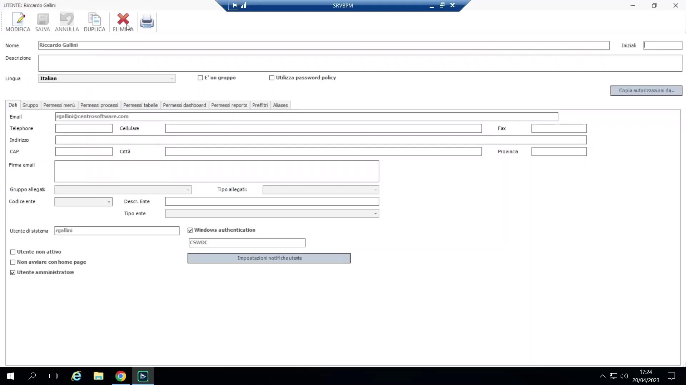
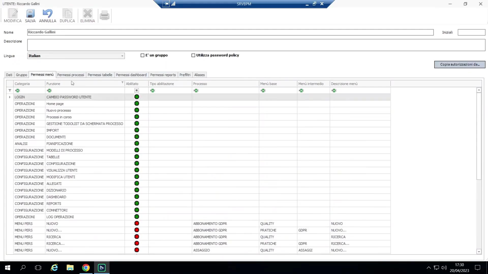
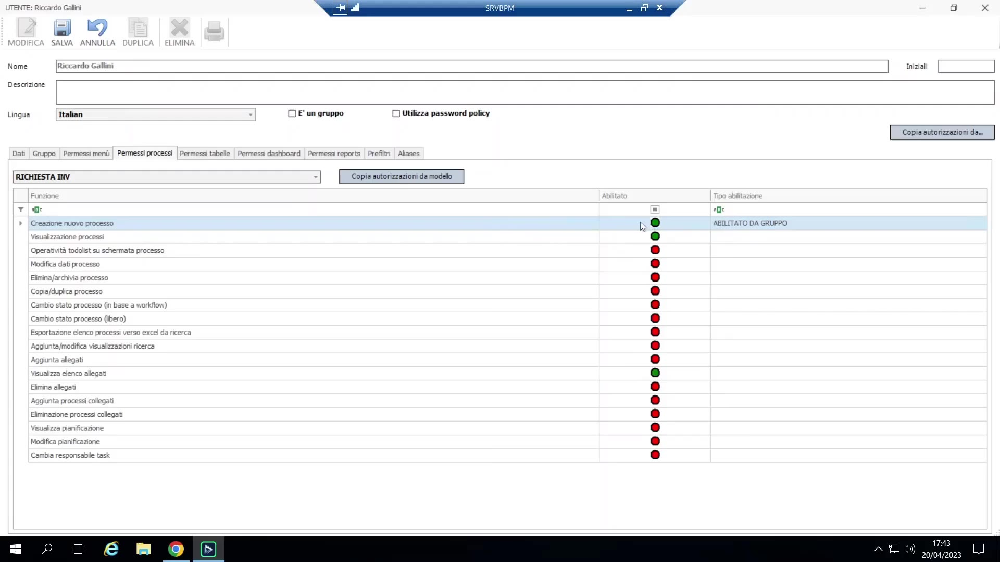

# Permessi

## Regola di base

**Un utente o un gruppo semplicemente citato in un processo** (come Esecutore/Responsabile/in conoscenza su una qualche attività) vede automaticamente e può agire su quell'attività nella propria To-Do List — **non è richiesta alcuna concessione di permesso aggiuntiva** per questo soltanto. I permessi governano tutto ciò che va *oltre* questa baseline (ricerca, creazione generica di nuovi processi dal menu, override in stile amministratore, accesso a tabelle/dashboard/report).

## Utenti e gruppi

- Utenti e Gruppi condividono un'unica tabella/griglia sottostante, filtrabile per tipo. Un utente ha un nome (stringa libera, la convenzione di naming è a discrezione) e una **e-mail** (importante — usata per le mail di notifica generate da BPM).
- Un utente BPM può **opzionalmente** essere collegato a un account Windows/dominio. Effetto: il **client desktop ottiene il single sign-on automatico** quando collegato; il **client Web, in questa versione, richiede ancora la password di dominio** (nessun SSO web per ora) — "l'ultimo username usato" mostrato al login web è solo un cookie, non vero SSO.

    { loading=lazy }

- **L'appartenenza a un gruppo serve due scopi distinti**, che spesso si sovrappongono ma non sono identici: (a) ereditare i *permessi* di quel gruppo, e (b) essere un partecipante che riceve i task assegnati a quel gruppo in uno o più processi. Un utente è tipicamente in più gruppi per queste due ragioni distinte contemporaneamente.

## Categorie di permessi

1. **Permessi Menu** (a livello applicativo) — abilitano/disabilitano intere aree dell'app: cambio password, accesso a una "pagina", avvio nuovo processo (generico), visualizzazione processi in corso, ecc. Suddivisi in un set **operativo** (home, nuovo processo, in corso, To-Do sulla schermata processo, import, allegati, pianificazione) e un set di **configurazione** (gestione modelli di processo, tabelle, configurazione, visualizzazione/modifica utenti) — gli utenti finali ordinari tipicamente non hanno alcuno dei permessi del set di configurazione.

    { loading=lazy }

2. **Permessi Processi** (per uno specifico modello di processo) — granulari, disattivati di default (rosso): **Creazione** (avviare una nuova istanza di questo modello — nota: richiede anche il permesso *menu* generico "nuovo processo" attivo, cioè una logica AND tra i due livelli), **Visualizzazione** (aprire/cercare il dettaglio del processo in lettura), **Modifica** (forzare la modifica di valori — la capacità di override amministrativo della sezione 5), **Eliminazione** (cancellare permanentemente una specifica istanza — distinto dai pieni diritti di amministratore di sistema; può essere concesso a un "proprietario di processo" non amministratore), **Copia/Duplica**, **Cambio stato processo** (forzare l'avanzamento, stesso meccanismo dell'override amministrativo).
3. **Permessi Tabelle** — per singola tabella locale BPM, separatamente per Visualizza (sfogliare l'area di gestione tabella standalone) contro Modifica (modificare i record) — distinto dal semplice uso di quella tabella come fonte lookup dentro un form di processo.
4. **Permessi Dashboard / Report** — concessione per singola dashboard e per singolo report (le dashboard in particolare sono spesso ristrette, poiché possono esporre cifre sensibili come totali monetari).
5. (Menzionati brevemente, non approfonditi in questo corso) **Prefiltri/alias** sull'accesso ai dati.

## Logica di risoluzione e buone prassi

- I diritti si risolvono in modo **additivo** da due fonti: concessione diretta a livello **utente**, oppure **ereditata via gruppo** di appartenenza (l'interfaccia marca un diritto come "abilitato da gruppo" quando ereditato).
- **Buona prassi: concedere via gruppi, non individui** — es. creare un gruppo solo-permessi "Inserimento richieste INV", concedergli Creazione su "Richiesta INV", poi aggiungere gli utenti a quel gruppo. Regola pratica: *"se ci si ritrova con tanti o più gruppi-permesso quanti utenti, probabilmente c'è qualcosa che non va nel design."*
- **Semantica di override Abilita/Nega**: abilitare un permesso direttamente su un utente quando lo ha già tramite un gruppo rende la concessione "appiccicosa" (sopravvive a una successiva rimozione dal gruppo); rimuovere una concessione utente ridondante ancora coperta dal gruppo non ha effetto; un **"Nega" a livello utente** ha priorità su un'Abilitazione a livello gruppo, permettendo di escludere un membro specifico da una concessione altrimenti valida per tutto il gruppo.

    { loading=lazy }

- **Ciò di cui un utente finale tipico ha davvero bisogno**: per un utente che si limita a *ricevere ed eseguire* task dalla To-Do List, non servono essenzialmente **permessi aggiuntivi** oltre all'essere citato nel processo (gli allegati e i campi di cui ha bisogno sono già esposti tramite la configurazione "variabili/allegati da richiedere" del task stesso). L'aggiunta comunemente necessaria è **Creazione** (avviare un nuovo processo), per gli utenti che iniziano nuove richieste dal menu generico (non necessaria se agiscono solo su task già assegnati). Un accesso più ampio come Visualizzazione/Modifica/Eliminazione è riservato a proprietari di processo/amministratori, non ai partecipanti ordinari.

## Considerazione finale del docente

A un livello base, il sistema di permessi richiede una configurazione relativamente contenuta, perché la maggior parte del "pensiero" di controllo accessi è previsto avvenga dentro la **progettazione del processo stesso** (chi è citato su quale task, tramite quale gruppo). Le matrici di permesso più fini (menu/processo/tabella/dashboard/report) sono un livello avanzato che un primo corso "base" può in gran parte sorvolare — questo punto di chiusura segna la fine della parte fondamentale del corso; integrazione SAP, integrazione documentale (Globo), connettori e copertura più approfondita di dashboard/report sono riservati a sessioni successive.
