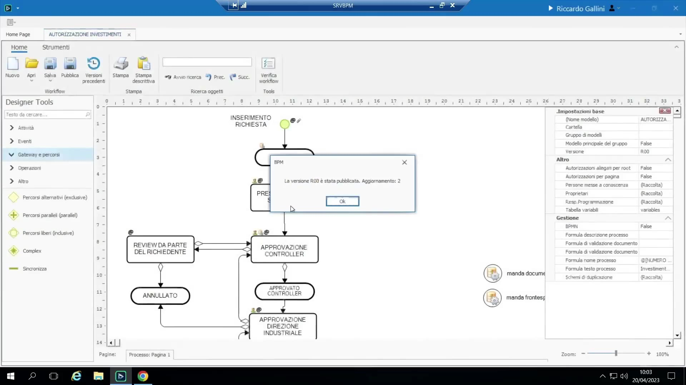
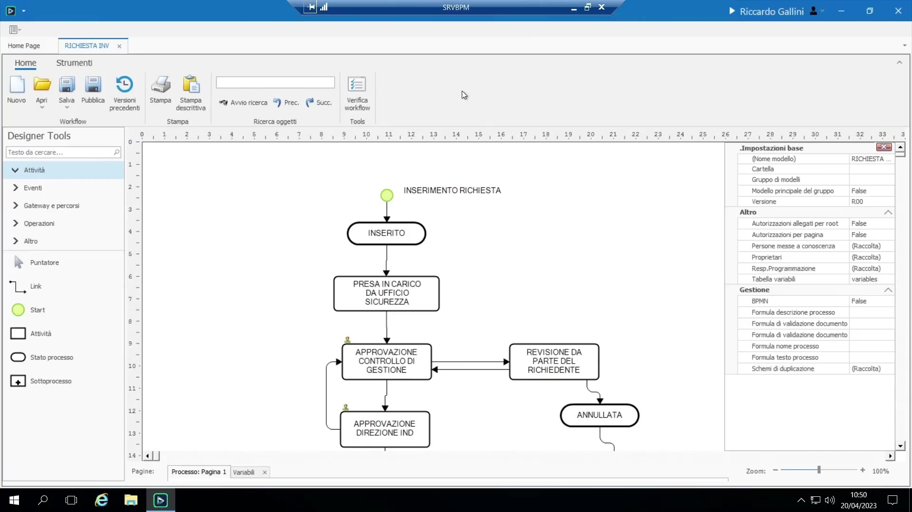
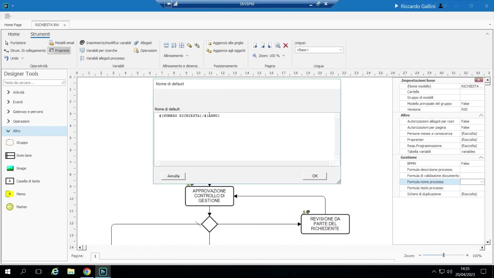
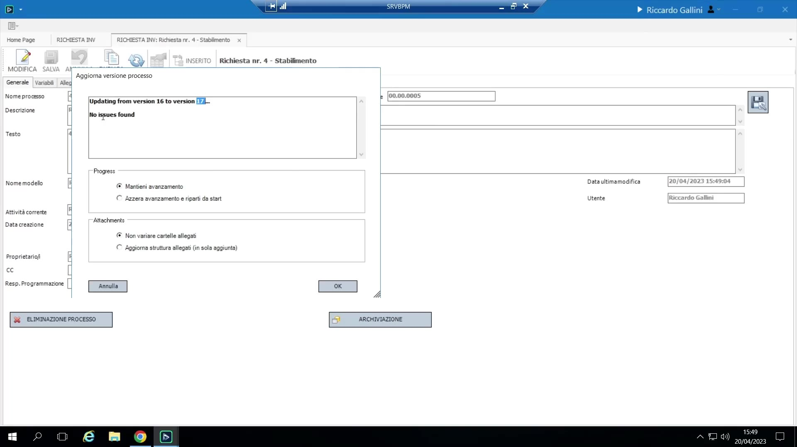
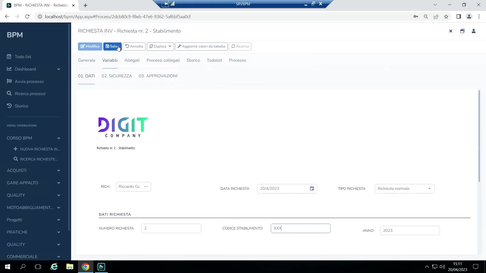

# Pubblicazione e versioni

- **Pubblicare** rende un modello vivo/utilizzabile dagli utenti citati al suo interno. Esegue una validazione (mostra warning, ma in genere consente comunque di pubblicare) e crea una nuova versione numerata (R00, R01,...); **tutte le versioni vengono conservate** — sia per motivi tecnici (le istanze in corso fanno riferimento a versioni precedenti), sia per motivi organizzativi/di audit.

    { loading=lazy }

- Un modello di processo richiede un **Nome modello** (la chiave usata per trovarlo/sovrascriverlo) prima di poter essere pubblicato o salvato. Si imposta cliccando sull'area bianca del canvas > proprietà del processo.

    { loading=lazy }

- Due ulteriori **formule a livello di processo** sono richieste per una pubblicazione pulita (la validazione avvisa se mancano):

    { loading=lazy }

 - **Formula per il calcolo del nome del processo** — costruisce il titolo/business-key di ogni istanza, tipicamente da un contatore o una variabile data, es. `[numero richiesta] & "/" & [anno]`.
 - **Formula per la descrizione del processo** — costruisce una stringa libera di intestazione, es. `"Richiesta numero " & [numero] & " " & [stabilimento]`.
 Questi nome/descrizione sono ciò che appare nella To-Do List, nelle griglie di ricerca e nelle intestazioni, al posto degli ID interni grezzi.
- **Salva su file**: un processo (l'intero design — diagramma, variabili, form, formule) può essere esportato su un unico file **JSON** locale (estensione `.jbkf`) invece della/in aggiunta alla pubblicazione — il modo standard per spostare una configurazione tra ambienti (es. portatile → ambiente cliente). Report e dashboard fanno eccezione: hanno vita propria perché possono coprire più processi contemporaneamente.
- **Comportamento del versionamento per le istanze in corso**: ripubblicare **non** modifica retroattivamente le istanze già in esecuzione — ogni istanza resta ancorata alla versione del modello attiva quando è stata avviata. Un pulsante a livello di processo, **"Aggiornamento processo"**, consente di allineare manualmente un'istanza in corso specifica a una versione più recente (es. "Aggiorna dalla versione 16 alla 17"). Alcune modifiche (interventi sul magazzino, nuovi binding di tabella) vengono recepite automaticamente dalle istanze in corso; le aggiunte di layout/UI a un task già eseguito tipicamente richiedono questa azione di aggiornamento esplicita. Se il salto di versione è troppo grande/incompatibile, l'unica soluzione è riavviare l'istanza e replicarne manualmente l'avanzamento.

    { loading=lazy }

- **Override riservati agli amministratori**, per casi eccezionali:
 - **Forzatura dei valori del magazzino** su un'istanza in corso, dalla sua schermata di dettaglio processo, fuori dal flusso normale ("forzatura extra processo") — richiede conferma/scarto alla chiusura, ed è interamente tracciata in Storico.

     { loading=lazy }

 - **Forzatura dell'avanzamento del processo**: tasto destro su un task in modalità modifica > "Imposta oggetto attivo" per saltare/far avanzare forzatamente il motore a un dato passo — esplicitamente definito "barare" dal docente, ma utile in fase di sviluppo (passi dimenticati) o per sbloccare un processo realmente incastrato senza un intervento di un programmatore sul database.
