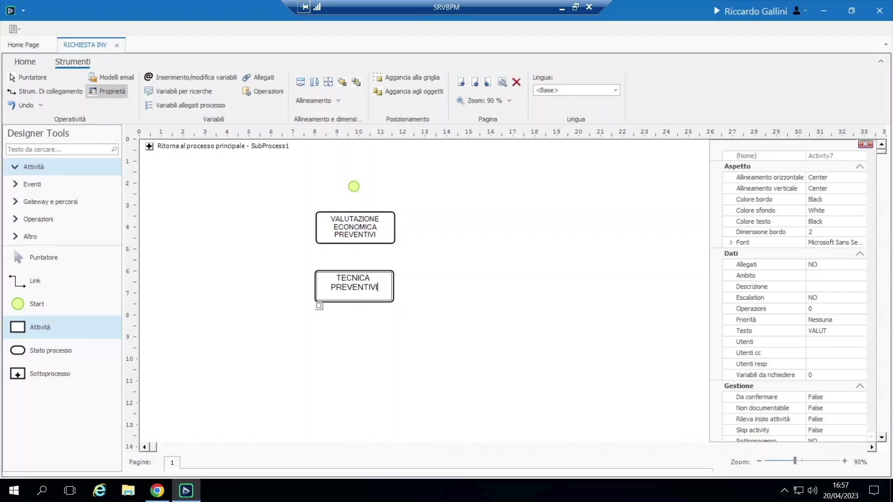
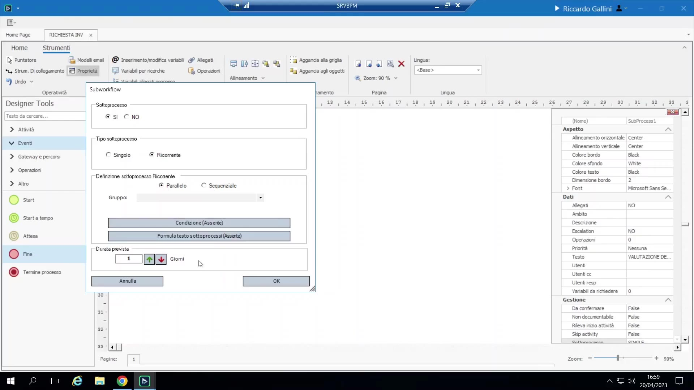

# Sotto-processi

Una shape Sotto-processo nasconde un mini-flusso annidato, progettato in modo indipendente, dietro un unico box nel diagramma padre (doppio clic per entrare/progettarlo). Usi tipici:

{ loading=lazy }

- Mantenere il diagramma di primo livello pulito/leggibile pur modellando il dettaglio sottostante.
- **Far evolvere** un design: un Task semplice esistente può essere convertito in un Sotto-processo se in seguito si scopre che necessita di una scomposizione interna (es. suddividere un unico task "Approvazione" in passi di pre-approvazione/qualità/tecnico) senza dover riprogettare il flusso padre.

**Sotto-processo ricorrente**: un sotto-processo può essere legato a un **gruppo** (l'insieme di variabili master-detail, vedi 4.6) e marcato "ricorrente" — a runtime genera una istanza completa del proprio flusso interno **per ogni riga** di quel gruppo (es. un mini-flusso di valutazione per ogni preventivo fornitore ricevuto). Configurabile come:

{ loading=lazy }

- **Parallelo** (tutte le istanze generate sono aperte contemporaneamente; l'assegnatario le esegue in qualsiasi ordine) — l'icona mostra barre parallele aggiuntive.
- **Sequenziale** (una alla volta; richiede di indicare la variabile che determina l'ordine di esecuzione) — l'icona mostra linee sequenziali.
- Una "formula per condizione" opzionale può filtrare quali righe generano effettivamente un'istanza.

Il flusso padre procede oltre il sotto-processo solo quando **tutti** i rami generati sono terminati (sincronizzazione/join). Questo pattern è prezioso ogni volta che il numero di sotto-attività parallele è noto solo a runtime, non in fase di progettazione — es. azioni correttive/di miglioramento qualità, passi di ispezione/collaudo, oppure (come dimostrato nel corso) N preventivi fornitore da valutare. Dentro un sotto-processo ricorrente legato a un gruppo, le variabili di quel gruppo appaiono come campi a **valore singolo** (concettualmente si è "dentro una riga"); le variabili di altri gruppi e le variabili di intestazione restano accessibili normalmente.
