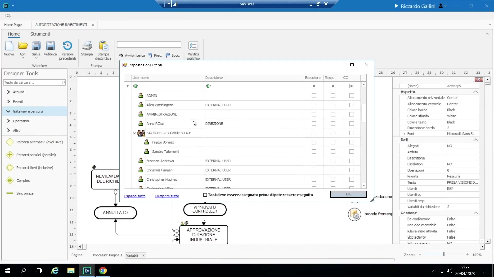
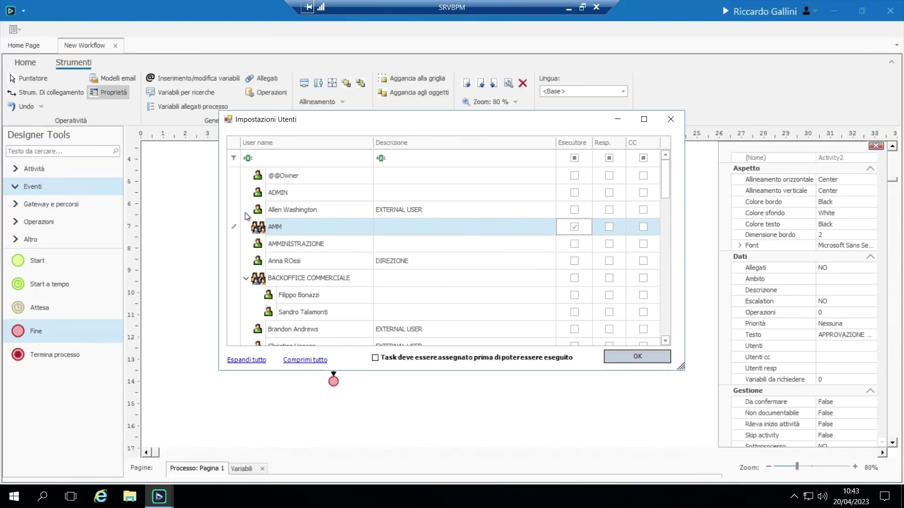
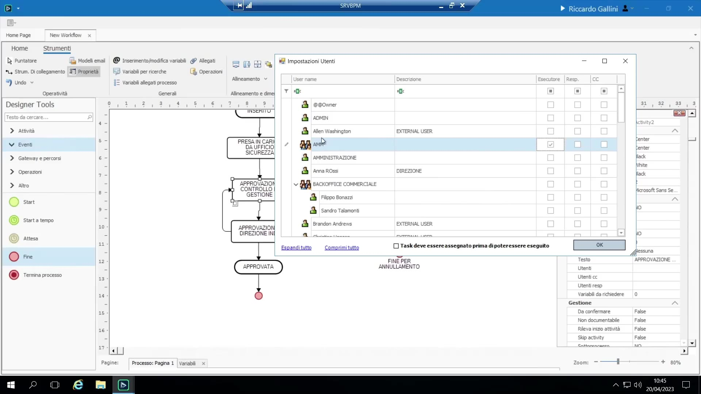
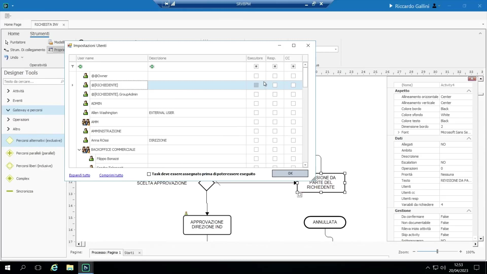

# Utenti e assegnazione attività

## Ruoli per attività

Per ogni attività, BPM permette di indicare:

{ loading=lazy }

- **Esecutore** — la persona/il gruppo che trova il task nella propria To-Do List. Usato in circa il 90% dei casi reali.
- **Responsabile** — può smistare il task a un membro specifico del proprio gruppo.
- **In conoscenza** (CC) — deve solo sapere che l'attività è avvenuta.

## Due modalità di assegnazione

1. **Assegnazione diretta al gruppo** (il caso più comune): si assegna un **gruppo** (es. "Controllo di gestione") come Esecutore. Tutti i membri del gruppo vedono il task nella propria To-Do List; il primo che agisce lo completa e il processo avanza. Si usano gruppi invece di singoli individui perché "le persone cambiano, i ruoli/gruppi restano"; i gruppi sono tipicamente **costruiti ad hoc per il singolo processo** piuttosto che importati integralmente da Active Directory (i gruppi AD raramente rispecchiano la granularità realmente necessaria).

    { loading=lazy }

2. **Assegnazione poi esecuzione**: si spunta il flag "Task deve essere assegnato prima di poter essere eseguito" — aggiunge un passaggio esplicito di smistamento in cui un Responsabile sceglie manualmente una persona specifica del gruppo, e solo quella persona vede poi il task. Più burocratico; usato selettivamente (es. scenari su commessa/progetto con un passaggio di triage in ufficio tecnico).

    { loading=lazy }

3. **Assegnazione dinamica tramite una variabile di tipo Utente**: la finestra "Utenti e responsabili" elenca anche le **variabili di tipo Utente** del processo (es. "richiedente") come possibili esecutori — si sceglie la variabile e il task viene instradato a chiunque quella variabile contenga in quel momento. Uso classico: rimandare un task a chi ha originariamente inoltrato la richiesta.

    { loading=lazy }

## Nota per la fase di sviluppo

Un'attività temporaneamente lasciata senza utente assegnato è visibile solo all'amministratore — va bene durante la progettazione/i test, ma va sistemata prima del go-live (ogni attività deve avere un proprietario reale).
