# Le variabili di processo (il magazzino)

Il **magazzino delle variabili** è l'unica superficie di progettazione che contiene tutti i campi dati che un processo porta con sé — si accede da Strumenti > "Inserimento modifica variabili", e appare come una pagina/tab aggiuntiva del processo.

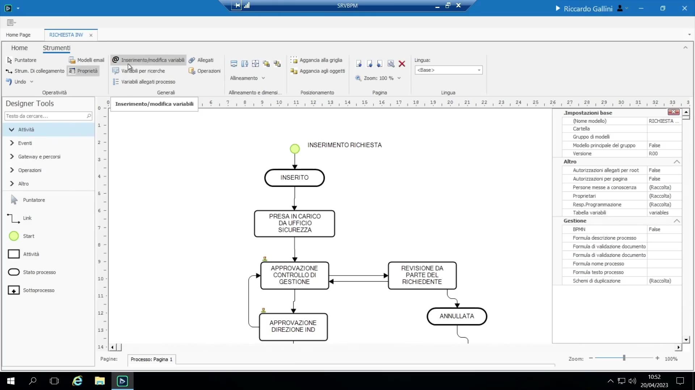{ loading=lazy }

Modello mentale di progettazione: si abbozza il processo → si ragiona su quali dati devono entrare/uscire in ogni punto → si creano le variabili corrispondenti nel magazzino → poi, per ogni attività, si trascina il sottoinsieme rilevante tramite **"Variabili da richiedere"** (vedi 4.2). Le variabili generano automaticamente i campi database sottostanti — non serve progettare tabelle/SQL a mano.

- Le variabili possono essere organizzate in più **pagine** (tab), convenzionalmente prefissate `01`, `02`, `03`... poiché le pagine si ordinano alfabeticamente. Buona prassi: seguire liberamente il flusso cronologico del processo nell'organizzare le pagine, per leggibilità (non obbligatorio).
- I campi possono essere allineati/ridimensionati (multi-selezione con Ctrl) per un layout ordinato lato utente finale — la superficie di progettazione è letteralmente ciò che l'utente vedrà.

## Tipi di variabile

| Tipo | Note |
|---|---|
| Stringa (String) | Testo libero, limite di default 250 caratteri (adatto a codici/campi brevi tipicamente provenienti da un ERP); può essere flaggata multiriga |
| Numerico | Può essere flaggato come **Contatore** auto-incrementante (perpetuo, oppure raggruppato/azzerato da un altro campo, es. azzeramento per "anno") |
| Booleano | Renderizzato di default come checkbox, oppure come **Bottone** statefull/stateless — vedi 4.8 |
| Data | Le impostazioni di base controllano principalmente la formattazione |
| Valuta | Una specializzazione del tipo numerico |
| Memo | Testo lungo/blob, lunghezza di fatto illimitata, adatto a note formattate/lunghe |
| Lista Valori (Value List) | Un insieme piccolo e fisso di scelte (una dropdown); supporta un **codice di iscrizione** interno separato dall'etichetta visualizzata, così rietichettare non rompe i codici già memorizzati |
| Utente (User type) | Limitato al registro di utenti/gruppi BPM; può essere ristretto a un gruppo specifico tramite "Tipo impostazioni di base" |
| Etichetta (Label) | Testo di visualizzazione read-only, non persistito, con editor rich-text — vedi 4.4 |

## "Variabili da richiedere" (il sottoinsieme per singolo task)

È la controparte, a livello di ogni Task/Start/bottone, del magazzino globale: tasto destro su un task (o su una variabile, per il proprio sotto-form) > "Variabili da richiedere" e trascinamento dei soli campi rilevanti in quel punto.

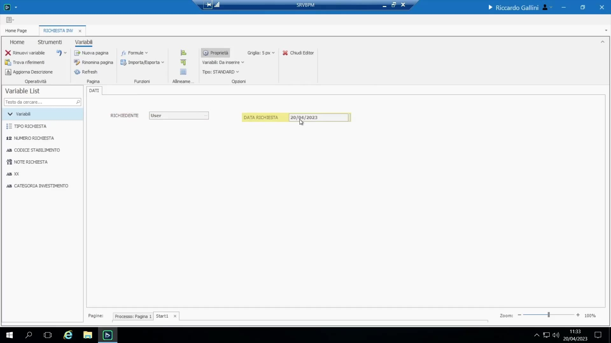{ loading=lazy }

Relazione chiave: il magazzino e la schermata "variabili da richiedere" di ogni task sono **collegati per nome della variabile** (fonte unica di verità per variabile, un solo valore per istanza di processo) ma **indipendenti in layout/posizionamento** — rimuovere una variabile dalla schermata di un task non la cancella dal magazzino né azzera il suo valore altrove.

Impostazioni locali/per-task su una variabile posizionata (indipendenti dai default a livello di magazzino):

- **Obbligatorio** — impostabile globalmente nel magazzino oppure, come buona prassi, localmente per task (poiché un campo può essere obbligatorio in un punto del processo ma non in un altro).
- **Sola lettura / "Ridolli"** — es. per mostrare dati di contesto a monte a un utente di un task successivo senza permettergli di modificarli (pattern comune: rimostrare richiedente/data/tipo come sola lettura su un task a valle).
- **Formula di validazione** locale (vedi 4.7).

**Scorciatoia esporta/importa**: una pagina (o l'intero layout "variabili da richiedere" di un task) può essere esportata su file locale e importata in un altro task, evitando di ritrascinare manualmente molti campi — molto usato quando si riutilizza un layout (es. copiare il form dello Start su un successivo task "Revisione da parte del richiedente").

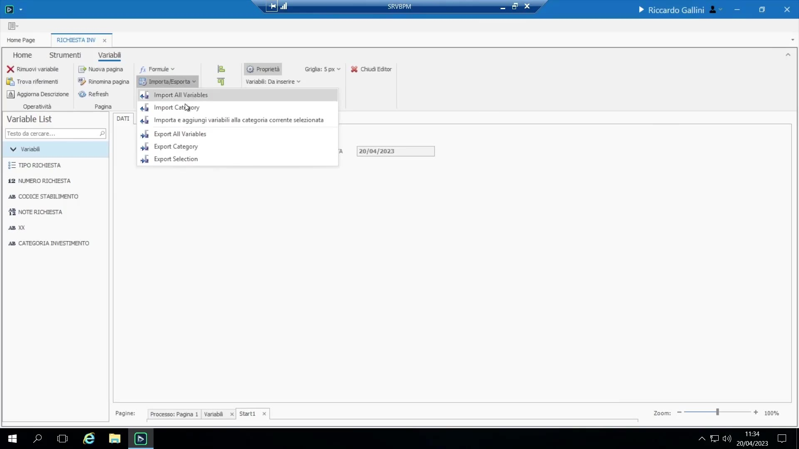{ loading=lazy }

## Proprietà fondamentali di una variabile

- **Nome** — la chiave interna/DB; **immutabile** una volta creata.

    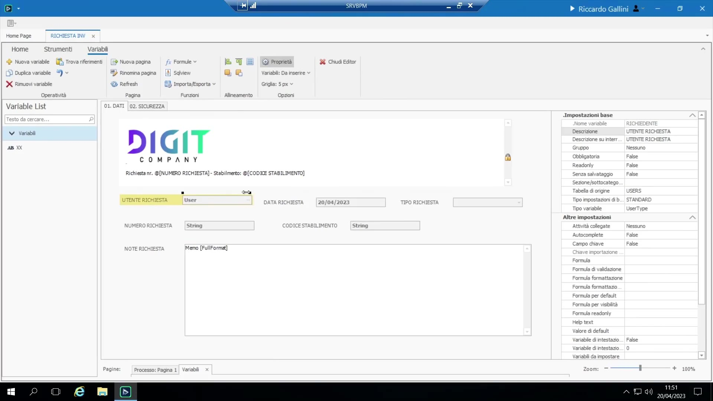{ loading=lazy }

- **Descrizione** (etichetta) — liberamente modificabile, localizzabile, mostrata accanto al campo; può essere abbreviata (es. "Rich.") indipendentemente dal nome sottostante.
- **Descrizione su interrogazioni** — un'etichetta separata usata specificamente nelle colonne delle griglie di ricerca, che può essere più verbosa/svincolata dal contesto rispetto all'etichetta nel form.
- **Obbligatorio / Ridolli (sola lettura)** — come sopra, impostabile a livello globale o locale.
- **Variabile senza salvataggio** — valore non persistito su DB, puro stato di interfaccia, tipicamente abbinato a un campo di visualizzazione calcolato tramite formula che non si vuole memorizzare.

    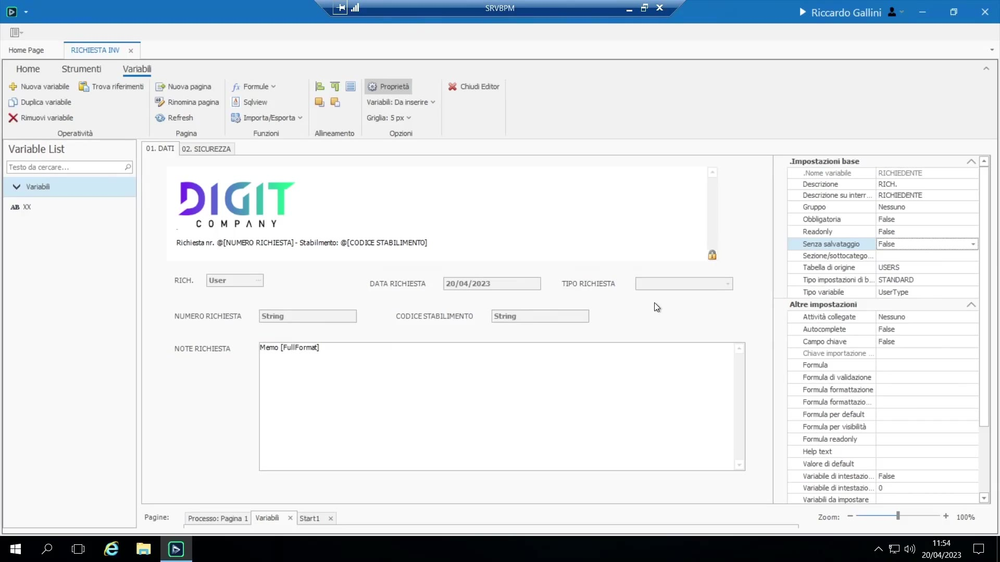{ loading=lazy }

- **Sottocategoria** — assegnare la stessa etichetta di sottocategoria a un gruppo di variabili selezionate con Ctrl disegna una barra divisoria a tutta larghezza sopra di esse nel form, per organizzare visivamente form densi; la sottocategoria della variabile più in alto determina la posizione della barra.
- **Testo di aiuto** — tooltip mostrato al passaggio del mouse, utile per guidare l'utente (es. "inserire l'importo secondo il modulo XXXX").
- **Valore di default** vs. **Formula per default** — una costante fissa contro un valore iniziale calcolato tramite logica (utente corrente, data corrente, ecc.) — vedi 4.7.
- **Variabili di intestazione** — flag e numerazione (1, 2, 3...) di una manciata delle variabili più importanti (es. numero richiesta, codice stabilimento) affinché emergano in modo prominente in tutta l'applicazione (colonne della To-Do List, intestazioni), oltre alla singola schermata di dettaglio processo.
- **Tag**, flag "nascondi su mobile", dimensione del font (piccolo/medio/grande — differenza visiva minore).
- **Gruppo** — assegna una variabile a un gruppo master-detail (vedi 4.6).

## Variabili di tipo Etichetta (Label)

Una variabile di tipo Label non è un campo DB reale: contiene un "Testo" rich-text che può includere **segnaposto di variabile** (tasto destro > inserisci variabile, es. "Richiesta numero {numero richiesta}") e persino immagini (es. un logo incollato). Un pattern comune: sostituire diversi campi read-only trascinati separatamente su un form con un'unica label che li compone in un'intestazione riassuntiva più curata, riutilizzabile su più schermate di task.

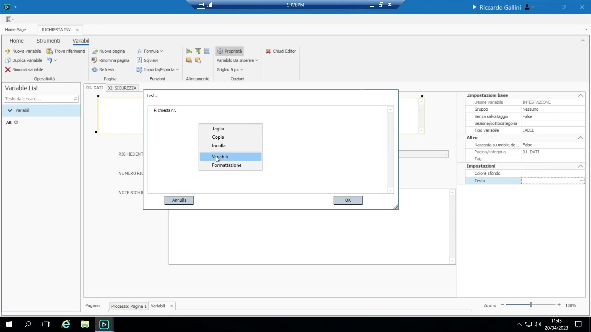{ loading=lazy }

## Tabelle di origine (lookup) — valore singolo

La "Tabella di origine" trasforma una variabile Stringa da testo libero in una **scelta legata a una fonte dati**:

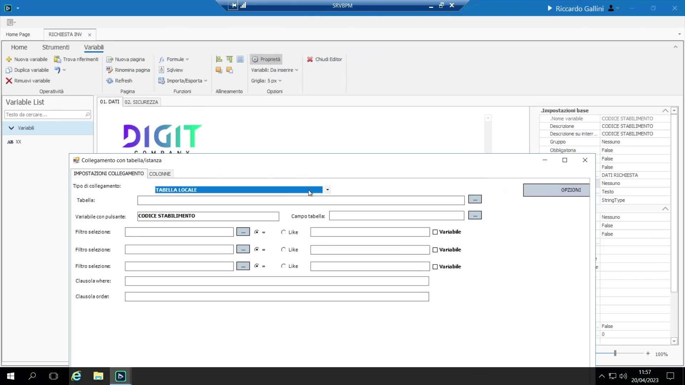{ loading=lazy }

- **Tabella locale** — una tabella creata direttamente nel database BPM (prefisso `P_...`), oppure una **vista** SQL creata lì.
- **Dati esterni** — richiede una stringa di connessione (server, database, utente, password; SQL o ODBC) verso il database di un sistema esterno (es. un database usato anche da SAP/SAM). Stringhe di connessione nominate/riutilizzabili possono essere predisposte per azienda/ambiente (es. "SAM A1", "SAM B") invece di codificare una stringa grezza in ogni campo.
- Scorciatoia sconsigliata ma a volte usata: creare una **vista dentro il DB di BPM che a sua volta punta cross-database al sistema esterno** — fragile (si rompe se spostata su un altro ambiente cliente) rispetto a una connessione esterna pulita.

    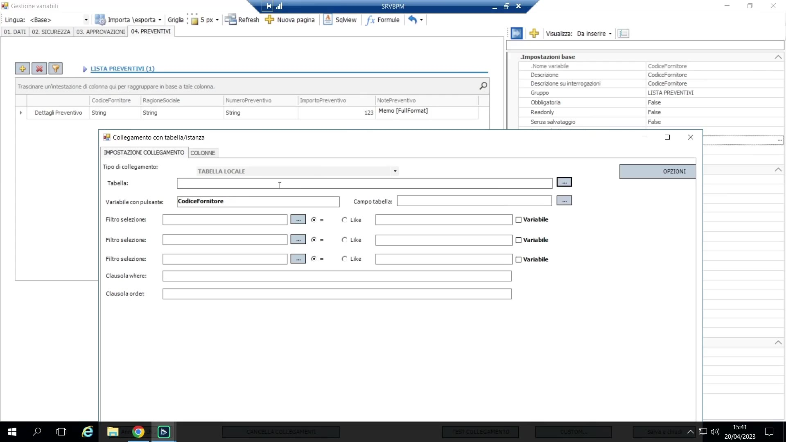{ loading=lazy }

- ODBC funziona ma può essere problematico con alcuni sistemi legacy (es. AS400); web service o connettori dedicati sono spesso preferibili in quei casi.
- La configurazione richiede di mappare la **colonna chiave** (colonna della tabella sorgente → variabile guida, obbligatoria) e poi mappature aggiuntive arbitrarie di **altre colonne** (altre colonne sorgente → altre variabili target), così selezionare un valore riempie automaticamente campi denormalizzati collegati (es. selezionare un codice fornitore riempie automaticamente la sua ragione sociale).
- **Lookup dai dati di gruppo del processo stesso** (fonte "Variabili locali"): invece di una tabella esterna, un campo può recuperare una riga da uno dei gruppi del processo (es. far scegliere all'utente "il preventivo vincente" dal gruppo "Lista Preventivi" già inserito in precedenza nello stesso processo, riempiendo automaticamente una coppia "Codice fornitore scelto"/"Ragione sociale scelta").

    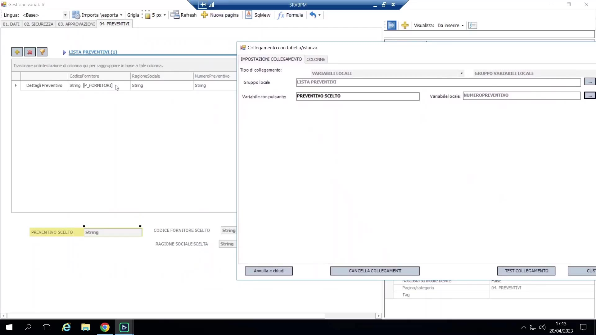{ loading=lazy }

- I **connettori preconfigurati** (es. un connettore SAM/SAP) sono un meccanismo correlato ma distinto: configurati per azienda (non con una stringa di connessione grezza) e, in particolare, a volte l'*unico* modo supportato per **scrivere** dati verso il sistema esterno (contro il sola-lettura di una connessione semplice). Approfondimento riservato a una sessione successiva.

    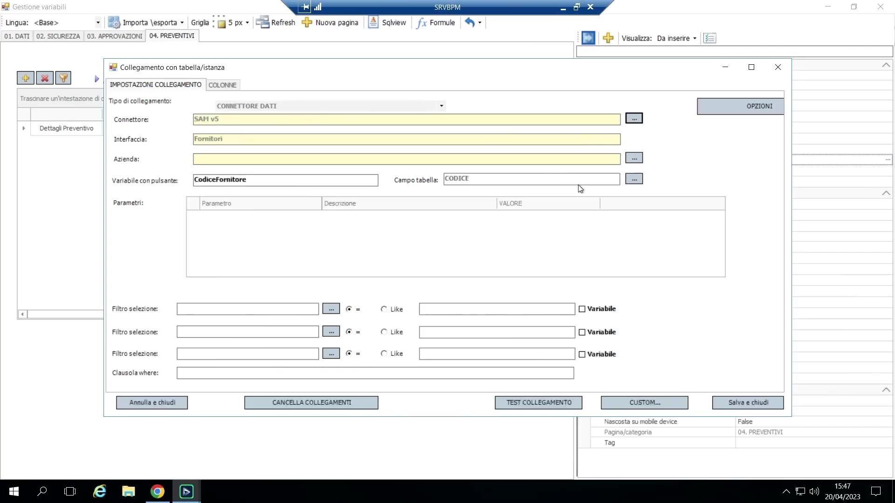{ loading=lazy }

## Variabili di gruppo — dati master-detail (1-a-molti)

Il meccanismo di BPM per dati 1-a-molti (es. N preventivi di fornitori su un'unica richiesta di investimento):

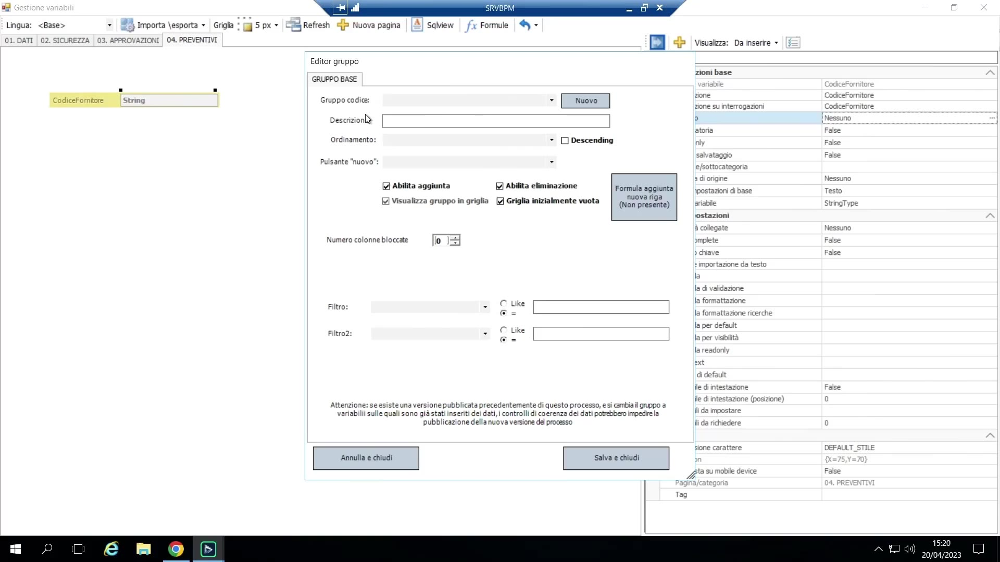{ loading=lazy }

1. Si crea normalmente una variabile nel magazzino (es. "Codice Fornitore").
2. Invece di lasciarla a valore singolo, si clicca il pulsante "..." di configurazione e la si assegna a un **Gruppo** nuovo o esistente (es. "Lista Preventivi") — questo la trasforma nella prima colonna di una tabella di dettaglio virtuale/griglia.
3. Si aggiungono altre colonne semplicemente **trascinando ulteriori variabili direttamente sulla griglia** — il modo più rapido e comune (usato nel 99% dei casi). Ogni variabile ulteriore rilasciata dentro la griglia si unisce automaticamente allo stesso gruppo.

Vincoli e note:

- Una variabile appartiene a **esattamente un** gruppo.
- I gruppi sono una struttura **piatta/a un solo livello** — BPM deliberatamente **non** supporta sottogruppi annidati: un compromesso di usabilità, dato che chi progetta/configura è tipicamente un consulente, non un programmatore.
- Un processo può avere più gruppi indipendenti tra loro (es. "Lista Preventivi" e un separato gruppo "Team utenti").
- A runtime, il gruppo viene renderizzato come una **griglia modificabile** dove l'utente può aggiungere/rimuovere righe liberamente (a meno che non vengano aggiunte regole di obbligatorietà sui campi per riga, es. rendere obbligatori fornitore/importo *all'interno* di ogni riga — una questione separata dal "richiedere almeno una riga").
- Un **bottone stateless trascinato nella griglia** ("Dettagli...") può aprire un pop-up più grande con il form di una singola riga (tramite le proprie "Variabili da richiedere") — risolve il problema di colonne di griglia troppo strette per campi come note lunghe.

    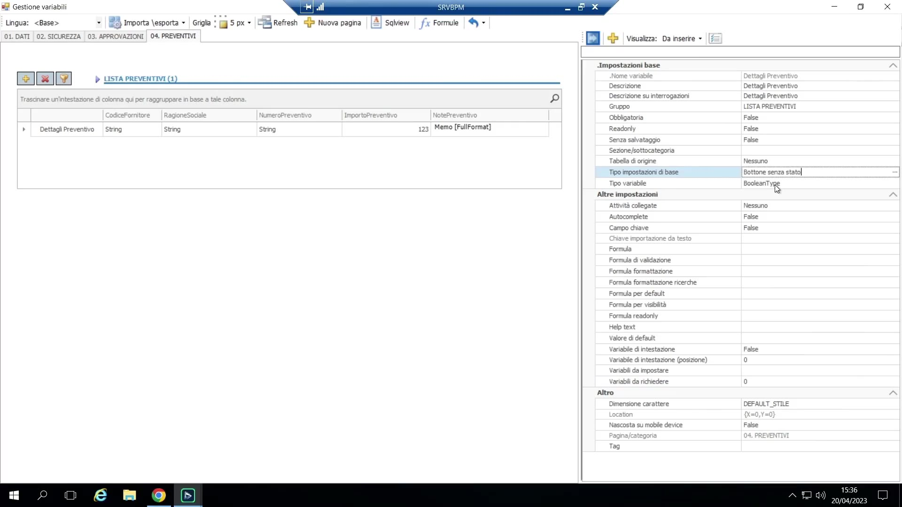{ loading=lazy }

- Le colonne di un gruppo supportano le stesse **Tabelle di origine** delle variabili ordinarie (vedi 4.5), compreso il lookup da dati locali di un altro gruppo o del gruppo stesso.

## Formule

Le formule sono il livello di scripting integrato di BPM, scritte in sintassi **Visual Basic**, modificate tramite un editor di formule con un menu di supporto al tasto destro (anno/utente/data correnti, e un albero ricercabile di tutte le variabili di processo per pagina). Le espressioni one-liner in stile Excel funzionano direttamente (es. `Year([data richiesta])`); la logica multi-riga richiede un'istruzione `Return` esplicita e supporta `If/Then/Else`. Le formule **si ricalcolano automaticamente** ogni volta che una variabile da cui dipendono cambia (tracciamento delle dipendenze, come in un foglio di calcolo).

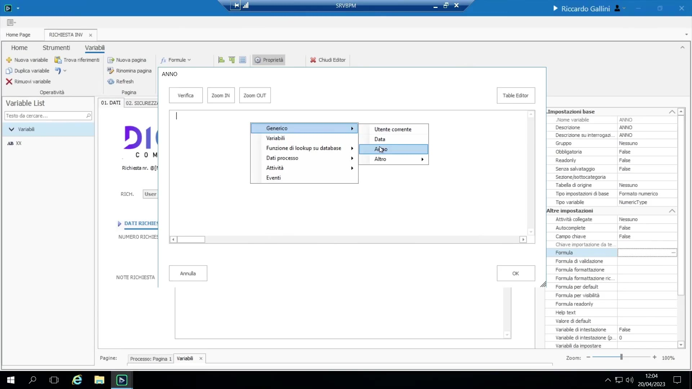{ loading=lazy }

Tipi di formula, e dove si configurano:

- **Formula** (a livello di magazzino, "la" formula) — un valore calcolato sempre valido a livello globale, es. `anno = Year(data_richiesta)`, oppure un totale corrente `totale_costi = importo_richiesta + costi_accessori`.

    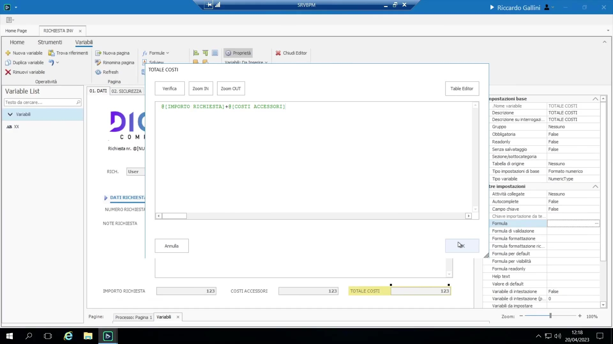{ loading=lazy }

- **Formula di validazione** — impostata per task su "variabili da richiedere" (non globale); ritorna vero/falso per validare un campo oltre il semplice flag obbligatorio (es. `data_richiesta >= Today()`), e può impostare un messaggio di errore personalizzato mostrato all'utente (`Errore = "..."`). Usabile anche per esprimere "obbligatorio *se* [condizione]", cosa che un semplice flag obbligatorio non può fare.

    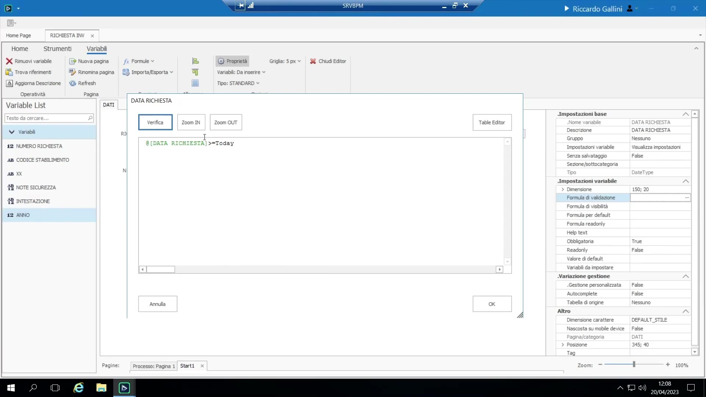{ loading=lazy }

- **Formula di visibilità** — mostra/nasconde dinamicamente un campo in base a una condizione.
- **Formula per default** — imposta il valore *iniziale* di una variabile solo la prima volta che viene aperta mentre è ancora non valorizzata (es. richiedente = utente corrente, data = oggi); distinta dal costante **Valore di default** fisso.

    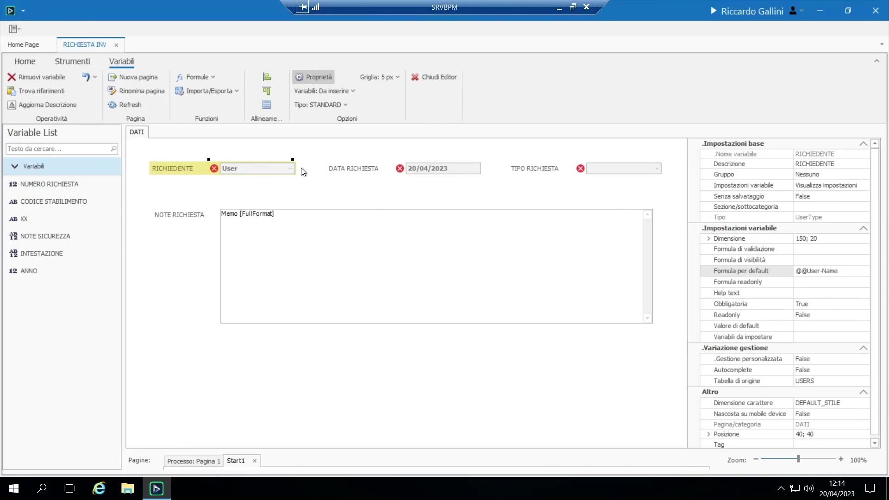{ loading=lazy }

- **Formula per ridolli** — rende un campo condizionalmente in sola lettura in determinate circostanze; considerata una tecnica più avanzata/specifica.
- **Condizione di abilitazione** — la formula collegata a una freccia di transizione o a un ramo di gateway per controllare l'instradamento (vedi 2.3).

Indicazione del docente: il motore è abbastanza potente da gestire complessità arbitraria, ma la raccomandazione è di mantenere le formule semplici quanto la logica di business richiede realmente, senza ingegnerizzare eccessivamente.

## Bottoni e "Variabili da impostare"

Una variabile Booleana può essere renderizzata come checkbox oppure come **Bottone** (statefull — si comporta come un interruttore che resta "premuto" — oppure stateless, un comando puro). I bottoni sono più potenti di una semplice checkbox perché è possibile agganciare loro delle azioni:

- **Variabili da impostare**: un'alternativa imperativa a una Formula reattiva — si aggancia al bottone una lista di azioni che valorizzano variabili target solo al momento del click (es. un bottone "Ricalcola totali" che imposta esplicitamente `totale_costi`), in contrapposizione a una Formula che si ricalcola automaticamente a ogni cambio di dipendenza. Due varianti dello stesso obiettivo di fondo, scelte in base a se si vuole un comportamento "sempre live" oppure "solo su richiesta".

    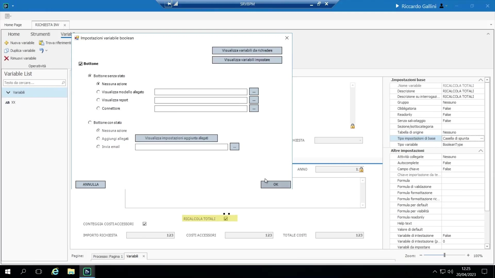{ loading=lazy }

- Comportamento del bottone **Aggiunta allegati** — vedi sezione 7.2.
- Un bottone può anche avere una propria sotto-form **"Variabili da richiedere"** (vedi 4.2), usata sia per l'inserimento di dettaglio in pop-up standalone sia per il pattern "Dettagli" a livello di riga di gruppo (vedi 4.6).
